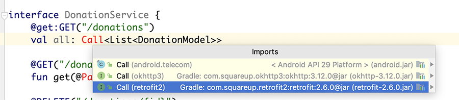

# Setup - Starter Code & Configuring Retrofit

This is the Donation Android app as it currently stands : [Donation](archives/donation-v3-start.zip).

If you have completed that lab, then you can use your own project. If not, use the above archive.

First we need to add a few `dependencies` so open your `app/build.gradle` and include the following

~~~
implementation 'com.squareup.retrofit2:retrofit:2.6.0'
implementation 'com.squareup.retrofit2:converter-gson:2.6.0'
implementation 'com.google.code.gson:gson:2.8.6'
~~~

and

~~~
implementation "org.jetbrains.anko:anko-commons:0.10.8"
~~~

if you haven't done so already.

Open your `androidManifext.xml` file - and confirm/insert this new permission entry:

~~~xml
    <uses-permission android:name="android.permission.INTERNET"/>
~~~

This should be entered before the `<application>` element as shown here:

~~~xml
<manifest...

    <uses-permission android:name="android.permission.INTERNET"/>

    <application
      ....
      ....
      ....
</manifest>
~~~

and make sure to 'Sync' your project.

NOTE : If you get a `Clear Text Traffic` Error you'll need to add

~~~xml
android:usesCleartextTraffic="true"
~~~

to your **application** tag, in your manifest file.

and you can remove the residual activity tags (if you wish)

~~~
<activity android:name=".activities.Report" />
        <activity
            android:name=".activities.Donate"
            android:label="@string/app_name"
            android:theme="@style/AppTheme.NoActionBar">
        </activity>
~~~

Next, create an **api** package

~~~
ie.wit.api
~~~

add the following class to represent the Donation JSON response

~~~
class DonationWrapper {
    var message: String? = null
    var data: DonationModel? = null
}
~~~

and then introduce this **DonationService** interface, fixing any import errors - make sure to choose the correct `Retrofit2` import

~~~
interface DonationService {
    @GET("/donations")
    fun getall(): Call<List<DonationModel>>

    @GET("/donations/{id}")
    fun get(@Path("id") id: String): Call<DonationModel>

    @DELETE("/donations/{id}")
    fun delete(@Path("id") id: String): Call<DonationWrapper>

    @POST("/donations")
    fun post(@Body donation: DonationModel): Call<DonationWrapper>

    @PUT("/donations/{id}")
    fun put(@Path("id") id: String,
            @Body donation: DonationModel
    ): Call<DonationWrapper>

    companion object {

        val serviceURL = "https://donationweb-hdip-server.herokuapp.com"

        fun create() : DonationService {

            val gson = GsonBuilder().create()

            val okHttpClient = OkHttpClient.Builder()
                .connectTimeout(30, TimeUnit.SECONDS)
                .writeTimeout(30, TimeUnit.SECONDS)
                .readTimeout(30, TimeUnit.SECONDS)
                .build()

            val retrofit = Retrofit.Builder()
                .baseUrl(serviceURL)
                .addConverterFactory(GsonConverterFactory.create(gson))
                .client(okHttpClient)
                .build()
            return retrofit.create(DonationService::class.java)
        }
    }
}
~~~

This class will server as a local interface for interacting with the remote service (deployed to heroku).

Next, replace your **DonationApp** with the following:

~~~
class DonationApp : Application(), AnkoLogger {

    lateinit var donationsStore: DonationMemStore
    lateinit var donationService: DonationService

    override fun onCreate() {
        super.onCreate()
        donationsStore = DonationMemStore()
        info("Donation App started")
        donationService = DonationService.create()
        info("Donation Service Created")
    }
}
~~~
Add the following string resource:

~~~
<string name="messageLoading">Please Wait while the Donations are Loading...</string>
~~~

And the following layout resource `loading.xml`

~~~
<LinearLayout xmlns:android="http://schemas.android.com/apk/res/android"
    android:layout_width="match_parent"
    android:layout_height="wrap_content"
    android:orientation="horizontal"
    android:padding="20dp">
    <ProgressBar
        android:layout_width="0dp"
        android:layout_height="wrap_content"
        android:layout_weight="1" />

    <TextView
        android:id="@+id/loaderTV"
        android:layout_width="0dp"
        android:layout_height="match_parent"
        android:layout_weight="4"
        android:gravity="center"
        android:text="@string/messageLoading"
        android:textSize="12sp" />
</LinearLayout>
~~~

Finally, create a new package `ie.wit.utils` and add the following `Helper.kt` FILE:

~~~
import androidx.appcompat.app.AlertDialog
import android.widget.Toast
import androidx.fragment.app.FragmentActivity
import ie.wit.R

fun createLoader(activity: FragmentActivity) : AlertDialog {
    val loaderBuilder = AlertDialog.Builder(activity)
        .setCancelable(true) // 'false' if you want user to wait
        .setView(R.layout.loading)
    var loader = loaderBuilder.create()
    loader.setTitle(R.string.app_name)
    loader.setIcon(R.mipmap.ic_launcher_homer_round)

    return loader
}

fun showLoader(loader: AlertDialog, message: String) {
    if (!loader.isShowing()) {
        if (message != null) loader.setTitle(message)
        loader.show()
    }
}

fun hideLoader(loader: AlertDialog) {
    if (loader.isShowing())
        loader.dismiss()
}

fun serviceUnavailableMessage(activity: FragmentActivity) {
    Toast.makeText(
        activity,
        "Donation Service Unavailable. Try again later",
        Toast.LENGTH_LONG
    ).show()
}

fun serviceAvailableMessage(activity: FragmentActivity) {
    Toast.makeText(
        activity,
        "Donation Contacted Successfully",
        Toast.LENGTH_LONG
    ).show()
}
~~~

We are now ready to make our api calls.
