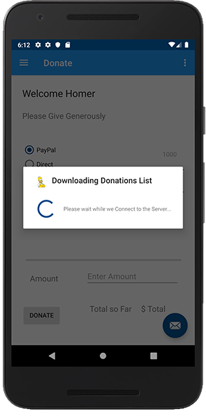
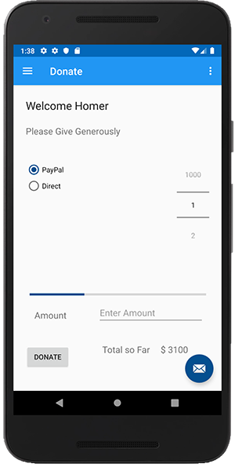

# Getting All Donations from the Server on App Startup

First, make your `DonateFragment` implement the following interface:

~~~
Callback<List<DonationModel>>
~~~

taking care again to import the correct class (retrofit 2.6.0)

You should now have the following override methods available

~~~
override fun onFailure(call: Call<List<DonationModel>>, t: Throwable) {
     TODO("not implemented") //To change body of created functions use File | Settings | File Templates.
 }

 override fun onResponse(
     call: Call<List<DonationModel>>,
     response: Response<List<DonationModel>>
 ) {
     TODO("not implemented") //To change body of created functions use File | Settings | File Templates.
 }
~~~

Next, add the following declaration

~~~
lateinit var loader : AlertDialog
~~~

and add its creation to your `onCreateView()` *after* you inflate the layout.

~~~
 loader = createLoader(activity!!)
~~~

replace your callback methods with the following:

~~~
override fun onResponse(call: Call<List<DonationModel>>,
                         response: Response<List<DonationModel>>) {
     serviceAvailableMessage(activity!!)
     info("Retrofit JSON = $response.raw()")
     app.donationsStore.donations = response.body() as ArrayList<DonationModel>
     updateUI()
     hideLoader(loader)
 }

 override fun onFailure(call: Call<List<DonationModel>>, t: Throwable) {
     info("Retrofit Error : $t.message")
     serviceUnavailableMessage(activity!!)
     hideLoader(loader)
 }

 fun updateUI() {
     totalDonated = app.donationsStore.findAll().sumBy { it.amount }
     progressBar.progress = totalDonated
     totalSoFar.text = format("$ $totalDonated")
 }
~~~

You'll get an error on

~~~
app.donationsStore.donations = response.body() as ArrayList<DonationModel>
~~~

so we need to make a minor change to our `DonationMemStore` declaration

like so

~~~
  var donations = ArrayList<DonationModel>()
~~~

and don't forget to implement `AnkoLogger`.

Finally, update your `onResume()` like so:

~~~
override fun onResume() {
       super.onResume()
       getAllDonations()
   }

fun getAllDonations() {
  showLoader(loader, "Downloading Donations List")
  var callGetAll = app.donationService.getall()
  callGetAll.enqueue(this)
  }   
~~~

Run your app and (once the server has 'woken up') you should see something like this:

and after the Donations have been downloaded (a total of $3100 at the time of running)

The next step is to add (POST) a Donation back to the server so we'll continue to refactor our `DonateFragment`.

<b>NOTE : If you're having issues connecting via the Emulator make sure your DNS list has the following:

- 8.8.8.8
- 8.8.4.4

(Google Servers) :)
