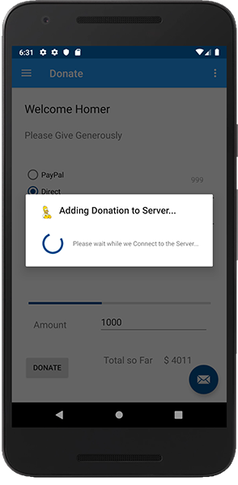

# Adding a Donation to our Server

At this stage, we've made a simple **GET** request on the Server - now let's make some **POST** Requests using **Retrofit** and add a donation to the list maintained on the server.

As our `DonateFragment` already implements a Callback, we'll need to use an anonymous callback to add our donations.

First, a minor change to our Model (for later on), go ahead and add a 'message' property to your `DonationModel` (which matches the message in our JSON string). Also `refactor` 'paymentmethod' to 'paymenttype' (to also match our JSON). Make sure you refactor->rename so all references are updated in the project.

Your model should now look like this:

~~~
@Parcelize
data class DonationModel(var id: Long = 0,
                         val paymenttype: String = "N/A",
                         val amount: Int = 0,
                         val message: String = "a message") : Parcelable
~~~

Next, bring in the following method to `DonateFragment`:

~~~
fun addDonation(donation : DonationModel) {
       showLoader(loader, "Adding Donation to Server...")
       var callAdd = app.donationService.post(donation)
       callAdd.enqueue(object : Callback<DonationWrapper> {
           override fun onFailure(call: Call<DonationWrapper>, t: Throwable) {
               info("Retrofit Error : $t.message")
               serviceUnavailableMessage(activity!!)
               hideLoader(loader)
           }

           override fun onResponse(call: Call<DonationWrapper>,
                                       response: Response<DonationWrapper>) {
               val donationWrapper = response.body()
               info("Retrofit Wrapper : $donationWrapper")
               getAllDonations()
               updateUI()
               hideLoader(loader)
           }
       })
   }
~~~

and see can you refactor your `setButtonListener` to use this method to add a donation to the server and not our local ArrayList.

When completed, and you go to make a donation, you should get something like this:

It's worth keeping track of our 'LogCat' too, just to see the responses coming back.

(If you're stuck, solution isn't far away :))

To confirm the added Donation for the moment, you can always launch a browser window and access the endpoint to get all the donations:

[Launch Server](https://donationweb-hdip-server.herokuapp.com/donations)
