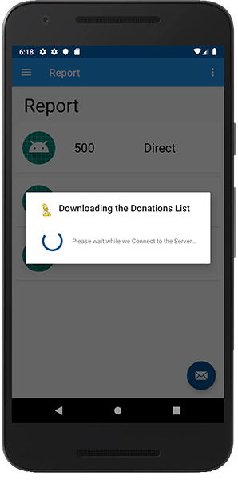
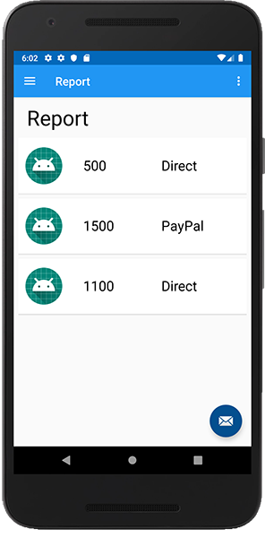
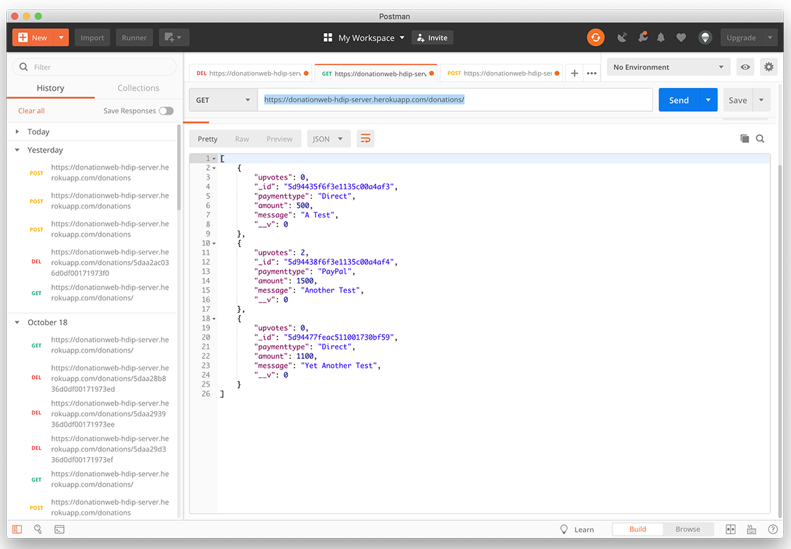
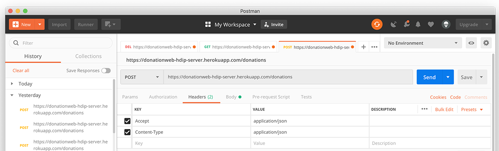
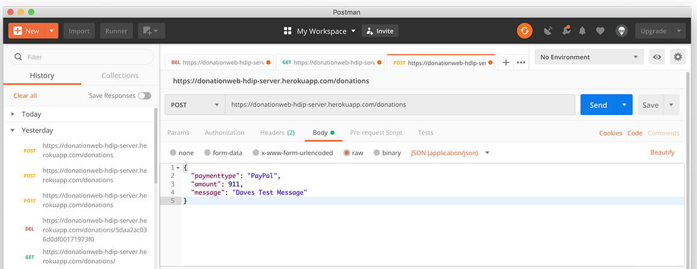
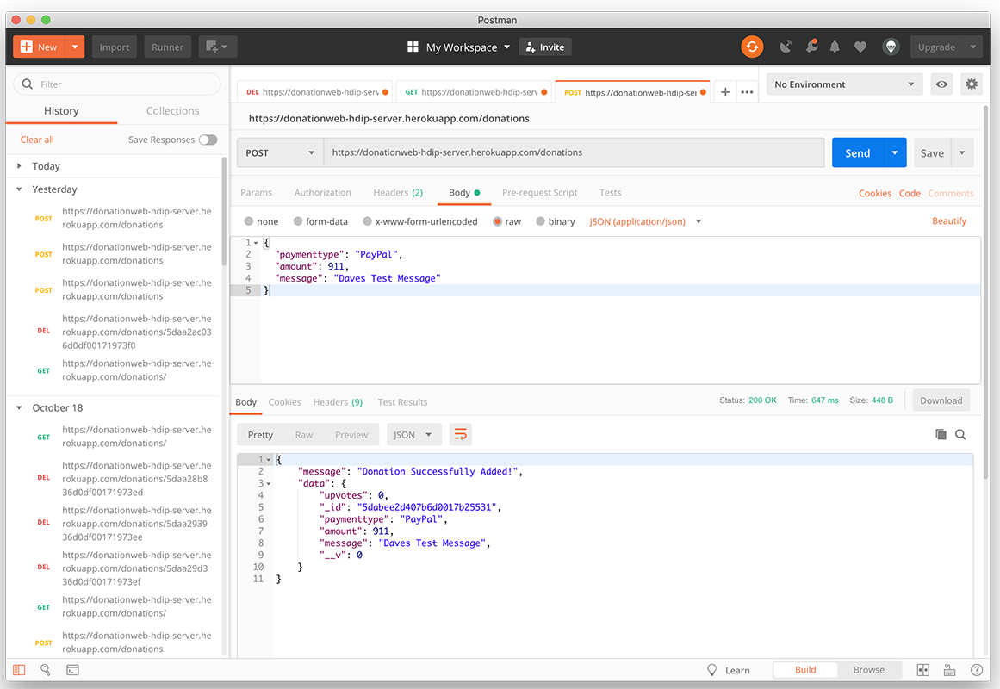
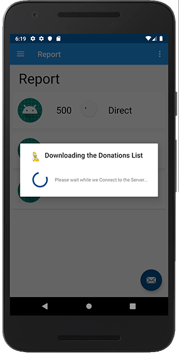
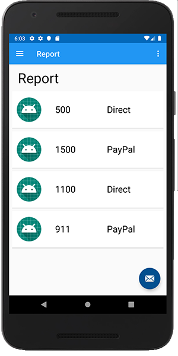
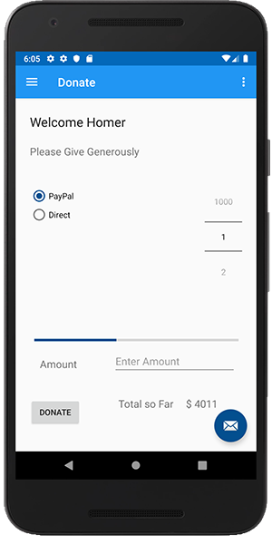

# Retrieving our Donations for Reporting

Here's the `setButtonListener` code you need for the previous step (if you didn't get it working).

Notice we've removed adding it to our local `DonationStore` (more on this later) and the need to update the totalDonated & progress bar - that's now taken care of by our Retrofit request.

~~~
fun setButtonListener( layout: View) {
       layout.donateButton.setOnClickListener {
           val amount = if (layout.paymentAmount.text.isNotEmpty())
               layout.paymentAmount.text.toString().toInt() else layout.amountPicker.value
           if(totalDonated >= layout.progressBar.max)
               activity?.toast("Donate Amount Exceeded!")
           else {
               val paymentmethod = if(layout.paymentMethod.checkedRadioButtonId == R.id.Direct) "Direct" else "Paypal"
               addDonation(DonationModel(paymenttype = paymentmethod,amount = amount))
           }
       }
   }
~~~

As our donations are now maintained remotely, there's always the possibility that the list of donations (or any list of data for that matter) could be modified while using the app, so we need to be able to retrieve the remote data and maintain the most up to date list on our Report Screen.

In this lab/step we'll modify the layout to include a `SwipeRefresh` so we can refresh our list any time we want which will force a callback (we'll do something different in later labs).

First, confirm/add the following dependency

~~~
implementation 'androidx.swiperefreshlayout:swiperefreshlayout:1.1.0'
~~~

and replace your `fragment_report.xml` with the following:

~~~
<?xml version="1.0" encoding="utf-8"?>
<androidx.constraintlayout.widget.ConstraintLayout xmlns:android="http://schemas.android.com/apk/res/android"
    xmlns:app="http://schemas.android.com/apk/res-auto"
    xmlns:tools="http://schemas.android.com/tools"
    android:layout_width="match_parent"
    android:layout_height="match_parent"
    tools:context=".fragments.ReportFragment">

    <androidx.swiperefreshlayout.widget.SwipeRefreshLayout
        android:id="@+id/swiperefresh"
        android:layout_width="403dp"
        android:layout_height="518dp"
        android:layout_marginStart="16dp"
        android:layout_marginTop="24dp"
        android:layout_marginEnd="16dp"
        app:layout_constraintBottom_toBottomOf="parent"
        app:layout_constraintEnd_toEndOf="parent"
        app:layout_constraintHorizontal_bias="0.518"
        app:layout_constraintStart_toStartOf="parent"
        app:layout_constraintTop_toTopOf="parent"
        app:layout_constraintVertical_bias="0.85">

        <androidx.recyclerview.widget.RecyclerView
            android:id="@+id/recyclerView"
            android:layout_width="399dp"
            android:layout_height="601dp"
            android:layout_marginTop="116dp"
            app:layout_constraintBottom_toBottomOf="parent"
            app:layout_constraintEnd_toEndOf="parent"
            app:layout_constraintStart_toStartOf="parent"
            app:layout_constraintTop_toTopOf="parent"
            app:layout_constraintVertical_bias="0.0" />
    </androidx.swiperefreshlayout.widget.SwipeRefreshLayout>

    <TextView
        android:id="@+id/reportTitle"
        android:layout_width="wrap_content"
        android:layout_height="wrap_content"
        android:text="@string/action_report"
        android:textColor="#000000"
        android:textSize="36sp"
        app:layout_constraintBottom_toTopOf="@+id/swiperefresh"
        app:layout_constraintEnd_toEndOf="parent"
        app:layout_constraintHorizontal_bias="0.052"
        app:layout_constraintStart_toStartOf="parent"
        app:layout_constraintTop_toTopOf="parent"
        app:layout_constraintVertical_bias="0.19" />
</androidx.constraintlayout.widget.ConstraintLayout>
~~~

Next, open your `ReportFragment` and introduce the following class properties:

~~~
lateinit var loader : AlertDialog
lateinit var root: View
~~~

and methods:

~~~
fun setSwipeRefresh() {
       root.swiperefresh.setOnRefreshListener(object : SwipeRefreshLayout.OnRefreshListener {
           override fun onRefresh() {
               root.swiperefresh.isRefreshing = true

           }
       })
   }

   fun checkSwipeRefresh() {
       if (root.swiperefresh.isRefreshing) root.swiperefresh.isRefreshing = false
   }
~~~

Notice we need to move our 'root' reference to the class level so we can access it outside the `onCreateView()` so make sure you update your `onCreateView()` accordingly

~~~
root = inflater.inflate(R.layout.fragment_report, container, false)
~~~

and don't forget to 'create' our loader AlertDialog:

~~~
loader = createLoader(activity!!)
~~~

Similar to your `DonateFragment`, make `ReportFragment` implement the `Callback<List<DonationModel>>` interface and replace with the following:
~~~
override fun onFailure(call: Call<List<DonationModel>>, t: Throwable) {
       info("Retrofit Error : $t.message")
       serviceUnavailableMessage(activity!!)
       checkSwipeRefresh()
       hideLoader(loader)
   }

   override fun onResponse(call: Call<List<DonationModel>>,
                       response: Response<List<DonationModel>>
   ) {
       serviceAvailableMessage(activity!!)
       info("Retrofit JSON = ${response.body()}")
       app.donationsStore.donations = response.body() as ArrayList<DonationModel>
       root.recyclerView.adapter = DonationAdapter(app.donationsStore.findAll())
       root.recyclerView.adapter?.notifyDataSetChanged()
       checkSwipeRefresh()
       hideLoader(loader)
   }
~~~

Now bring in the following methods:

~~~
   fun getAllDonations() {
       showLoader(loader, "Downloading the Donations List")
       var callGetAll = app.donationService.getall()
       callGetAll.enqueue(this)
   }

   override fun onResume() {
       super.onResume()
       getAllDonations()
   }
~~~

you may need `AnkoLogger` too, but that should be straightforward to fix any errors.

Run your app, choose the 'Report' option and you should get something like this:

and

Now, update your `setSwipeRefresh()` like so:

~~~
fun setSwipeRefresh() {
       root.swiperefresh.setOnRefreshListener(object : SwipeRefreshLayout.OnRefreshListener {
           override fun onRefresh() {
               root.swiperefresh.isRefreshing = true
               getAllDonations()
           }
       })
   }
~~~

and finally, call it inside your `onCreateView`.

To actually test this we need to manually add a donation to the server first using a RESTful client (I'm using [POSTman](https://www.getpostman.com)) so here's what you need to do:

1. install and launch POSTman
2. Create a new 'GET' request using https://donationweb-hdip-server.herokuapp.com/donations/ just to confirm the donations currently on the server

3. Create a new 'POST' request https://donationweb-hdip-server.herokuapp.com/donations/ with the following settings

REQUEST HEADERS

and the BODY , you can use this JSON (maybe change the message so you know it's yours :) )

~~~
{
  "paymenttype": "PayPal",
  "amount": 911,
  "message": "Daves Test Message"
}
~~~

4. Run your request and you should get back

5. Run your 'GET' again to confirm the newly added Donation.

Head back to your App and 'swipe down' on your Report list, and you should get something like this:

and then:

and your total should also be updated on your Donate scree.

We'll look at deleting donations (and some setup for editing) in the last few steps.
