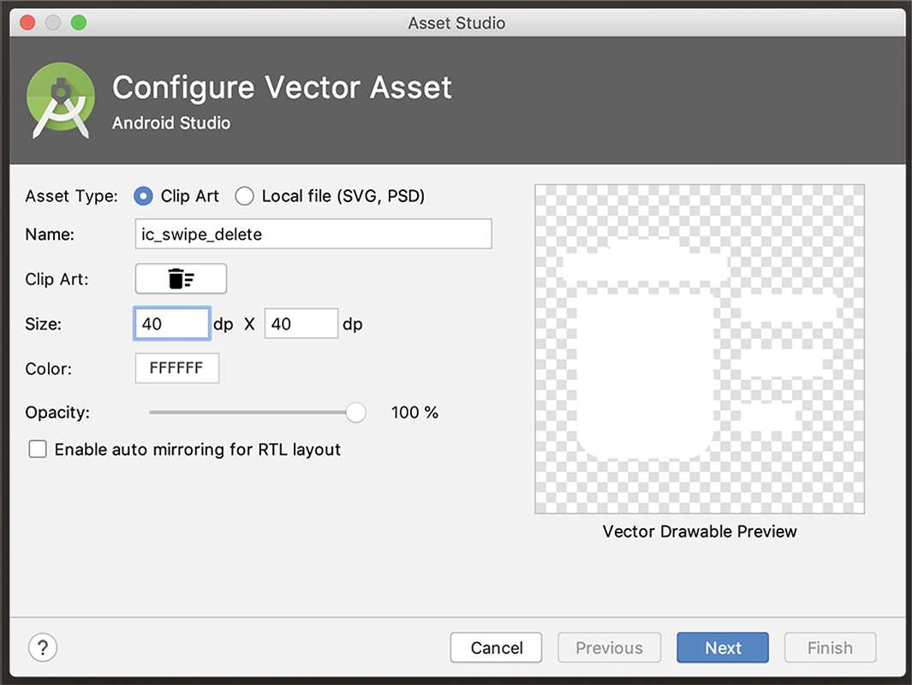
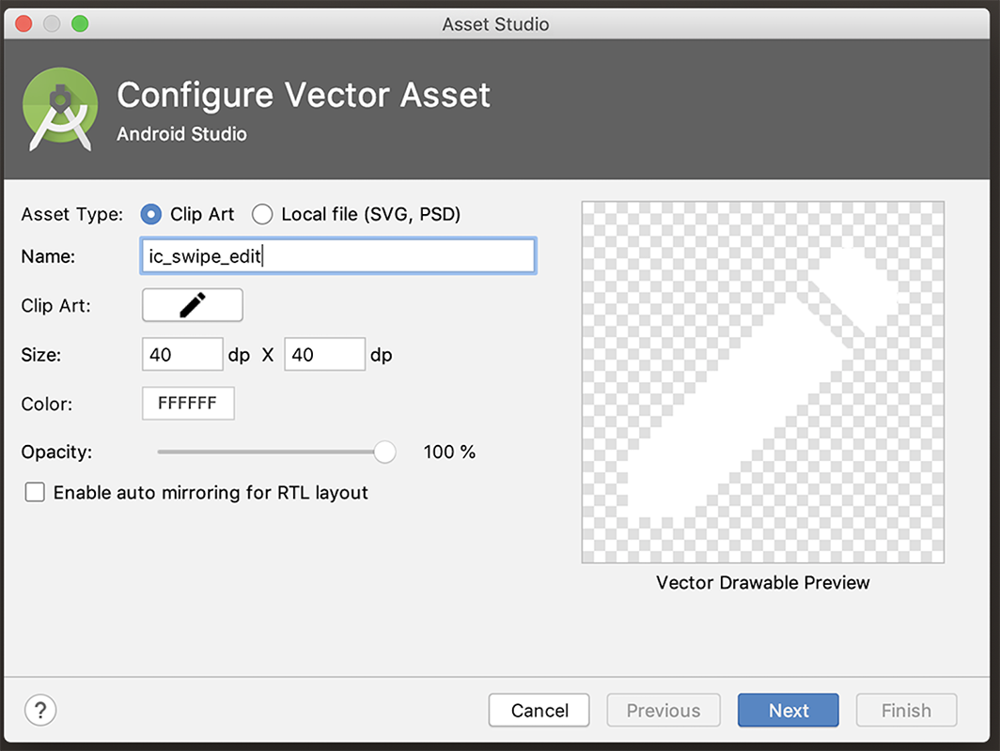
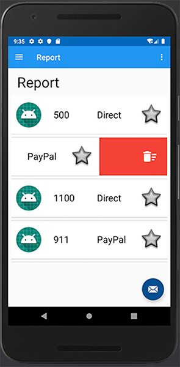
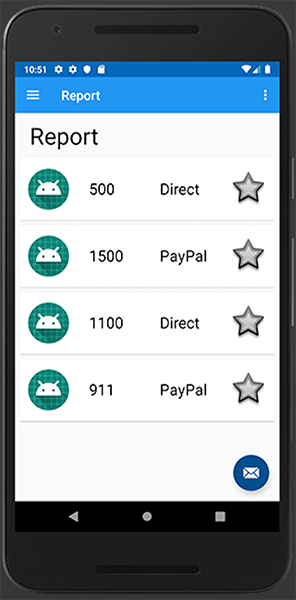

# Deleting a Donation from the Server - Part 1

We'll tackle the delete feature here in this lab (as it needs less work!) but we'll add some of the common resources for both editing and deleting so go ahead and create 2 new **Vector Assets** `ic_swipe_delete` with the following settings - Note the size (40x40) and colour (white FFFFFF):

and `ic_swipe_edit`

Now, at this point, we haven't been too concerned about the id's of each donation as all we've been doing is adding and retrieving.

Because we need to be able to delete (and eventually update) our donations on the server, we need to know the id of each donation. This id is a mongo id, so we need to modify our model once again, like so:

~~~

@Parcelize
data class DonationModel(var _id: String = "N/A",
                         val paymenttype: String = "N/A",
                         val amount: Int = 0,
                         val message: String = "a message") : Parcelable
~~~

Note the `_id` which Retrofit will match with the JSON retrieved from the server.

This 'breaks' our app in a number of places so we're going to remove our `DonationMemStore` altogether (yes, totally remove it) and simply work with a temporary donations list, maintained in the application object.

To start this refactor, replace your `DonationApp` with the following:

~~~
class DonationApp : Application(), AnkoLogger {

    lateinit var donationService: DonationService
    var donations = ArrayList<DonationModel>()

    override fun onCreate() {
        super.onCreate()
        info("Donation App started")
        donationService = DonationService.create()
        info("Donation Service Created")
    }
}
~~~

Build your project and you'll get a number of errors, but we'll fix those now.

Anywhere you have

~~~
app.donationsStore.donations
~~~

now becomes

~~~
app.donations
~~~

finding our 'totalDonated' is now

~~~
totalDonated = app.donations.sumBy { it.amount }
~~~

Setting up our recyclerView is now, simply

~~~
root.recyclerView.adapter = DonationAdapter(app.donations)
~~~

You can either fix the small errors in `DonationMemStore` by replacing `id` with `_id` - or just delete the class, as we're not using it going forward.

We can now continue with an app that will exclusively interact with our RESTful service while only maintaining a temporary local list as needed.

First update your adapter like so:

~~~
class DonationAdapter constructor(var donations: ArrayList<DonationModel>)
~~~

and introduce the following method into your `DonationAdapter`:

~~~
fun removeAt(position: Int) {
      donations.removeAt(position)
      notifyItemRemoved(position)
  }
~~~

We're going to implement a Swipe-Left-to-Delete feature, to give us something like this when we swipe left:

And we're going to use the following as a starting point [here](https://github.com/kitek/android-rv-swipe-delete) so first update your `card_donation.xml` layout with this:

~~~
<?xml version="1.0" encoding="utf-8"?>
<androidx.cardview.widget.CardView
    xmlns:android="http://schemas.android.com/apk/res/android"
    xmlns:app="http://schemas.android.com/apk/res-auto"
    xmlns:tools="http://schemas.android.com/tools"
    android:layout_width="match_parent"
    android:layout_height="wrap_content"
    android:layout_marginBottom="8dp"
    android:elevation="24dp">

    <RelativeLayout
        android:layout_width="match_parent"
        android:layout_height="wrap_content"
        android:padding="16dp">

        <ImageView
            android:id="@+id/imageIcon"
            android:layout_width="64dp"
            android:layout_height="64dp"
            android:layout_alignParentLeft="true"
            android:layout_alignParentTop="true"
            android:layout_marginRight="16dp"
            app:srcCompat="@mipmap/ic_launcher_round" />

        <TextView
            android:id="@+id/paymentamount"
            android:layout_width="90dp"
            android:layout_height="wrap_content"
            android:layout_alignParentTop="true"
            android:layout_marginStart="15dp"
            android:layout_marginTop="15dp"
            android:layout_toEndOf="@+id/imageIcon"
            android:text="TextView"
            android:textAlignment="viewStart"
            android:textColor="#000000"
            android:textSize="24sp"
            tools:text="€1000" />

        <TextView
            android:id="@+id/paymentmethod"
            android:layout_width="89dp"
            android:layout_height="wrap_content"
            android:layout_alignParentTop="true"
            android:layout_marginStart="20dp"
            android:layout_marginTop="15dp"
            android:layout_toEndOf="@+id/paymentamount"
            android:text="@string/paypal"
            android:textAlignment="viewStart"
            android:textColor="#000000"
            android:textSize="24sp" />

        <ImageView
            android:id="@+id/imagefavourite"
            android:layout_width="64dp"
            android:layout_height="64dp"
            android:layout_alignParentTop="true"
            android:layout_marginStart="21dp"
            android:layout_toEndOf="@id/paymentmethod"
            app:srcCompat="@android:drawable/star_big_off" />

    </RelativeLayout>
</androidx.cardview.widget.CardView>
~~~

Bring in the following `SwipeToDeleteCallback` class

~~~

// https://github.com/kitek/android-rv-swipe-delete

abstract class SwipeToDeleteCallback(context: Context) : ItemTouchHelper.SimpleCallback(0, ItemTouchHelper.LEFT) {

    private val deleteIcon = ContextCompat.getDrawable(context, R.drawable.ic_swipe_delete)
    private val intrinsicWidth = deleteIcon?.intrinsicWidth
    private val intrinsicHeight = deleteIcon?.intrinsicHeight
    private val background = ColorDrawable()
    private val backgroundColor = Color.parseColor("#f44336")
    private val clearPaint = Paint().apply { xfermode = PorterDuffXfermode(PorterDuff.Mode.CLEAR) }

    override fun getMovementFlags(recyclerView: RecyclerView, viewHolder: RecyclerView.ViewHolder): Int {
        /**
         * To disable "swipe" for specific item return 0 here.
         * For example:
         * if (viewHolder?.itemViewType == YourAdapter.SOME_TYPE) return 0
         * if (viewHolder?.adapterPosition == 0) return 0
         */
        if (viewHolder.adapterPosition == 10) return 0
        return super.getMovementFlags(recyclerView, viewHolder)
    }

    override fun onMove(recyclerView: RecyclerView, viewHolder: RecyclerView.ViewHolder, target: RecyclerView.ViewHolder): Boolean {
        return false
    }

    override fun onChildDraw(
        c: Canvas, recyclerView: RecyclerView, viewHolder: RecyclerView.ViewHolder,
        dX: Float, dY: Float, actionState: Int, isCurrentlyActive: Boolean
    ) {

        val itemView = viewHolder.itemView
        val itemHeight = itemView.bottom - itemView.top
        val isCanceled = dX == 0f && !isCurrentlyActive

        if (isCanceled) {
            clearCanvas(c, itemView.right + dX, itemView.top.toFloat(), itemView.right.toFloat(), itemView.bottom.toFloat())
            super.onChildDraw(c, recyclerView, viewHolder, dX, dY, actionState, isCurrentlyActive)
            return
        }

        // Draw the red delete background
        background.color = backgroundColor
        background.setBounds(itemView.right + dX.toInt(), itemView.top, itemView.right, itemView.bottom)
        background.draw(c)

        // Calculate position of delete icon
        val deleteIconTop = itemView.top + (itemHeight - intrinsicHeight!!) / 2
        val deleteIconMargin = (itemHeight - intrinsicHeight) / 2
        val deleteIconLeft = itemView.right - deleteIconMargin - intrinsicWidth!!
        val deleteIconRight = itemView.right - deleteIconMargin
        val deleteIconBottom = deleteIconTop + intrinsicHeight

        // Draw the delete icon
        deleteIcon?.setBounds(deleteIconLeft, deleteIconTop, deleteIconRight, deleteIconBottom)
        deleteIcon?.draw(c)

        super.onChildDraw(c, recyclerView, viewHolder, dX, dY, actionState, isCurrentlyActive)
    }

    private fun clearCanvas(c: Canvas?, left: Float, top: Float, right: Float, bottom: Float) {
        c?.drawRect(left, top, right, bottom, clearPaint)
    }
}
~~~

and `SwipeToEditCallback` class

~~~
abstract class SwipeToEditCallback(context: Context) : ItemTouchHelper.SimpleCallback(0, ItemTouchHelper.RIGHT), AnkoLogger {

    private val editIcon = ContextCompat.getDrawable(context, R.drawable.ic_swipe_edit)
    private val intrinsicWidth = editIcon?.intrinsicWidth
    private val intrinsicHeight = editIcon?.intrinsicHeight
    private val background = ColorDrawable()
    private val backgroundColor = Color.parseColor("#2196F3")
    private val clearPaint = Paint().apply { xfermode = PorterDuffXfermode(PorterDuff.Mode.CLEAR) }

    override fun getMovementFlags(recyclerView: RecyclerView, viewHolder: RecyclerView.ViewHolder): Int {
        /**
         * To disable "swipe" for specific item return 0 here.
         * For example:
         * if (viewHolder?.itemViewType == YourAdapter.SOME_TYPE) return 0
         * if (viewHolder?.adapterPosition == 0) return 0
         */
        if (viewHolder.adapterPosition == 10) return 0
        return super.getMovementFlags(recyclerView, viewHolder)
    }

    override fun onMove(recyclerView: RecyclerView, viewHolder: RecyclerView.ViewHolder, target: RecyclerView.ViewHolder): Boolean {
        return false
    }

    override fun onChildDraw(
        c: Canvas, recyclerView: RecyclerView, viewHolder: RecyclerView.ViewHolder,
        dX: Float, dY: Float, actionState: Int, isCurrentlyActive: Boolean
    ) {

        val itemView = viewHolder.itemView
        val itemHeight = itemView.bottom - itemView.top
        val isCanceled = dX == 0f && !isCurrentlyActive

        if (isCanceled) {
            clearCanvas(c, itemView.left + dX, itemView.top.toFloat(), itemView.left.toFloat(), itemView.bottom.toFloat())
            super.onChildDraw(c, recyclerView, viewHolder, dX, dY, actionState, isCurrentlyActive)
            return
        }

        // Draw the blue edit background
        background.color = backgroundColor
        background.setBounds(itemView.left + dX.toInt(), itemView.top, itemView.left, itemView.bottom)
        background.draw(c)

        // Calculate position of Edit icon
        val editIconTop = itemView.top + (itemHeight - intrinsicHeight!!) / 2
        val editIconMargin = (itemHeight - intrinsicHeight) / 2
        val editIconLeft = itemView.right - editIconMargin - intrinsicWidth!! - 810
        val editIconRight = itemView.right - editIconMargin - 810
        val editIconBottom = editIconTop + intrinsicHeight

        // Draw the edit icon
        editIcon?.setBounds(editIconLeft, editIconTop, editIconRight, editIconBottom)
        info ("EditSwipe : $editIconLeft $editIconTop $editIconRight $editIconBottom")
        editIcon?.draw(c)

        super.onChildDraw(c, recyclerView, viewHolder, dX, dY, actionState, isCurrentlyActive)
    }

    private fun clearCanvas(c: Canvas?, left: Float, top: Float, right: Float, bottom: Float) {
        c?.drawRect(left, top, right, bottom, clearPaint)
    }
}
~~~

into your `utils` package and fix the import errors.

We now need to update our recyclerView in our `ReportFragment` to handle the swiping gesture and also remove the donation from both the recyclerView data and the Server.

Add the following to your **onCreateView()** in your `ReportFragment`:

~~~
val swipeDeleteHandler = object : SwipeToDeleteCallback(activity!!) {
            override fun onSwiped(viewHolder: RecyclerView.ViewHolder, direction: Int) {
                val adapter = root.recyclerView.adapter as DonationAdapter
                adapter.removeAt(viewHolder.adapterPosition)

            }
        }
val itemTouchDeleteHelper = ItemTouchHelper(swipeDeleteHandler)
itemTouchDeleteHelper.attachToRecyclerView(root.recyclerView)
~~~

If you run your app now you should be able to swipe left and remove a donation from the list, but this only affects the recyclerView - if you swipe down to refresh you get back the original list from the Server.

and then after a swipe down

Next we'll implement our Retrofit Callback to delete it from the Server.
