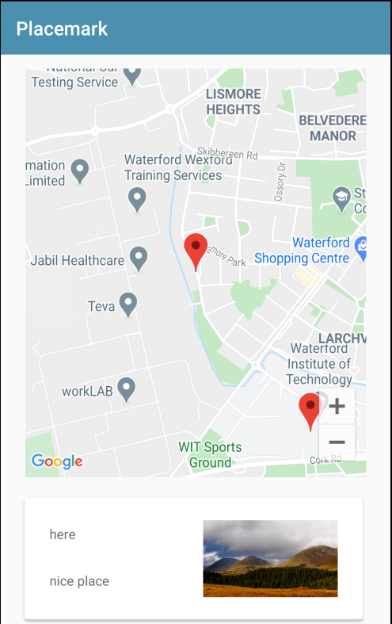

# Exercise Solution

## Exercise 2

Currently, when you select the marker in the PlacemarkMapsActivity, we display the title of the placemark only:

```kotlin
  override fun onMarkerClick(marker: Marker): Boolean {
    currentTitle.text = marker.title
    return false
  }
```

How would you go about showing the description + the image as well?

HINT: What does this code do in the configureMap function:

```kotlin
      map.addMarker(options).tag = it.id
```

How can we use this to realise this feature?

## Solution

Currently we do not have any way retrieving a placemark by its ID. Having this ability is a useful utility method for a variety of scenarios.

We can start by introducing this into the PlacemarkStore and PlacemarkMemStore

## PlacemarkStore

```kotlin
...
  fun findById(id:Long) : PlacemarkModel?
...
```

## PlacemarkMemStore

```kotlin
...
  override fun findById(id:Long) : PlacemarkModel? {
    val foundPlacemark: PlacemarkModel? = placemarks.find { it.id == id }
    return foundPlacemark
  }
...
```

This implements the facility only if we are using in-memory store. Now implement the same feature when we are using the PlacemarkJSONStore implementation:

```kotlin
  override fun findById(id:Long) : PlacemarkModel? {
    val foundPlacemark: PlacemarkModel? = placemarks.find { it.id == id }
    return foundPlacemark
  }
```

It is in fact the same.

Now, back to PlacemarkMapsActivity. This line:

```kotlin
        map.addMarker(options).tag = it.id
```

This is doing two things:

- adding a marker to the map
- "Tagging" the marker with the ID of the placemark

This means the each placemark will have the ID (from the datastore) of the placemark it is representing. We can now use this `tag` to update the card containing details of the selected placemark. This is the current version of the onMarkerClick event hander:

## PlacemarkMapsActivity

```kotlin
...
  override fun onMarkerClick(marker: Marker): Boolean {
    currentTitle.text = marker.title
    return false
  }
...
```

Replace it with the following:

```kotlin
...
  override fun onMarkerClick(marker: Marker): Boolean {
    val tag = marker.tag as Long
    val placemark = app.placemarks.findById(tag)
    currentTitle.text = placemark!!.title
    currentDescription.text = placemark!!.description
    currentImage.setImageBitmap(readImageFromPath(this, placemark.image))
    return true
  }
...
```

(auto import the readImageFromPath function).

Look carefully at method - when a user clicks on a placemark in the map, we do the following:

- retrieve the tag from the marker
- look up the datatore for a placemark based in this ID
- set the currentTitle, currentDescription & imageView to contains the details of the placemark

Try this out now - it should display the placemark details on the panel as each marker is selected.



(You may need to restart the app for these changes to take effect)
