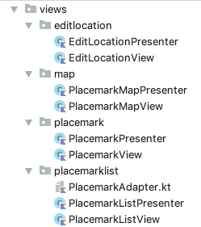

# Exercises

Placemark application so far:

- [placemark-08a.zip](archives/placemark-08a.zip)

## Exercise 1

Convert the PlacemarkMaps Activity into PlacemarkMapView + PlacemarkPresenter. Perhaps aim for this final structure:

## Exercise 2:

Simplify the UX for PlacemarkActivity, removing the `Add Placemark` button, and including a `save` menu option to perform equivalent functionality:

