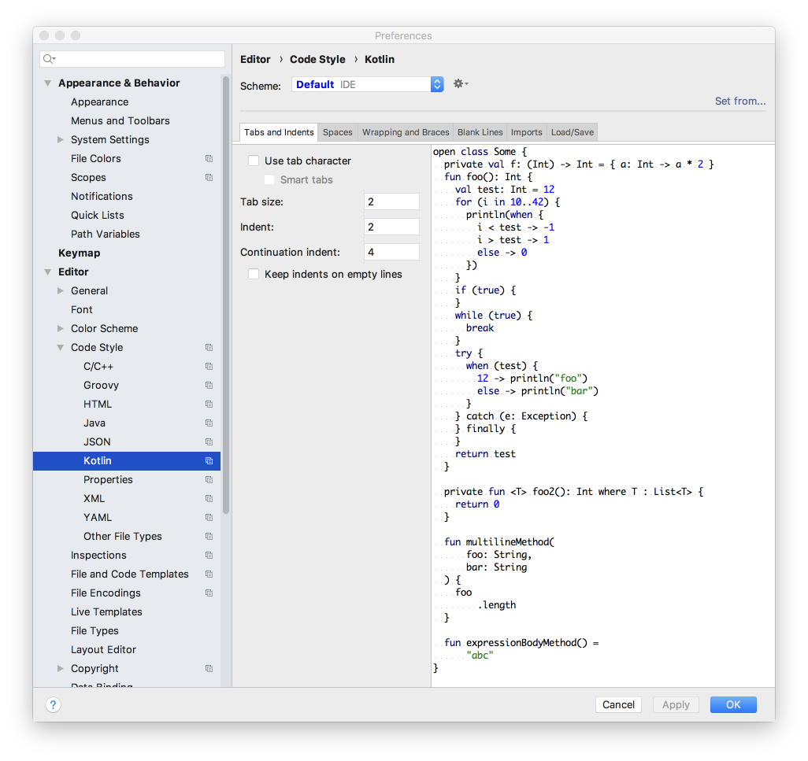

# Setup

Download and install the latest Android Studio (4.0.1 when this lab was updated last).

- <https://developer.android.com/studio>

You can proceed with a standard configuration:

The installation may take some time.

## Indentation Levels

You may have individual preferences re indentation. These labs will use 2 spaces indent, with 4 continuation indent (no tab characters).

These settings are available in Preferences->Editor->Code Style->Language.

Set your preferences for Kotlin, XML, Groovy, Java and JSON.
