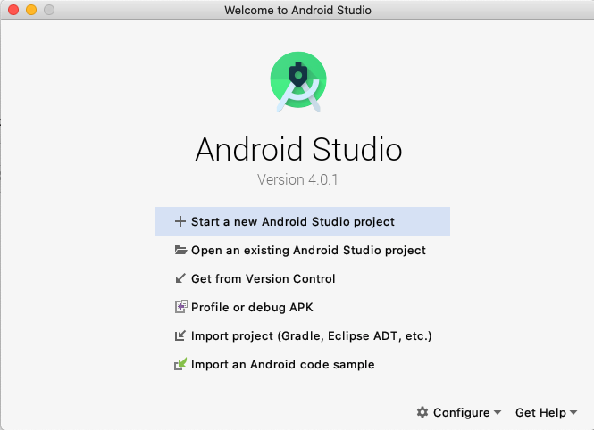
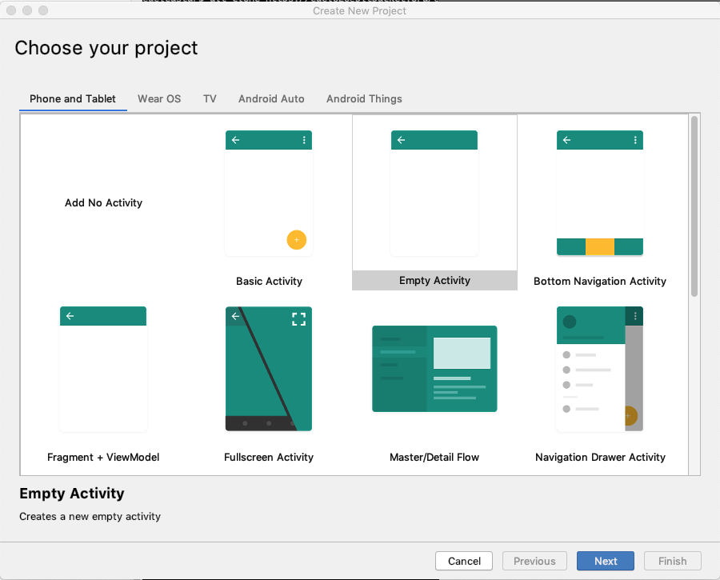
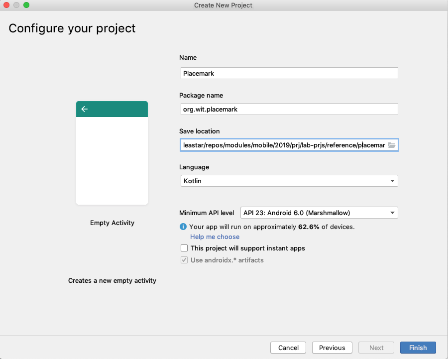
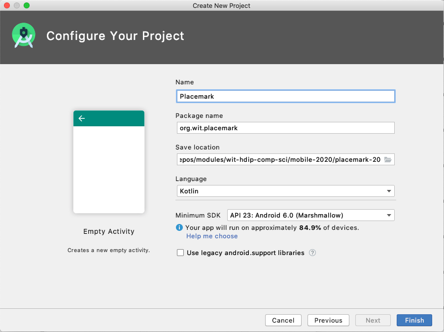
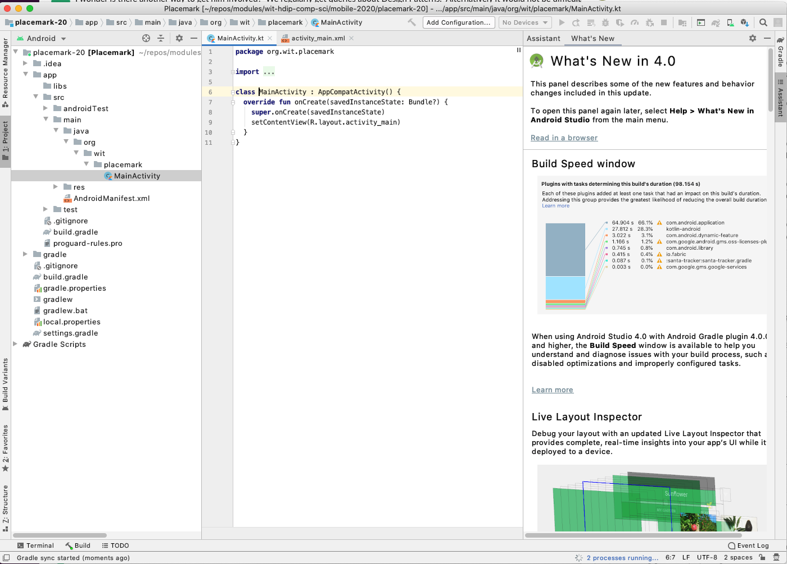

## New Project

Start a new Android Studio project:

When creating the project, select 'Empty Activity'

- Name "Placemark"
- Language "Kotlin"
- Minimum API level (android 23; Android 6.0 (Marshmallow)
- Make sure you can track / configure the location

Your project should look like this:

The new project should look like this;

