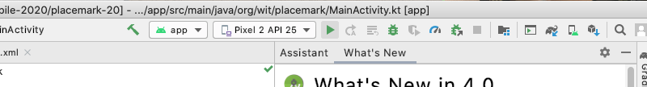
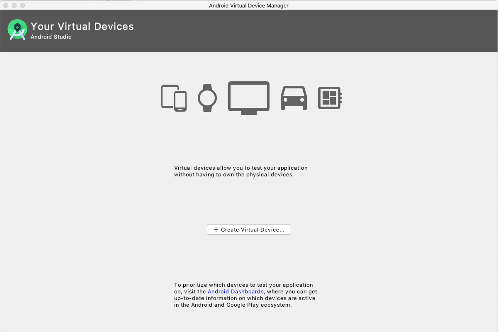
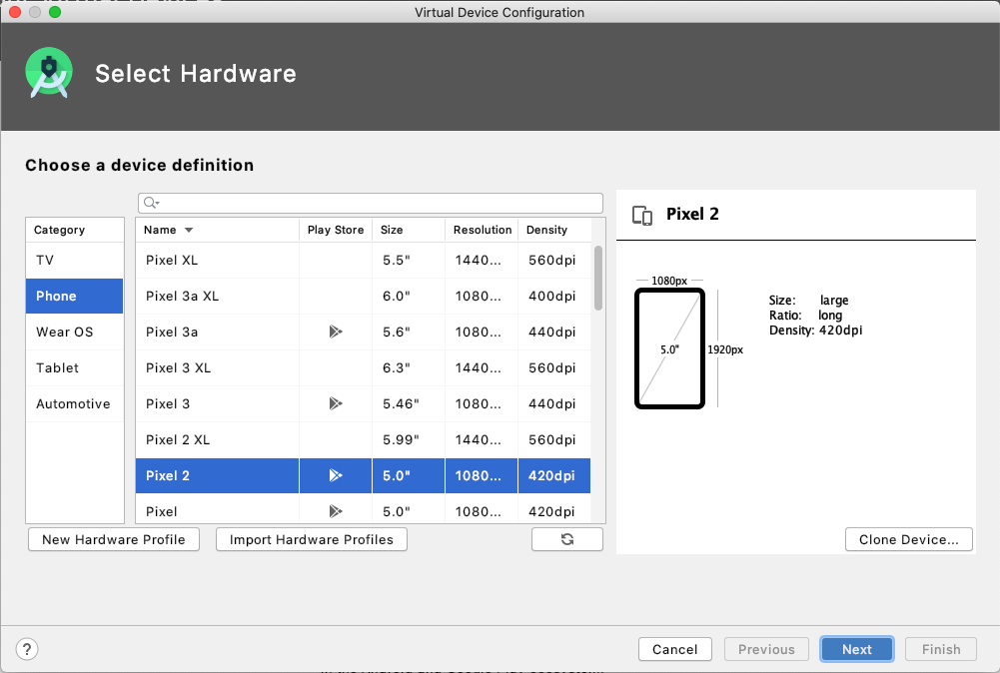
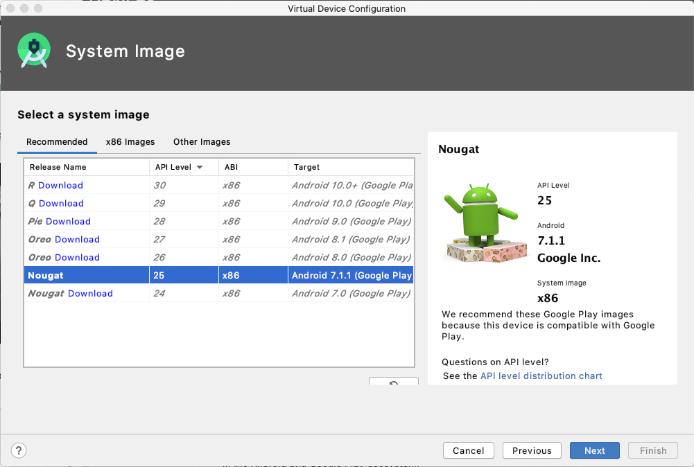
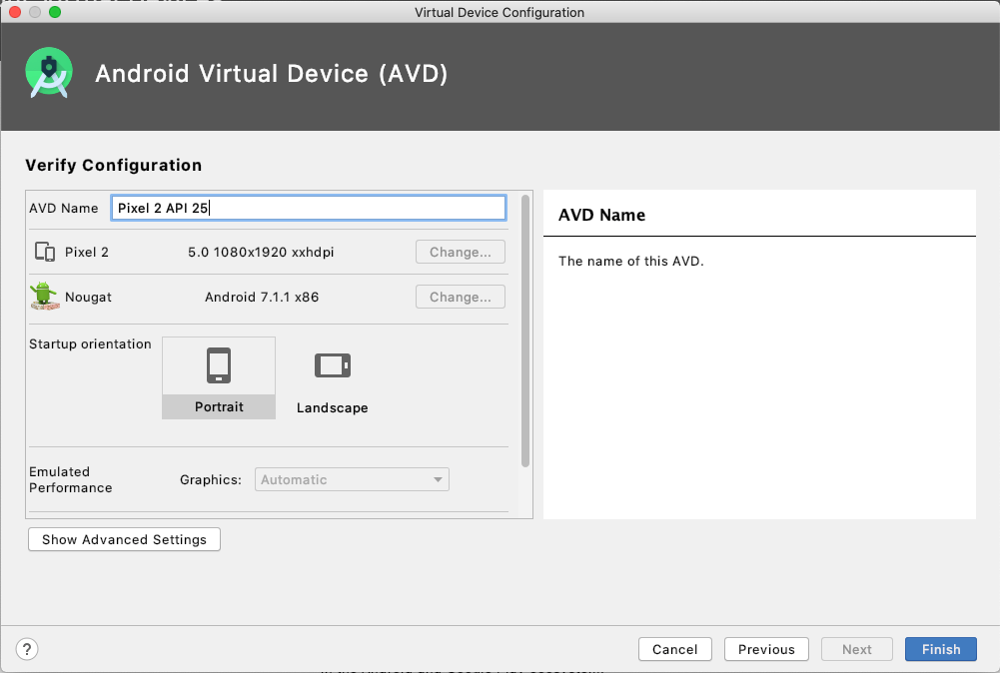
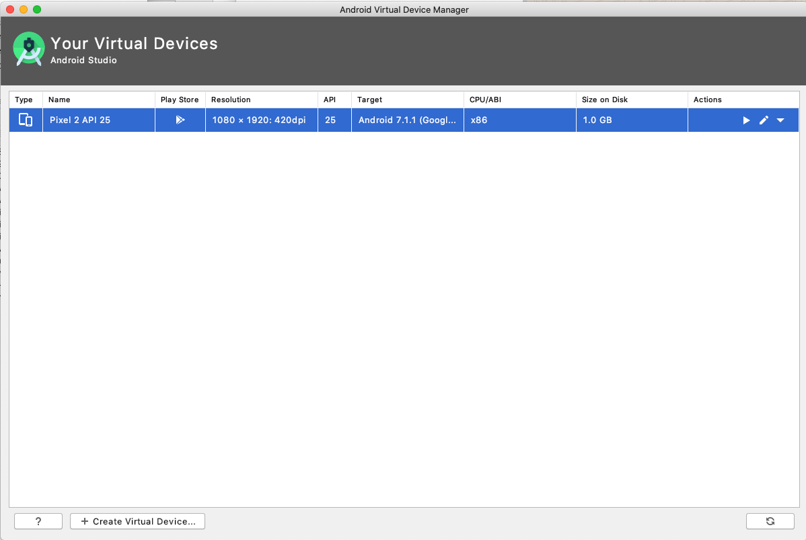
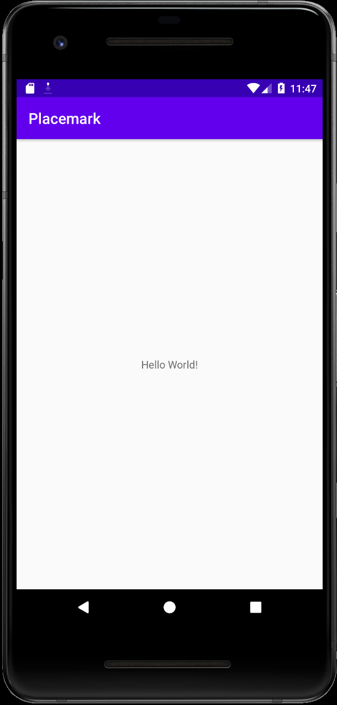

# Run

The project should be building automatically. It can be executed via the Run app button the toolbar:



When you first attempt to run the app, you will be asked to create a Virtual Device.

This default configuration may be appropriate:







Close the last window - and then attempt to run the application again.

If it launches successfully, if should look like this in the VM:



## .gitignore

If you are using git, you might want to make the following small adjustments to the generated .gitignore file:

```
*.iml
.gradle
/local.properties
/.idea
.DS_Store
/build
/captures
.externalNativeBuild
.cxx
```

(we are excluding all .idea files)

It is a good idea to commit the project to a repository now.
