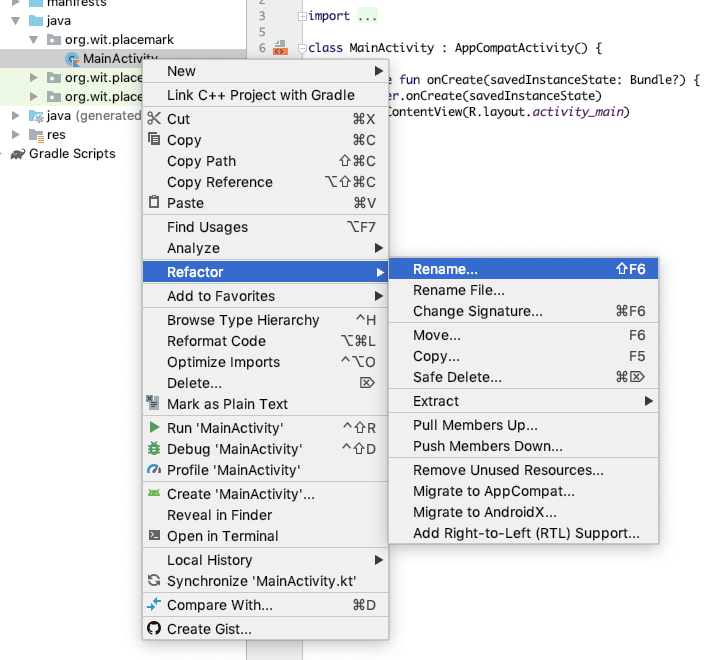
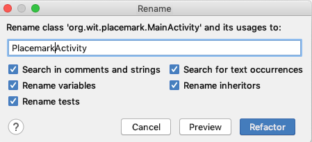
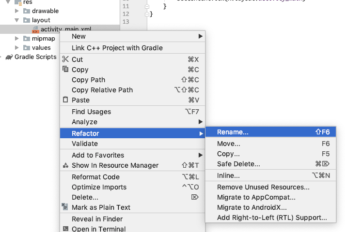
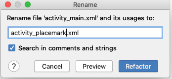

# Refactor

We will now rename the MainActivity class to 'PlacemarkActivity'. When renaming classes, it is usually best to use the refactor menu:

Enter the new class name:

Also, rename the layout 'activity_main.xml' to 'activity_placemark.xml'

---

Make sure you can still run the application successfully.