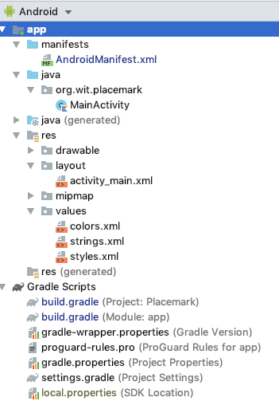
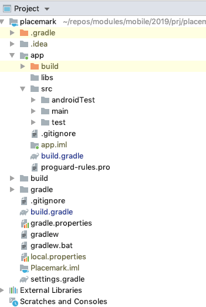
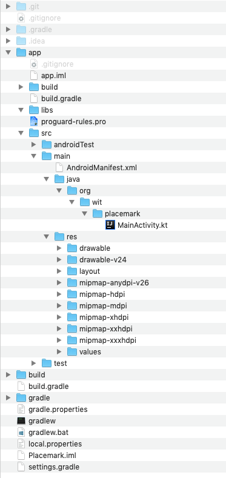

# Key Project Files & Resources

Although the project structure looks daunting, there are only a small number of source files to work with regularly:

Find each of these files now (there are presented here without filenames)

```kotlin
package org.wit.placemark

import androidx.appcompat.app.AppCompatActivity
import android.os.Bundle

class PlacemarkActivity : AppCompatActivity() {
  override fun onCreate(savedInstanceState: Bundle?) {
    super.onCreate(savedInstanceState)
    setContentView(R.layout.activity_placemark)
  }
}
```

---

```xml
<?xml version="1.0" encoding="utf-8"?>
<manifest xmlns:android="http://schemas.android.com/apk/res/android"
    package="org.wit.placemark">

  <application
      android:allowBackup="true"
      android:icon="@mipmap/ic_launcher"
      android:label="@string/app_name"
      android:roundIcon="@mipmap/ic_launcher_round"
      android:supportsRtl="true"
      android:theme="@style/AppTheme">
    <activity android:name=".PlacemarkActivity">
      <intent-filter>
        <action android:name="android.intent.action.MAIN" />

        <category android:name="android.intent.category.LAUNCHER" />
      </intent-filter>
    </activity>
  </application>

</manifest>
```

---

```groovy
// Top-level build file where you can add configuration options common to all sub-projects/modules.
buildscript {
  ext.kotlin_version = "1.4.0"
  repositories {
    google()
    jcenter()
  }
  dependencies {
    classpath "com.android.tools.build:gradle:4.0.1"
    classpath "org.jetbrains.kotlin:kotlin-gradle-plugin:$kotlin_version"

    // NOTE: Do not place your application dependencies here; they belong
    // in the individual module build.gradle files
  }
}

allprojects {
  repositories {
    google()
    jcenter()
  }
}

task clean(type: Delete) {
  delete rootProject.buildDir
}
```

---

```groovy
apply plugin: 'com.android.application'
apply plugin: 'kotlin-android'
apply plugin: 'kotlin-android-extensions'

android {
  compileSdkVersion 29
  buildToolsVersion "30.0.2"

  defaultConfig {
    applicationId "org.wit.placemark"
    minSdkVersion 23
    targetSdkVersion 29
    versionCode 1
    versionName "1.0"

    testInstrumentationRunner "androidx.test.runner.AndroidJUnitRunner"
  }

  buildTypes {
    release {
      minifyEnabled false
      proguardFiles getDefaultProguardFile('proguard-android-optimize.txt'), 'proguard-rules.pro'
    }
  }
}

dependencies {
  implementation fileTree(dir: "libs", include: ["*.jar"])
  implementation "org.jetbrains.kotlin:kotlin-stdlib:$kotlin_version"
  implementation 'androidx.core:core-ktx:1.1.0'
  implementation 'androidx.appcompat:appcompat:1.1.0'
  implementation 'androidx.constraintlayout:constraintlayout:1.1.3'
  testImplementation 'junit:junit:4.12'
  androidTestImplementation 'androidx.test.ext:junit:1.1.1'
  androidTestImplementation 'androidx.test.espresso:espresso-core:3.2.0'

}
```

---

```xml
<?xml version="1.0" encoding="utf-8"?>
<androidx.constraintlayout.widget.ConstraintLayout xmlns:android="http://schemas.android.com/apk/res/android"
    xmlns:app="http://schemas.android.com/apk/res-auto"
    xmlns:tools="http://schemas.android.com/tools"
    android:layout_width="match_parent"
    android:layout_height="match_parent"
    tools:context=".PlacemarkActivity">

  <TextView
      android:layout_width="wrap_content"
      android:layout_height="wrap_content"
      android:text="Hello World!"
      app:layout_constraintBottom_toBottomOf="parent"
      app:layout_constraintLeft_toLeftOf="parent"
      app:layout_constraintRight_toRightOf="parent"
      app:layout_constraintTop_toTopOf="parent" />

</androidx.constraintlayout.widget.ConstraintLayout>
```

---

```xml
<resources>
  <string name="app_name">Placemark</string>
</resources>
```

---

```xml
<?xml version="1.0" encoding="utf-8"?>
<resources>
  <color name="colorPrimary">#6200EE</color>
  <color name="colorPrimaryDark">#3700B3</color>
  <color name="colorAccent">#03DAC5</color>
</resources>
```

---

```xml
<resources>
  <!-- Base application theme. -->
  <style name="AppTheme" parent="Theme.AppCompat.Light.DarkActionBar">
    <!-- Customize your theme here. -->
    <item name="colorPrimary">@color/colorPrimary</item>
    <item name="colorPrimaryDark">@color/colorPrimaryDark</item>
    <item name="colorAccent">@color/colorAccent</item>
  </style>

</resources>
```

The files are (in order of appearance)

- app/src/main/java/org/wit/placemark/MainActivity.kt
- app/src/main/AndroidManifest.xml
- build.gradle
- app/build.gradle
- app/src/main/res/layout/activity_main.xml
- app/src/main/res/values/strings.xml
- app/src/main/res/values/colors.xml
- app/src/main/res/values/styles.xml

Locate all of these files in the Android Studio 'Android' perspective:



and in the 'Project' perspective:



and using Finder/Explorer:



As you gain experience in android - the role and purpose of each of these files will become clearer.
