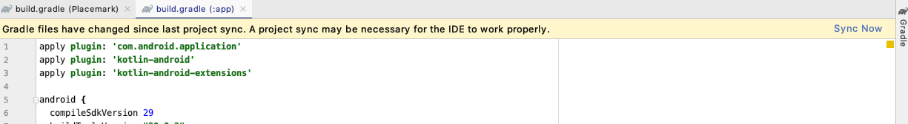
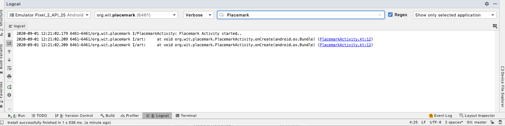

# Logging Event Handling in Kotlin

We are going to be working exclusively in Kotlin - not Java. This affords considerable improvements, largely around conciseness and expressiveness of code.

## Logging

To prepare for this, include this additional dependency in our build.gradle

## build.gradle

```groovy
  implementation 'org.jetbrains.anko:anko-commons:0.10.8'
```

There are 2 build.gradle files - add the above to the one inside the 'app' folder

The dependencies section will look like this now:

```groovy
dependencies {
  implementation fileTree(dir: "libs", include: ["*.jar"])
  implementation "org.jetbrains.kotlin:kotlin-stdlib:$kotlin_version"
  implementation 'androidx.core:core-ktx:1.1.0'
  implementation 'androidx.appcompat:appcompat:1.1.0'
  implementation 'androidx.constraintlayout:constraintlayout:1.1.3'
  implementation 'org.jetbrains.anko:anko-commons:0.10.8'
  testImplementation 'junit:junit:4.12'
  androidTestImplementation 'androidx.test.ext:junit:1.1.1'
  androidTestImplementation 'androidx.test.espresso:espresso-core:3.2.0'

}
```

When you make a change to the gradle file, Studio will offer you a change to 'sync' the gradle configuration:



In this case, pressing 'sync' will download the library we have just added and rebuild the application.

## Anko Logging

This library we have introduced is documented here:

- <https://github.com/Kotlin/anko>

We will be progressively introducing some of its features as we evolve the application.

The first feature is a simple way of logging. Change the class to include the 'AnkoLogger' feature:

## PlacemarkActivity

```kotlin
..
class PlacemarkActivity : AppCompatActivity(), AnkoLogger {
...
```

When you make this change, AnkoLogger will not be recognized - so you will need to import it. This can be triggered automatically (if you can figure this out). The correct import statement is:

```
import org.jetbrains.anko.AnkoLogger
```

Then, in our onCreate() method, try it out:

```kotlin
...
    info("Placemark Activity started..")
...
```

Again, this will require an import - which will be this:

```kotlin
import org.jetbrains.anko.info
```

Try to figure out the key strokes required to generate this...

Now, make sure you can run the app and see this log in the 'Logcat' view in Studio:



In the above, we have entered the search term 'Placemark' in order to see the entry...

Do not proceed further until you can locate something like the above in Logcat. The logs are a bit noisy, and may contain what look like errors. However, buried in there should be your message.

This style of logging is discussed here:

- <https://github.com/Kotlin/anko/wiki/Anko-Commons-%E2%80%93-Logging>

This is the complete class;

```kotlin
package org.wit.placemark

import androidx.appcompat.app.AppCompatActivity
import android.os.Bundle
import org.jetbrains.anko.AnkoLogger
import org.jetbrains.anko.info

class PlacemarkActivity : AppCompatActivity(), AnkoLogger {
  override fun onCreate(savedInstanceState: Bundle?) {
    super.onCreate(savedInstanceState)
    info("Placemark Activity started..")
    setContentView(R.layout.activity_placemark)
  }
}
```
