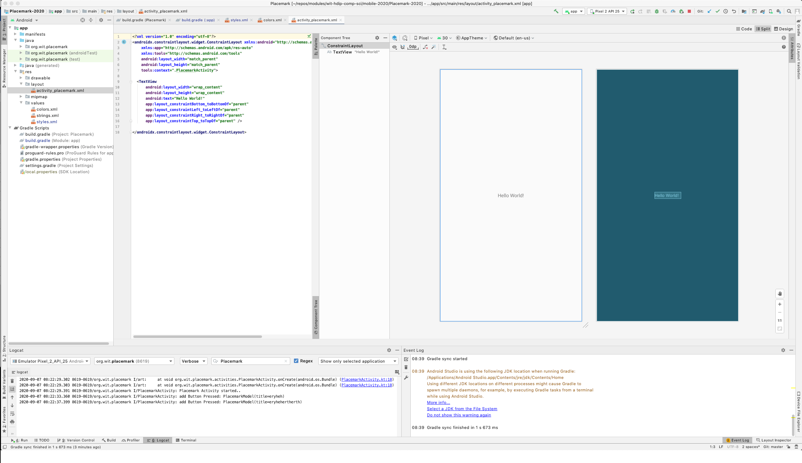
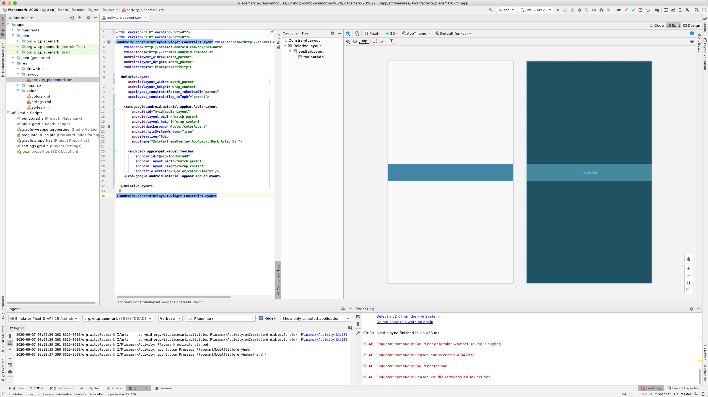
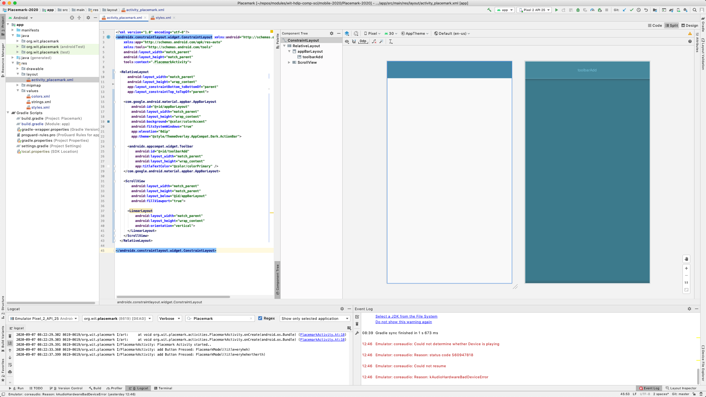
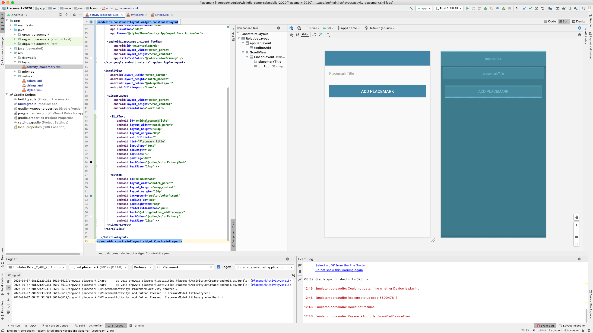

# Layouts

Working with `activity_placemark.xml`, progressively introduce the following versions - replacing each with the successive content below via simple copy/paste of the xml content n the `code` view. Keep an eye on the `design` view as you progress to notice the changes - perhaps consider using the `split` view.

This is what you may currently have (in split view):



... and this is the layout file:

## activity_placemark.xml Version A

```xml
<?xml version="1.0" encoding="utf-8"?>
<androidx.constraintlayout.widget.ConstraintLayout xmlns:android="http://schemas.android.com/apk/res/android"
    xmlns:app="http://schemas.android.com/apk/res-auto"
    xmlns:tools="http://schemas.android.com/tools"
    android:layout_width="match_parent"
    android:layout_height="match_parent"
    tools:context=".PlacemarkActivity">

  <TextView
      android:layout_width="wrap_content"
      android:layout_height="wrap_content"
      android:text="Hello World!"
      app:layout_constraintBottom_toBottomOf="parent"
      app:layout_constraintLeft_toLeftOf="parent"
      app:layout_constraintRight_toRightOf="parent"
      app:layout_constraintTop_toTopOf="parent" />

</androidx.constraintlayout.widget.ConstraintLayout>
```

## activity_placemark.xml Version B

Now make the following change ... replace the current contents to include relative layout + toolbar

```xml
<?xml version="1.0" encoding="utf-8"?>
<androidx.constraintlayout.widget.ConstraintLayout xmlns:android="http://schemas.android.com/apk/res/android"
  xmlns:app="http://schemas.android.com/apk/res-auto"
  xmlns:tools="http://schemas.android.com/tools"
  android:layout_width="match_parent"
  android:layout_height="match_parent"
  tools:context=".PlacemarkActivity">

  <RelativeLayout
    android:layout_width="match_parent"
    android:layout_height="wrap_content"
    app:layout_constraintBottom_toBottomOf="parent"
    app:layout_constraintTop_toTopOf="parent">

    <com.google.android.material.appbar.AppBarLayout
      android:id="@+id/appBarLayout"
      android:layout_width="match_parent"
      android:layout_height="wrap_content"
      android:background="@color/colorAccent"
      android:fitsSystemWindows="true"
      app:elevation="0dip"
      app:theme="@style/ThemeOverlay.AppCompat.Dark.ActionBar">

      <androidx.appcompat.widget.Toolbar
        android:id="@+id/toolbarAdd"
        android:layout_width="match_parent"
        android:layout_height="wrap_content"
        app:titleTextColor="@color/colorPrimary" />
    </com.google.android.material.appbar.AppBarLayout>

  </RelativeLayout>

</androidx.constraintlayout.widget.ConstraintLayout>
```

Pasting this directly into the layout file - you should see this:



(You may beed to close and reopen the layout to have the design view update)

## activity_placemark.xml Version C

Now we augment with a scroll view containing a linear layout:

```xml
<?xml version="1.0" encoding="utf-8"?>
<androidx.constraintlayout.widget.ConstraintLayout xmlns:android="http://schemas.android.com/apk/res/android"
  xmlns:app="http://schemas.android.com/apk/res-auto"
  xmlns:tools="http://schemas.android.com/tools"
  android:layout_width="match_parent"
  android:layout_height="match_parent"
  tools:context=".PlacemarkActivity">

  <RelativeLayout
    android:layout_width="match_parent"
    android:layout_height="wrap_content"
    app:layout_constraintBottom_toBottomOf="parent"
    app:layout_constraintTop_toTopOf="parent">

    <com.google.android.material.appbar.AppBarLayout
      android:id="@+id/appBarLayout"
      android:layout_width="match_parent"
      android:layout_height="wrap_content"
      android:background="@color/colorAccent"
      android:fitsSystemWindows="true"
      app:elevation="0dip"
      app:theme="@style/ThemeOverlay.AppCompat.Dark.ActionBar">

      <androidx.appcompat.widget.Toolbar
        android:id="@+id/toolbarAdd"
        android:layout_width="match_parent"
        android:layout_height="wrap_content"
        app:titleTextColor="@color/colorPrimary" />
    </com.google.android.material.appbar.AppBarLayout>

    <ScrollView
      android:layout_width="match_parent"
      android:layout_height="match_parent"
      android:layout_below="@id/appBarLayout"
      android:fillViewport="true">

      <LinearLayout
        android:layout_width="match_parent"
        android:layout_height="wrap_content"
        android:orientation="vertical">
      </LinearLayout>
    </ScrollView>
  </RelativeLayout>

</androidx.constraintlayout.widget.ConstraintLayout>
```



## activity_placemark.xml Version D

For the next version, we need an additional text resource - these are defined in strings.xml:

## strings.xml

````xml
<resources>
  <string name="app_name">Placemark</string>
  <string name="hint_placemarkTitle">Placemark Title</string>
</resources>

With this in place, we can the scroll view linear layout can contain a text edit field:

```xml
<?xml version="1.0" encoding="utf-8"?>
<androidx.constraintlayout.widget.ConstraintLayout xmlns:android="http://schemas.android.com/apk/res/android"
  xmlns:app="http://schemas.android.com/apk/res-auto"
  xmlns:tools="http://schemas.android.com/tools"
  android:layout_width="match_parent"
  android:layout_height="match_parent"
  tools:context=".PlacemarkActivity">

  <RelativeLayout
    android:layout_width="match_parent"
    android:layout_height="wrap_content"
    app:layout_constraintBottom_toBottomOf="parent"
    app:layout_constraintTop_toTopOf="parent">

    <com.google.android.material.appbar.AppBarLayout
      android:id="@+id/appBarLayout"
      android:layout_width="match_parent"
      android:layout_height="wrap_content"
      android:background="@color/colorAccent"
      android:fitsSystemWindows="true"
      app:elevation="0dip"
      app:theme="@style/ThemeOverlay.AppCompat.Dark.ActionBar">

      <androidx.appcompat.widget.Toolbar
        android:id="@+id/toolbarAdd"
        android:layout_width="match_parent"
        android:layout_height="wrap_content"
        app:titleTextColor="@color/colorPrimary" />
    </com.google.android.material.appbar.AppBarLayout>

    <ScrollView
      android:layout_width="match_parent"
      android:layout_height="match_parent"
      android:layout_below="@id/appBarLayout"
      android:fillViewport="true">

      <LinearLayout
        android:layout_width="match_parent"
        android:layout_height="wrap_content"
        android:orientation="vertical">

        <EditText
          android:id="@+id/placemarkTitle"
          android:layout_width="match_parent"
          android:layout_height="45dp"
          android:layout_margin="8dp"
          android:autofillHints=""
          android:hint="@string/hint_placemarkTitle"
          android:inputType="text"
          android:maxLength="25"
          android:maxLines="1"
          android:padding="8dp"
          android:textColor="@color/colorPrimaryDark"
          android:textSize="14sp" />

      </LinearLayout>
    </ScrollView>
  </RelativeLayout>

</androidx.constraintlayout.widget.ConstraintLayout>
````

We should see the text field:


## activity_placemark.xml Version E

Introduce an additional string resource:

```
  <string name="button_addPlacemark">Add Placemark</string>
```

We can now add a button in the layout

```xml
<?xml version="1.0" encoding="utf-8"?>
<androidx.constraintlayout.widget.ConstraintLayout
  xmlns:android="http://schemas.android.com/apk/res/android"
  xmlns:app="http://schemas.android.com/apk/res-auto"
  xmlns:tools="http://schemas.android.com/tools"
  android:layout_width="match_parent"
  android:layout_height="match_parent"
  tools:context="org.wit.placemark.PlacemarkActivity">

  <RelativeLayout
    android:layout_width="match_parent"
    android:layout_height="wrap_content"
    app:layout_constraintBottom_toBottomOf="parent"
    app:layout_constraintTop_toTopOf="parent">

    <com.google.android.material.appbar.AppBarLayout
      android:id="@+id/appBarLayout"
      android:layout_width="match_parent"
      android:layout_height="wrap_content"
      android:background="@color/colorAccent"
      android:fitsSystemWindows="true"
      app:elevation="0dip"
      app:theme="@style/ThemeOverlay.AppCompat.Dark.ActionBar">

      <androidx.appcompat.widget.Toolbar
        android:id="@+id/toolbarAdd"
        android:layout_width="match_parent"
        android:layout_height="wrap_content"
        app:titleTextColor="@color/colorPrimary" />
    </com.google.android.material.appbar.AppBarLayout>

    <ScrollView
      android:layout_width="match_parent"
      android:layout_height="match_parent"
      android:layout_below="@id/appBarLayout"
      android:fillViewport="true">

      <LinearLayout
        android:layout_width="match_parent"
        android:layout_height="wrap_content"
        android:orientation="vertical">

        <EditText
          android:id="@+id/placemarkTitle"
          android:layout_width="match_parent"
          android:layout_height="45dp"
          android:layout_margin="8dp"
          android:autofillHints=""
          android:hint="@string/hint_placemarkTitle"
          android:inputType="text"
          android:maxLength="25"
          android:maxLines="1"
          android:padding="8dp"
          android:textColor="@color/colorPrimaryDark"
          android:textSize="14sp" />

        <Button
          android:id="@+id/btnAdd"
          android:layout_width="match_parent"
          android:layout_height="wrap_content"
          android:layout_margin="16dp"
          android:background="@color/colorAccent"
          android:paddingTop="8dp"
          android:paddingBottom="8dp"
          android:stateListAnimator="@null"
          android:text="@string/button_addPlacemark"
          android:textColor="@color/colorPrimary"
          android:textSize="16sp" />
      </LinearLayout>
    </ScrollView>

  </RelativeLayout>
</androidx.constraintlayout.widget.ConstraintLayout>
```



Building layouts textually like this is a useful skill to acquire over time. Initially, you will probably be most comfortable with drawing the layouts using the design view.

Make sure the application launches now - and the design view is presented in the running app


This short article on layouts is as useful primer:

- <https://medium.com/google-developers/layouts-attributes-and-you-9e5a4b4fe32c.
