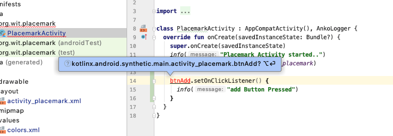
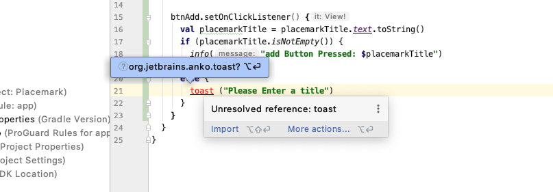
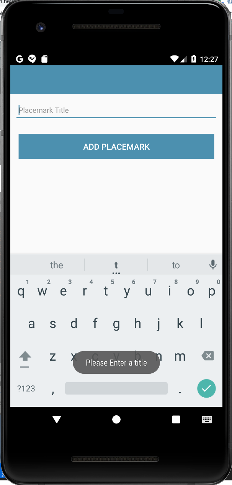

# Event Handling

Now include the following inside the onCreate function:

```kotlin
    btnAdd.setOnClickListener() {
      info("add Button Pressed")
    }
```

Introducing this will require additional imports - get used to selecting these as prompted by Studio. On this occasion you will be presented with a choice of imports:



We need to select the synthetic import.The complete class will look like this:

```kotlin
package org.wit.placemark.activities

import androidx.appcompat.app.AppCompatActivity
import android.os.Bundle
import kotlinx.android.synthetic.main.activity_placemark.*
import org.jetbrains.anko.AnkoLogger
import org.jetbrains.anko.info
import org.wit.placemark.R

class PlacemarkActivity : AppCompatActivity(), AnkoLogger {

  override fun onCreate(savedInstanceState: Bundle?) {
    super.onCreate(savedInstanceState)
    setContentView(R.layout.activity_placemark)
    info("Placemark Activity started..")

    btnAdd.setOnClickListener() {
      info("add Button Pressed")
    }
  }
}

```

Make sure you can run the app and that you can see the 'add button pressed' log.

Read this short blog post outlining how the above code differers from the traditional java implementation of same.

- <https://antonioleiva.com/lambdas-kotlin-android/>

Try this alternative implementation of the event handler:

```kotlin
    btnAdd.setOnClickListener() {
      val placemarkTitle = placemarkTitle.text.toString()
      if (placemarkTitle.isNotEmpty()) {
        info("add Button Pressed: $placemarkTitle")
      }
      else {
        toast ("Please Enter a title")
      }
    }
```

You will need to include an import for the toast:



Try it out and notice the difference - particularly if you press add without entering a title... a 'toast' should appear along the footer:



In the above we are using anko toasts:

- <https://github.com/Kotlin/anko/wiki/Anko-Commons-%E2%80%93-Dialogs#toasts>
