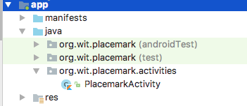
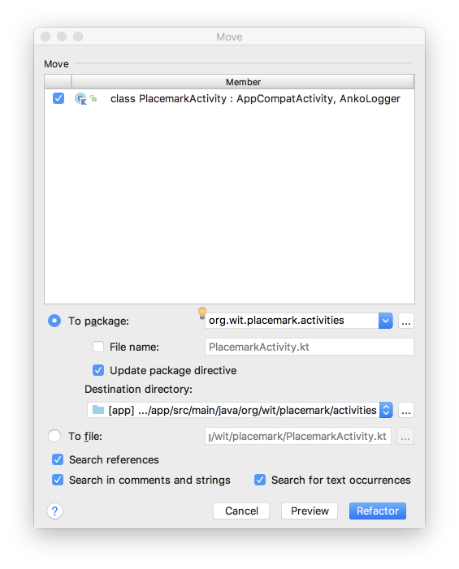

# Refactor

Refactor the application structure such that ActivityPlacemark is in a new package called 'org.wit.placemarks.activities':

You should be able to do this from within the Studio Android perspective. You will be using the context menu to create the new package in the java folder:

and then dragging/dropping the class into this new package. This will automatically trigger refactor step:

Once this is completed, a number of files will be automatically changed:

- AndroidManifest.xml
- PlacemarkActivity.kt
- activity_placemark.xml

See if you can locate each of the changes...
