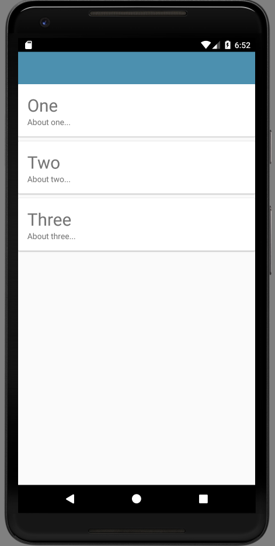

# Card + RecyclerView

To display a list of Placemarks, we will make use of these components:

- CardView
- RecyclerView
- RecyclerViewAdapter

Orchestrating these three is now a familiar patterns in Android development. It is covered briefly in this article here:

- <https://developer.android.com/training/material/lists-cards.html>

This is worth a quick skim read before proceeding.

Introduce this new layout into the res/layout folder:

## card_placemark.xml

```xml
<?xml version="1.0" encoding="utf-8"?>
<androidx.cardview.widget.CardView
  xmlns:android="http://schemas.android.com/apk/res/android"
  android:layout_width="match_parent"
  android:layout_height="wrap_content"
  android:layout_marginBottom="8dp"
  android:elevation="24dp">

  <RelativeLayout
    android:layout_width="match_parent"
    android:layout_height="wrap_content"
    android:padding="16dp">

    <TextView
      android:id="@+id/placemarkTitle"
      android:layout_width="wrap_content"
      android:layout_height="wrap_content"
      android:layout_alignParentTop="true"
      android:textSize="30sp" />

    <TextView
      android:id="@+id/description"
      android:layout_width="wrap_content"
      android:layout_height="wrap_content"
      android:layout_below="@id/placemarkTitle" />

  </RelativeLayout>
</androidx.cardview.widget.CardView>
```

When you rebuild the project, you should be able to view the card in design view.

To dynamically insert cards into the activity_placemark_list layout - by introducing a RecyclerView widget like this:

## `activity_placemark_list.xml`

```xml
...
  <androidx.recyclerview.widget.RecyclerView
    android:id="@+id/recyclerView"
    android:layout_width="match_parent"
    android:layout_height="match_parent"
    android:scrollbars="vertical"
    app:layout_behavior="@string/appbar_scrolling_view_behavior" />
...
```

This is to be inserted just before the closing tag of activity_placemark_list.

## RecyclerView + Adapter

With these resources in place - the PlacemarkListActivity can be reworked to include the RecyclerView + adapter:

## PlacemarkListActivity

```kotlin
package org.wit.placemark.activities

import android.os.Bundle
import android.view.LayoutInflater
import android.view.View
import android.view.ViewGroup
import androidx.appcompat.app.AppCompatActivity
import androidx.recyclerview.widget.LinearLayoutManager
import androidx.recyclerview.widget.RecyclerView
import kotlinx.android.synthetic.main.activity_placemark_list.*
import kotlinx.android.synthetic.main.card_placemark.view.*
import org.wit.placemark.R
import org.wit.placemark.main.MainApp
import org.wit.placemark.models.PlacemarkModel

class PlacemarkListActivity : AppCompatActivity() {

  lateinit var app: MainApp

  override fun onCreate(savedInstanceState: Bundle?) {
    super.onCreate(savedInstanceState)
    setContentView(R.layout.activity_placemark_list)
    app = application as MainApp

    val layoutManager = LinearLayoutManager(this)
    recyclerView.layoutManager = layoutManager
    recyclerView.adapter = PlacemarkAdapter(app.placemarks)
  }
}

class PlacemarkAdapter constructor(private var placemarks: List<PlacemarkModel>) :
  RecyclerView.Adapter<PlacemarkAdapter.MainHolder>() {

  override fun onCreateViewHolder(parent: ViewGroup, viewType: Int): MainHolder {
    return MainHolder(
      LayoutInflater.from(parent?.context).inflate(
        R.layout.card_placemark,
        parent,
        false
      )
    )
  }

  override fun onBindViewHolder(holder: MainHolder, position: Int) {
    val placemark = placemarks[holder.adapterPosition]
    holder.bind(placemark)
  }

  override fun getItemCount(): Int = placemarks.size

  class MainHolder constructor(itemView: View) : RecyclerView.ViewHolder(itemView) {

    fun bind(placemark: PlacemarkModel) {
      itemView.placemarkTitle.text = placemark.title
      itemView.description.text = placemark.description
    }
  }
}
```

The app should run now - but will still be blank. In MainApp, we can add some test placemarks to test out the Recycler machinery:

## MainApp

````
```kotlin
  override fun onCreate() {
    super.onCreate()
    info("Placemark started")
    placemarks.add(PlacemarkModel("One", "About one..."))
    placemarks.add(PlacemarkModel("Two", "About two..."))
    placemarks.add(PlacemarkModel("Three", "About three..."))
  }
...
````


