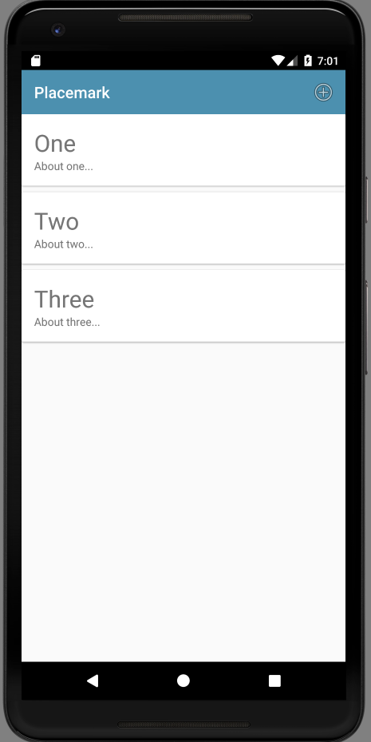

# Menu & Actionbar

In order to trigger the creation of Placemarks, we need some menu/action mechanic on our home screen. This will be provided by supporting a button/menu an action bar along the top of the PlacemarkListActivity.

First a new string resource:

## stings.xml

```xml
  <string name="menu_addPlacemark">Add</string>
```

Then a new menu resource:

## menu_main.xml

```xml
<?xml version="1.0" encoding="utf-8"?>
<menu xmlns:android="http://schemas.android.com/apk/res/android"
  xmlns:app="http://schemas.android.com/apk/res-auto">

  <item
    android:id="@+id/item_add"
    android:icon="@android:drawable/ic_menu_add"
    android:title="@string/menu_addPlacemark"
    app:showAsAction="always" />
</menu>
```

The above resource must be in its own folder:


In the PlacemarkListActivity onCreate method, we must enable the action bar (and give it a title):

## PlacemarkListActivity

```kotlin
...
    toolbar.title = title
    setSupportActionBar(toolbar)
...
```

... and then override the method to load the menu resource:

```kotlin
...
  override fun onCreateOptionsMenu(menu: Menu?): Boolean {
    menuInflater.inflate(R.menu.menu_main, menu)
    return super.onCreateOptionsMenu(menu)
  }
...
```

This gives us a single button on the action bar:



This is the stock icon we are using is

```xml
      android:icon="@android:drawable/ic_menu_add"
```

This is drawn from this set:

- <http://androiddrawables.com/Menu.html>

These can change with each release of Android - a comprehensive set of all drawable resources is available here:

- <http://androiddrawables.com/>

This is the complete PlacemarkListActivity at this stage:

## PlacemarkListActivity

```kotlin
package org.wit.placemark.activities

import android.os.Bundle
import android.view.LayoutInflater
import android.view.Menu
import android.view.View
import android.view.ViewGroup
import androidx.appcompat.app.AppCompatActivity
import androidx.recyclerview.widget.LinearLayoutManager
import androidx.recyclerview.widget.RecyclerView
import kotlinx.android.synthetic.main.activity_placemark_list.*
import kotlinx.android.synthetic.main.card_placemark.view.*
import org.wit.placemark.R
import org.wit.placemark.main.MainApp
import org.wit.placemark.models.PlacemarkModel

class PlacemarkListActivity : AppCompatActivity() {

  lateinit var app: MainApp

  override fun onCreate(savedInstanceState: Bundle?) {
    super.onCreate(savedInstanceState)
    setContentView(R.layout.activity_placemark_list)
    app = application as MainApp

    toolbar.title = title
    setSupportActionBar(toolbar)

    val layoutManager = LinearLayoutManager(this)
    recyclerView.layoutManager = layoutManager
    recyclerView.adapter = PlacemarkAdapter(app.placemarks)
  }

  override fun onCreateOptionsMenu(menu: Menu?): Boolean {
    menuInflater.inflate(R.menu.menu_main, menu)
    return super.onCreateOptionsMenu(menu)
  }
}

class PlacemarkAdapter constructor(private var placemarks: List<PlacemarkModel>) :
  RecyclerView.Adapter<PlacemarkAdapter.MainHolder>() {

  override fun onCreateViewHolder(parent: ViewGroup, viewType: Int): MainHolder {
    return MainHolder(
      LayoutInflater.from(parent?.context).inflate(
        R.layout.card_placemark,
        parent,
        false
      )
    )
  }

  override fun onBindViewHolder(holder: MainHolder, position: Int) {
    val placemark = placemarks[holder.adapterPosition]
    holder.bind(placemark)
  }

  override fun getItemCount(): Int = placemarks.size

  class MainHolder constructor(itemView: View) : RecyclerView.ViewHolder(itemView) {

    fun bind(placemark: PlacemarkModel) {
      itemView.placemarkTitle.text = placemark.title
      itemView.description.text = placemark.description
    }
  }
}
```
