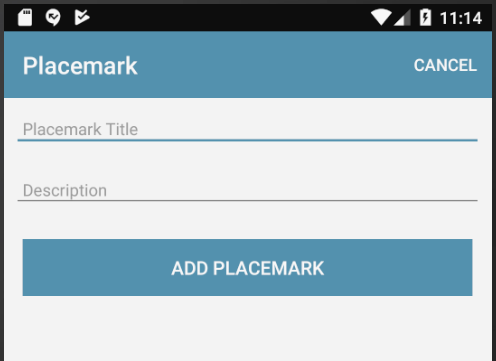

#Solution

Placemark application so far:

- [placemark-02.zip](archives/placemark-02.zip)

## Exercise 1: Sample Solution

Make sure you can download and run the sample solution (archive above)

## Exercise 2: Cancel Button

Incorporate new 'Cancel' action into `PlacemarkActivity`. This should return to PlacemarkListActivity without adding a new Placemark.

Follow the steps 05 & 06 in this lab as a guide to doing this. Remember, you will be introducing the menu/action into PlacemarkActivity.

## Exercise 3: Refactor PlacemarkAdapter to its own source file.

The PlacemarkAdapter class is currently in the same source file as the PlacemarkListActivity class. For clarity and ease of maintenance, move this into its own source file.
