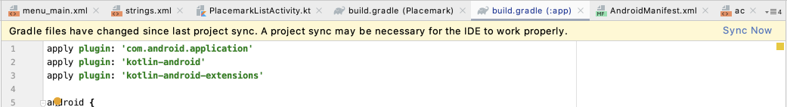
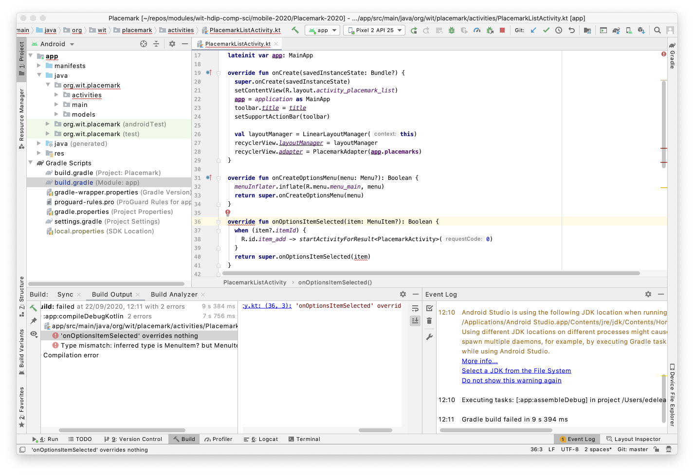

# CompileSdkVersion Upgrade

It might be worth a quick scan of this brief article here:

- [Picking your compileSdkVersion, minSdkVersion, and targetSdkVersion](https://medium.com/androiddevelopers/picking-your-compilesdkversion-minsdkversion-targetsdkversion-a098a0341ebd)

We are happy to run with these settings:

```groovy
    minSdkVersion 23
    targetSdkVersion 29
```

This give us a reasonable balance of phone coverage and android features.

However, this setting:

```groovy
  compileSdkVersion 29
```

... is largely independent of the 'min' and 'target' sdk versions above. In general, we would like to keep the compileSdkVersion at the latest as released by Google.

Your gradle file might look like this:

```groovy
apply plugin: 'com.android.application'
apply plugin: 'kotlin-android'
apply plugin: 'kotlin-android-extensions'

android {
  compileSdkVersion 29
  buildToolsVersion "30.0.2"

  defaultConfig {
    applicationId "org.wit.placemark"
    minSdkVersion 23
    targetSdkVersion 29
    versionCode 1
    versionName "1.0"

    testInstrumentationRunner "androidx.test.runner.AndroidJUnitRunner"
  }

  buildTypes {
    release {
      minifyEnabled false
      proguardFiles getDefaultProguardFile('proguard-android-optimize.txt'), 'proguard-rules.pro'
    }
  }
}

dependencies {
  implementation fileTree(dir: "libs", include: ["*.jar"])
  implementation "org.jetbrains.kotlin:kotlin-stdlib:$kotlin_version"
  implementation 'androidx.core:core-ktx:1.3.1'
  implementation 'androidx.appcompat:appcompat:1.2.0'
  implementation 'androidx.constraintlayout:constraintlayout:2.0.1'
  implementation 'com.google.android.material:material:1.2.1'
  implementation 'org.jetbrains.anko:anko-commons:0.10.8'
  testImplementation 'junit:junit:4.12'
  androidTestImplementation 'androidx.test.ext:junit:1.1.2'
  androidTestImplementation 'androidx.test.espresso:espresso-core:3.3.0'

}
```

Google have released a new compileSdkVersion - 30 - which you may have been prompted to install, or which will have been selected if you creates a completed new project in the last few weeks. Lets update it now:

```groovy
  compileSdkVersion 30
```

When you make this change - Studio will notice an update and suggest you 'sync`:



Sync now - and then attempt to run. You will get an error:



Remove the `?` from the parameter -

```kotlin
...
  override fun onOptionsItemSelected(item: MenuItem): Boolean {
...
```

and it should now compile and run correctly. Essentially the Kotlin API signature has been tightened, such that it now guarantees that the menu will be non-null.

Android version management is challenging - this is a brief glimpse into some of the complexities.
