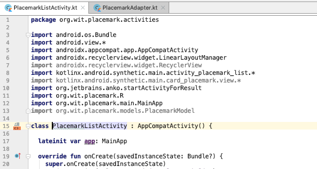

# Exercise Solutions

## Exercise 2: Cancel Button

Incorporate new 'Cancel' action into `PlacemarkActivity`. This should return to PlacemarkListActivity without adding a new Placemark.


## strings.xml

```xml
...
  <string name="menu_cancelPlacemark">Cancel</string>
...
```

## res/menu/menu_placemark.xml

This resources must be in the `menu` folder in `res`

```xml
<?xml version="1.0" encoding="utf-8"?>
<menu xmlns:android="http://schemas.android.com/apk/res/android"
  xmlns:app="http://schemas.android.com/apk/res-auto">

  <item
    android:id="@+id/item_cancel"
    android:title="@string/menu_cancelPlacemark"
    app:showAsAction="always"/>
</menu>
```

## PlacemarkActivity

In order to present the toolbar - we must explicitly enable it:

```kotlin
...
 override fun onCreate(savedInstanceState: Bundle?) {
    ...
    toolbarAdd.title = title
    setSupportActionBar(toolbarAdd)
    info("Placemark Activity started..")
    ...
    }
  }
...
```

Then we need to `inflate` the menu:

```kotlin
  override fun onCreateOptionsMenu(menu: Menu): Boolean {
    menuInflater.inflate(R.menu.menu_placemark, menu)
    return super.onCreateOptionsMenu(menu)
  }
```

Run the application now - and the CANCEL button should appear on the toolbar in the PlacemarkActivity:


This is PlacemarkActivity at this stage:

```kotlin
package org.wit.placemark.activities

import androidx.appcompat.app.AppCompatActivity
import android.os.Bundle
import android.view.Menu
import kotlinx.android.synthetic.main.activity_placemark.*
import org.jetbrains.anko.AnkoLogger
import org.jetbrains.anko.info
import org.jetbrains.anko.toast
import org.wit.placemark.R
import org.wit.placemark.main.MainApp
import org.wit.placemark.models.PlacemarkModel

class PlacemarkActivity : AppCompatActivity(), AnkoLogger {

  var placemark = PlacemarkModel()
  lateinit var app: MainApp

  override fun onCreate(savedInstanceState: Bundle?) {
    super.onCreate(savedInstanceState)
    setContentView(R.layout.activity_placemark)
    toolbarAdd.title = title
    setSupportActionBar(toolbarAdd)
    info("Placemark Activity started..")

    app = application as MainApp

    btnAdd.setOnClickListener() {
      placemark.title = placemarkTitle.text.toString()
      placemark.description = description.text.toString()
      if (placemark.title.isNotEmpty()) {
        app.placemarks.add(placemark.copy())
        info("add Button Pressed: ${placemark}")
        for (i in app.placemarks.indices) {
          info("Placemark[$i]:${app.placemarks[i]}")
        }
        setResult(AppCompatActivity.RESULT_OK)
        finish()
      } else {
        toast("Please Enter a title")
      }
    }
  }

  override fun onCreateOptionsMenu(menu: Menu): Boolean {
    menuInflater.inflate(R.menu.menu_placemark, menu)
    return super.onCreateOptionsMenu(menu)
  }
}

```

Finally, we need to handle the menu CANCEL event with this new method:

```kotlin
  override fun onOptionsItemSelected(item: MenuItem): Boolean {
    when (item?.itemId) {
      R.id.item_cancel -> {
        finish()
      }
    }
    return super.onOptionsItemSelected(item)
  }
...
```

When you run the app now, pressing CANCEL should dismiss PlacemarkActivity.

# Exercise 3: Refactor PlacemarkAdapter to its own source file.

The PlacemarkAdapter class is currently in the same source file as the PlacemarkListActivity class. For clarity and ease of maintenance, move this into its own source file.

## PlacemarkAdapter

```kotlin
package org.wit.placemark.activities

import android.view.LayoutInflater
import android.view.View
import android.view.ViewGroup
import androidx.recyclerview.widget.RecyclerView
import kotlinx.android.synthetic.main.card_placemark.view.*
import org.wit.placemark.R
import org.wit.placemark.models.PlacemarkModel

class PlacemarkAdapter constructor(private var placemarks: List<PlacemarkModel>) :
  RecyclerView.Adapter<PlacemarkAdapter.MainHolder>() {

  override fun onCreateViewHolder(parent: ViewGroup, viewType: Int): MainHolder {
    return MainHolder(
        LayoutInflater.from(parent?.context).inflate(R.layout.card_placemark, parent, false)
    )
  }

  override fun onBindViewHolder(holder: MainHolder, position: Int) {
    val placemark = placemarks[holder.adapterPosition]
    holder.bind(placemark)
  }

  override fun getItemCount(): Int = placemarks.size

  class MainHolder constructor(itemView: View) : RecyclerView.ViewHolder(itemView) {

    fun bind(placemark: PlacemarkModel) {
      itemView.placemarkTitle.text = placemark.title
      itemView.description.text = placemark.description
    }
  }
}
```

Delete the PlacemarkAdapter class from PlacemarkListActivity - and rebuild and run the app now to verify that these changes have been engaged correctly.

Check the imports in PlacemarkListActivity:



The greyed out imported are no longer needed (they were used by PlacemarkAdapter). Remove them now and rebuild.
