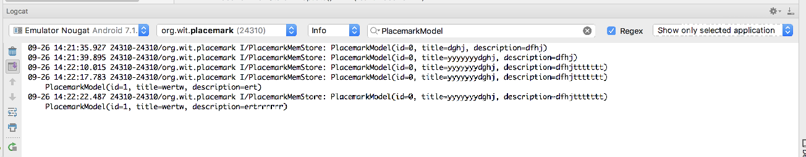

#Solution

Placemark application so far:

- [placemark-03.zip](archives/placemark-03.zip)

## Exercise 1: String Resources

In PlacemarkActivity - we have the following hard coded string:

## PlacemarkActivity
~~~
  toast("Please Enter a title")
~~~

These strings should be in the strings.xml resource file. Move them in there, and figure out how to load the strings in PlacemarkActivity.

For guidance, see:

- <https://developer.android.com/guide/topics/resources/string-resource.html>
- <https://stackoverflow.com/questions/44871481/how-can-i-access-values-from-strings-xml-in-kotlin-android>

## Exercise 2: Add Button Label

When you select a placemark - and the PlacemarkActivity is launched, the button label is 'Add Placemark'. See if you can change this to 'Save Placemark'. This is only to be changed if PlacemarkActivity is launched with a placemark passed to it. Make sure the `Save Placemark` string is externalized (in strings.xml)

## Exercise 3: Edit Placemark

When you select a placemark from PlacemarkListActivity - it presents the activity in the PlacemarkActivity. If you press 'Save Activity' - a new activity is created and appended to the list.

Change this behaviour such that the button should update the existing placemark with the newly entered values, not create a new one.  We have new features in PlacemarkStore to enable you to implement this (the update method). Essentially, you will need to call update OR create when handling the button event.

If you complete the implementation, you will notice that even if you update a Placemark's contents, the new contents will not be displayed in PlacemarkList. However, if you consult the logs you may be able to see if the values are actually changed.

If you have trouble finding the correct logs, enter `PlacemarkModel` in the expression window in logcat. This should remove all logs except the ones you want to see:

