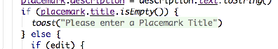
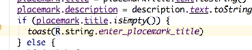

# Exercise Solutions

## Exercise 1: String Resources

In PlacemarkActivity - we have the following hard coded string:

## PlacemarkActivity

```kotlin
  toast("Please Enter a title")
```

These strings should be in the strings.xml resource file.

## Exercise 1 Solution:

## strings.xml

```
  <string name="enter_placemark_title"> Please enter a Placemark Title </string>
```

We can now rewrite the toast like this:

```kotlin
        toast(R.string.enter_placemark_title)
```

Notice that, in studio, you might see the code looking like this:



If you click on the string, then it reveals the id:



This is Studio trying to helpfully display the value of the string by interpolating it from the ID.

# Exercise 2: Add Button Label

When you select a placemark - and the PlacemarkActivity is launched, the button label is 'Add Placemark'. See if you can change this to 'Save Placemark'. This is only to be changed if PlacemarkActivity is launched with a placemark passed to it. Make sure the `Save Placemark` string is externalized (in strings.xml)

## Exercise 2 Solution

## strings.xml

```
  <string name="save_placemark"> Save Placemark </string>
```

## PlacemarkActivity

```kotlin
  if (intent.hasExtra("placemark_edit")) {
      ...
      btnAdd.setText(R.string.save_placemark)
    }
```

## Exercise 3

When you select a placemark from PlacemarkListActivity - it presents the activity in the PlacemarkActivity. If you press 'Save Activity' - a new activity is created and appended to the list.

Change this behaviour such that the button should update the existing placemark with the newly entered values, not create a new one. We have new features in PlacemarkStore to enable you to implement this (the update method). Essentially, you will need to call update OR create when handling the button event.

If you complete the implementation, you will notice that even if you update a Placemark's contents, the new contents will not be displayed in PlacemarkList. However, if you consult the logs you may be able to see if the values are actually changed.

## Exercise 3 Solution

Introduce a local flag in onCreate(), always initialised to false:

## PlacemarkActivity

```kotlin
    var edit = false
```

Set the flag to true if we have a placemark passed:

```kotlin
    if (intent.hasExtra("placemark_edit")) {
      edit = true
      placemark = intent.extras?.getParcelable<PlacemarkModel>("placemark_edit")!!
      placemarkTitle.setText(placemark.title)
      description.setText(placemark.description)
      btnAdd.setText(R.string.save_placemark)
    }
```

Then rework the add button event handler to follows:

```kotlin
    ...
    btnAdd.setOnClickListener() {
      placemark.title = placemarkTitle.text.toString()
      placemark.description = description.text.toString()
      if (placemark.title.isEmpty()) {
        toast(R.string.enter_placemark_title)
      } else {
        if (edit) {
          app.placemarks.update(placemark.copy())
        } else {
          app.placemarks.create(placemark.copy())
        }
      }
      info("add Button Pressed: $placemarkTitle")
      setResult(AppCompatActivity.RESULT_OK)
      finish()
    }
    ...
```

This is the complete PlacemarkActivity class at this stage:

## PlacemarkActivity

```kotlin
package org.wit.placemark.activities

import androidx.appcompat.app.AppCompatActivity
import android.os.Bundle
import android.view.Menu
import android.view.MenuItem
import kotlinx.android.synthetic.main.activity_placemark.*
import org.jetbrains.anko.AnkoLogger
import org.jetbrains.anko.info
import org.jetbrains.anko.toast
import org.wit.placemark.R
import org.wit.placemark.main.MainApp
import org.wit.placemark.models.PlacemarkModel

class PlacemarkActivity : AppCompatActivity(), AnkoLogger {

  var placemark = PlacemarkModel()
  lateinit var app: MainApp

  override fun onCreate(savedInstanceState: Bundle?) {
    super.onCreate(savedInstanceState)
    setContentView(R.layout.activity_placemark)
    toolbarAdd.title = title
    setSupportActionBar(toolbarAdd)
    info("Placemark Activity started..")

    app = application as MainApp

    var edit = false

    if (intent.hasExtra("placemark_edit")) {
      edit = true
      placemark = intent.extras?.getParcelable<PlacemarkModel>("placemark_edit")!!
      placemarkTitle.setText(placemark.title)
      description.setText(placemark.description)
      btnAdd.setText(R.string.save_placemark)
    }

    btnAdd.setOnClickListener() {
      placemark.title = placemarkTitle.text.toString()
      placemark.description = description.text.toString()
      if (placemark.title.isEmpty()) {
        toast(R.string.enter_placemark_title)
      } else {
        if (edit) {
          app.placemarks.update(placemark.copy())
        } else {
          app.placemarks.create(placemark.copy())
        }
      }
      info("add Button Pressed: $placemarkTitle")
      setResult(AppCompatActivity.RESULT_OK)
      finish()
    }
  }

  override fun onCreateOptionsMenu(menu: Menu): Boolean {
    menuInflater.inflate(R.menu.menu_placemark, menu)
    return super.onCreateOptionsMenu(menu)
  }

  override fun onOptionsItemSelected(item: MenuItem): Boolean {
    when (item?.itemId) {
      R.id.item_cancel -> {
        finish()
      }
    }
    return super.onOptionsItemSelected(item)
  }
}
```

When you run the application - see if you can update a placemarks contents. There still seems to be a problem... (see next step)
