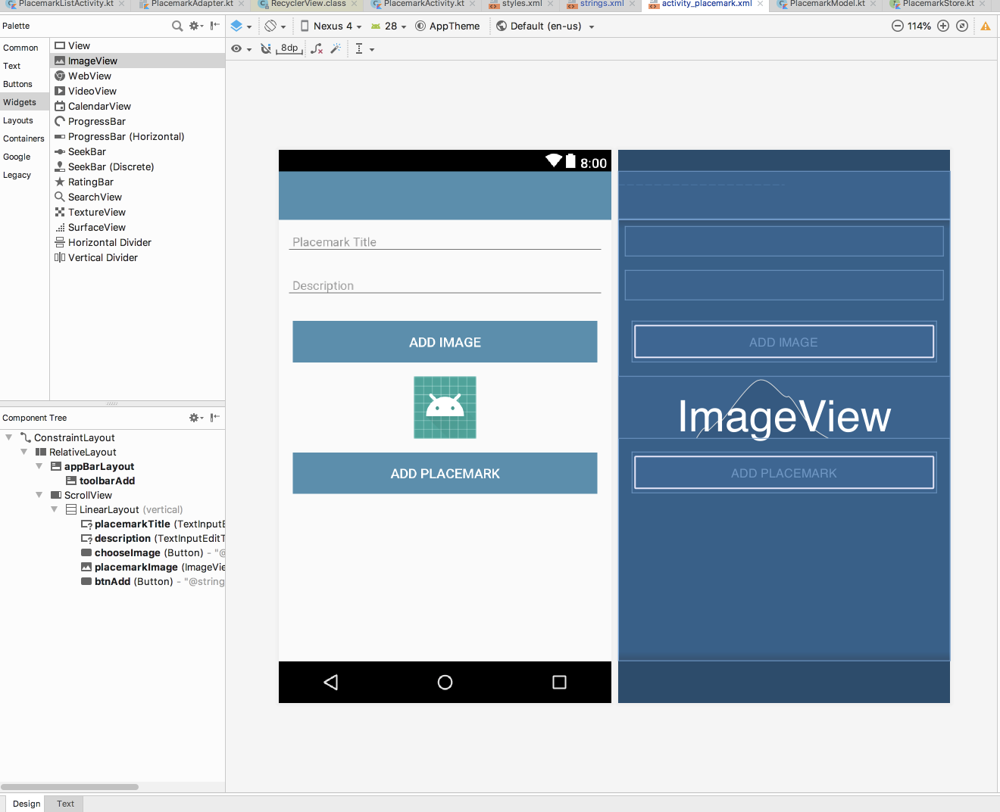

# Add Image UI

We need a new button, which when pressed will allow the user to select an image.

First the button string resource:

## strings.xml

A new string for the button we will introduce:

```
  <string name="button_addImage"> Add Image </string>
```

Then the button itself + an imageView to display the image:

## activity_placemark.xml

Two new controls:

```
        <Button
            android:id="@+id/chooseImage"
            android:layout_width="match_parent"
            android:layout_height="wrap_content"
            android:layout_margin="16dp"
            android:background="@color/colorAccent"
            android:paddingBottom="8dp"
            android:paddingTop="8dp"
            android:text="@string/button_addImage"
            android:textColor="@color/colorPrimary"
            android:textSize="16sp"/>

        <ImageView
            android:id="@+id/placemarkImage"
            android:layout_width="match_parent"
            android:layout_height="wrap_content"
            app:srcCompat="@mipmap/ic_launcher"/>

```

We can add these before the `Add Placemark` button. As we add the above in Studio, they should appear in the Design view:


At runtime, we should see this:


Take some time to look at the `Design` view in studio:



Remove the controls again - and this time add them using the palette - dragging and dropping the button + imageView widgets to achieve the same effect. You will notice, however, that we have a set of additional parameters included in our hand coded xml above.

We can add an event handler for the new button:

## PlacemarkActivity

```kotlin
    chooseImage.setOnClickListener {
      info ("Select image")
    }
```

You can use logcat to verify that this method is being called:


Note that this is `inside` the onCreate method. When you click on the button check that the log message is produced.

This is PlacemarkActivity at this stage:

## PlacemarkActivity

```kotlin
package org.wit.placemark.activities

import androidx.appcompat.app.AppCompatActivity
import android.os.Bundle
import android.view.Menu
import android.view.MenuItem
import kotlinx.android.synthetic.main.activity_placemark.*
import org.jetbrains.anko.AnkoLogger
import org.jetbrains.anko.info
import org.jetbrains.anko.toast
import org.wit.placemark.R
import org.wit.placemark.main.MainApp
import org.wit.placemark.models.PlacemarkModel

class PlacemarkActivity : AppCompatActivity(), AnkoLogger {

  var placemark = PlacemarkModel()
  lateinit var app: MainApp

  override fun onCreate(savedInstanceState: Bundle?) {
    super.onCreate(savedInstanceState)
    setContentView(R.layout.activity_placemark)
    toolbarAdd.title = title
    setSupportActionBar(toolbarAdd)
    info("Placemark Activity started..")

    app = application as MainApp

    var edit = false

    if (intent.hasExtra("placemark_edit")) {
      edit = true
      placemark = intent.extras?.getParcelable<PlacemarkModel>("placemark_edit")!!
      placemarkTitle.setText(placemark.title)
      description.setText(placemark.description)
      btnAdd.setText(R.string.save_placemark)
    }

    btnAdd.setOnClickListener() {
      placemark.title = placemarkTitle.text.toString()
      placemark.description = description.text.toString()
      if (placemark.title.isEmpty()) {
        toast(R.string.enter_placemark_title)
      } else {
        if (edit) {
          app.placemarks.update(placemark.copy())
        } else {
          app.placemarks.create(placemark.copy())
        }
      }
      info("add Button Pressed: $placemarkTitle")
      setResult(AppCompatActivity.RESULT_OK)
      finish()
    }

    chooseImage.setOnClickListener {
      info ("Select image")
    }
  }

  override fun onCreateOptionsMenu(menu: Menu): Boolean {
    menuInflater.inflate(R.menu.menu_placemark, menu)
    return super.onCreateOptionsMenu(menu)
  }

  override fun onOptionsItemSelected(item: MenuItem): Boolean {
    when (item?.itemId) {
      R.id.item_cancel -> {
        finish()
      }
    }
    return super.onOptionsItemSelected(item)
  }
}
```
