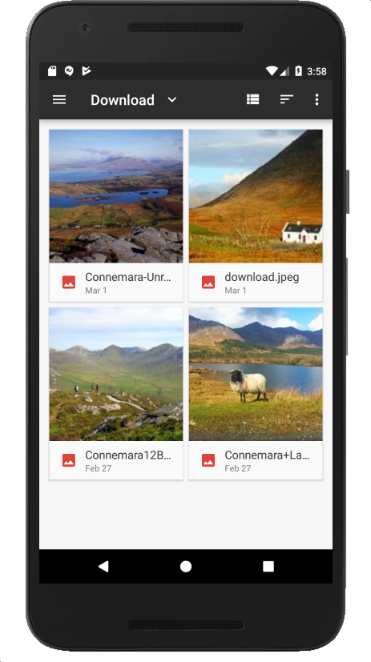

# Selecting Images

We will be supporting the selection of images from the phones gallery/photos. There are APIs in android for this purpose. Since Android 4.4, this has been centralized into the Storage Access Framework:

- <https://developer.android.com/guide/topics/providers/document-provider>

This is part of a larger `Content Provider` architecture - and serves a much broader remit than just accessing photos. We will try to simplify usage of the framework, by encapsulating it in a `helper` class

Create a new package called `org.wit.placemark.helpers`, and incorporate this file into the package:

## ImageHelpers.kt

```kotlin
package org.wit.placemark.helpers

import android.app.Activity
import android.content.Intent
import org.wit.placemark.R

fun showImagePicker(parent: Activity, id: Int) {
  val intent = Intent()
  intent.type = "image/*"
  intent.action = Intent.ACTION_OPEN_DOCUMENT
  intent.addCategory(Intent.CATEGORY_OPENABLE)
  val chooser = Intent.createChooser(intent, R.string.select_placemark_image.toString())
  parent.startActivityForResult(chooser, id)
}
```

This function relies on this new string in strings.xml:

## strings.xml

```
<string name="select_placemark_image">Select placemark image</string>
```

Notice that this is just a function, not a class or an object. Its purpose is to show an image picker dialog.

We will now trigger this dialog. When starting an activity like this, we usually define a special code - which we will expect the new activity to send back when it is finished (otherwise we might get confused as to which activity has just finished).

Here is the id we invent - make it a class member of PlacemakerActivity:

## PlacemakerActivity

```kotlin
  val IMAGE_REQUEST = 1
```

Then to trigger the picker:

```kotlin
    chooseImage.setOnClickListener {
      showImagePicker(this, IMAGE_REQUEST)
    }
```

If there are no images in your simulator, you might want to launch a browser, find some images and save them to your camera roll (long press in chrome will trigger this).

Run the app now and verify that the picker does in fact appear, presenting a set of images for selection.



The images will not go anywhere as yet.
