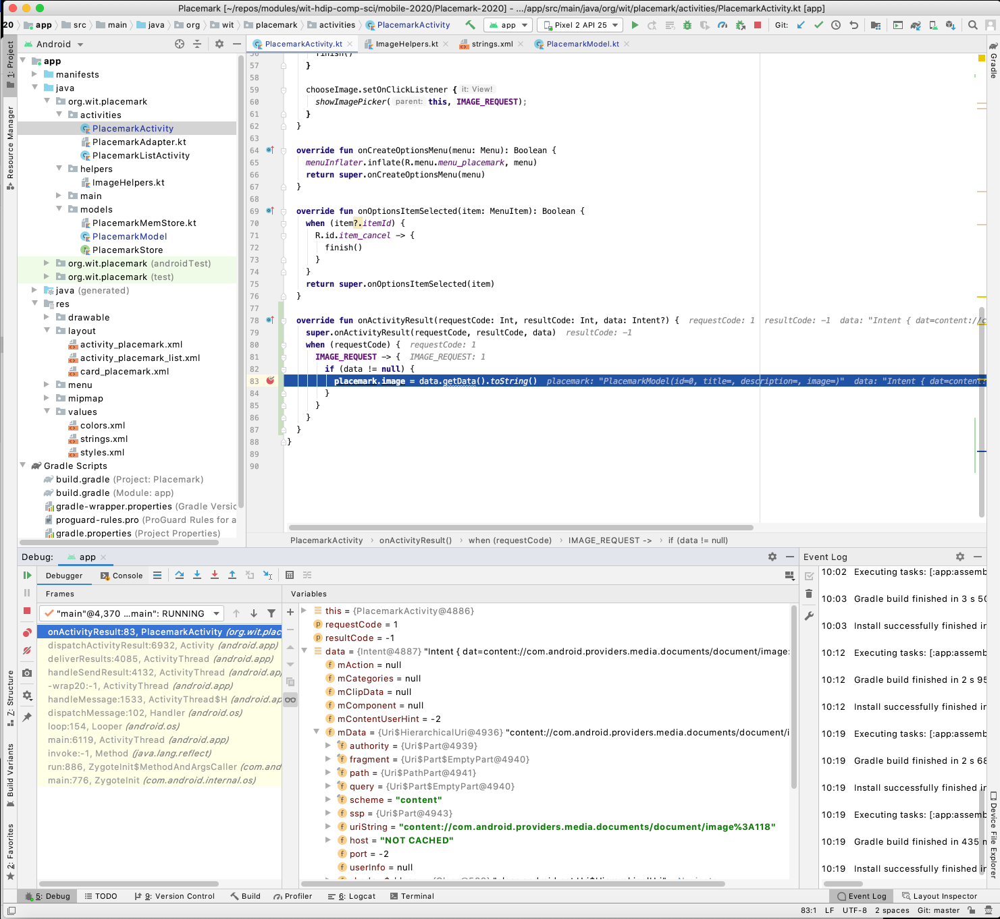
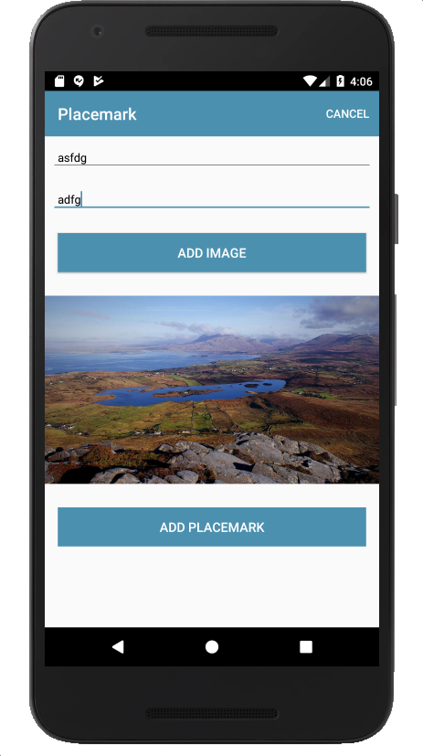

# Displaying the Image

We can now extend the PlacemarkModel to include the image reference as an additional field:

## PlacemarkModel

```kotlin
    var image: String = ""
```

In PlacemarkActivity we can recover the image name when the activity picker activity finishes. This is via a lifecycle event - triggered when an activity we may have started finishes:

## PlacemarkActivity

```kotlin
  override fun onActivityResult(requestCode: Int, resultCode: Int, data: Intent?) {
    super.onActivityResult(requestCode, resultCode, data)
    when (requestCode) {
      IMAGE_REQUEST -> {
        if (data != null) {
          placemark.image = data.getData().toString()
        }
      }
    }
  }
```

Notice how we are recovering the name only when the IMAGE_REQUEST is seen.

See if you can run the application under debug - and place a breakpoint where the image name is recovered above. See if you can inspect the name.



In order to display the image, we introduce another helper :

## Imagehelpers

```kotlin
fun readImage(activity: Activity, resultCode: Int, data: Intent?): Bitmap? {
  var bitmap: Bitmap? = null
  if (resultCode == Activity.RESULT_OK && data != null && data.data != null) {
    try {
      bitmap = MediaStore.Images.Media.getBitmap(activity.contentResolver, data.data)
    } catch (e: IOException) {
      e.printStackTrace()
    }
  }
  return bitmap
}
```

Finally, we can use this method to display the image in the image view. Back in onActivityResult:

## PlacemarkActivity

```kotlin
      IMAGE_REQUEST -> {
        if (data != null) {
          placemark.image = data.getData().toString()
          placemarkImage.setImageBitmap(readImage(this, resultCode, data))
        }
```

Run this now, and the selected image should be displayed in the view.


