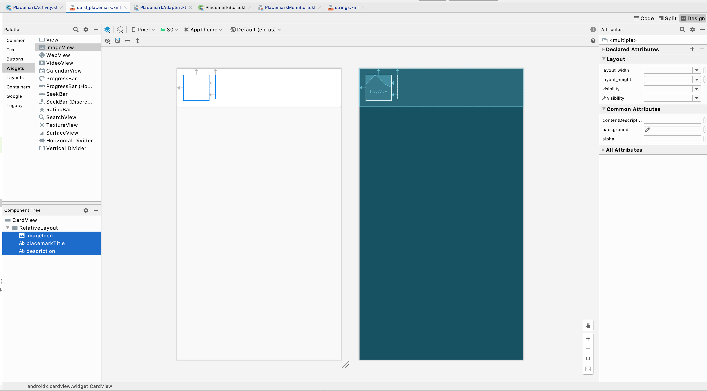
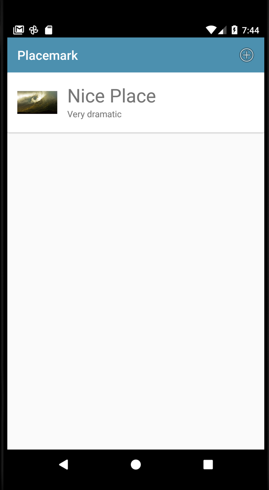

# Exercise Solutions

## Exercise 1

Create a new placemark with a title + image. Now edit the placemark and change the title - and update the placemark. Notice that the title has changed in PlacemarkList.

Edit the placemark and change the image - and update the placemark. Go back in to edit the placemark again - what image do you see?

There is a bug here - the placemark activity is still showing the original image. See if you can debug and fix this bug.

## Exercise 1 Solution

The problem is we are not changing the stored placemark in the `update` function in the PlacemarkMemStore:

## PlacemarkMemStore

```kotlin
...
  override fun update(placemark: PlacemarkModel) {
    var foundPlacemark: PlacemarkModel? = placemarks.find { p -> p.id == placemark.id }
    if (foundPlacemark != null) {
      foundPlacemark.title = placemark.title
      foundPlacemark.description = placemark.description
      foundPlacemark.image = placemark.image
      logAll();
    }
  }
...
```

Just one line added in the above.

## Exercise 2

in PlacemarkActivity, if you are editing a placemark OR if the placemark already has an image, change the button label to be 'Change Image' from `Add Image`.

## Exercise 2 Solution

## strings.xml

```
  <string name="change_placemark_image">Change placemark image</string>
```

## PlacemarkActivity

When edit it detected, change the label:

```kotlin
    ...
    if (intent.hasExtra("placemark_edit")) {
        ...
      placemarkImage.setImageBitmap(readImageFromPath(this, placemark.image))
      if (placemark.image != null) {
        chooseImage.setText(R.string.change_placemark_image)
      }
      ...
```

When an image is loaded, also change the label:

```kotlin
      ...
      IMAGE_REQUEST -> {
        if (data != null) {
          placemark.image = data.getData().toString()
          placemarkImage.setImageBitmap(readImage(this, resultCode, data))
          chooseImage.setText(R.string.change_placemark_image)
        }
      ...
```

## Exercise 3

Introduce a new ImageView into the card displayed on PlacemarkListAcivity (card_placemark.xml). Display the placemark images here (if an image has been loaded).

## Exercise 3 Solution

Extend the card to include an imageView:



## card_placemark.xml

```xml
<?xml version="1.0" encoding="utf-8"?>
<androidx.cardview.widget.CardView
  xmlns:android="http://schemas.android.com/apk/res/android"
  android:layout_width="match_parent"
  android:layout_height="wrap_content"
  android:layout_marginBottom="8dp"
  android:elevation="24dp">

  <RelativeLayout
    android:layout_width="match_parent"
    android:layout_height="wrap_content"
    android:padding="16dp">

    <ImageView
      android:id="@+id/imageIcon"
      android:layout_width="64dp"
      android:layout_height="64dp"
      android:layout_alignParentStart="true"
      android:layout_alignParentTop="true"
      android:layout_marginEnd="16dp"
      android:contentDescription="@string/change_placemark_image" />

    <TextView
      android:id="@+id/placemarkTitle"
      android:layout_width="wrap_content"
      android:layout_height="wrap_content"
      android:layout_alignParentTop="true"
      android:layout_toEndOf="@+id/imageIcon"
      android:textSize="30sp"/>

    <TextView
      android:id="@+id/description"
      android:layout_width="wrap_content"
      android:layout_height="wrap_content"
      android:layout_below="@id/placemarkTitle"
      android:layout_toEndOf="@+id/imageIcon"/>

  </RelativeLayout>
</androidx.cardview.widget.CardView>
```

In the layout, the text has is moved to align to the edge of the image.

In the adapter - initialise the imageView from the model:

## PlacemarkAdapter

```
...
    fun bind(placemark: PlacemarkModel,  listener : PlacemarkListener) {
      itemView.placemarkTitle.text = placemark.title
      itemView.description.text = placemark.description
      itemView.imageIcon.setImageBitmap(readImageFromPath(itemView.context, placemark.image))
      itemView.setOnClickListener { listener.onPlacemarkClick(placemark) }
    }
...
```

The placemark images should now appear in the list.


