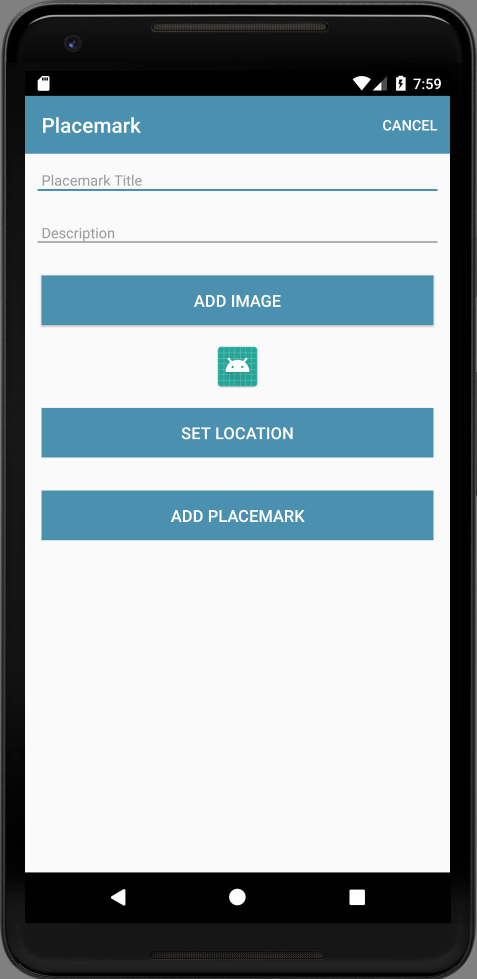

# Location Resources

First introduce a new button to set the location. This requires:

- string resource
- button
- event handler

## strings.xml

```xml
  <string name="button_location">Set Location</string>
```

## activity_placemark.xml

```xml
        <Button
          android:id="@+id/placemarkLocation"
          android:layout_width="match_parent"
          android:layout_height="wrap_content"
          android:layout_margin="16dp"
          android:background="@color/colorAccent"
          android:paddingBottom="8dp"
          android:paddingTop="8dp"
          android:stateListAnimator="@null"
          android:text="@string/button_location"
          android:textColor="@color/colorPrimary"
          android:textSize="16sp"/>
```

## PlacemarkActivity

```kotlin
    placemarkLocation.setOnClickListener {
      info ("Set Location Pressed")
    }
```

Build & run the application now and make sure the button appears as expected



and also the log appears when the button is pressed.
