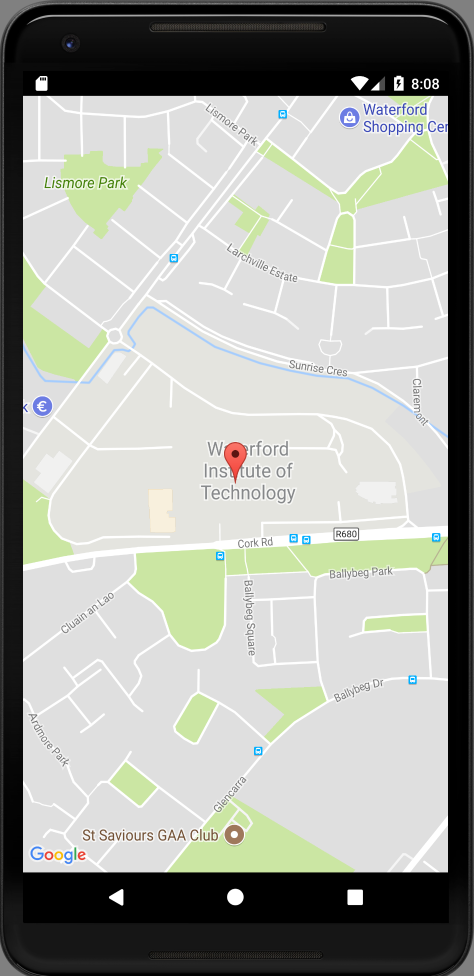

# Tidy up Generated code

We might remove some of the additional comments generated by the studio wizard (read them first)

## AndroidManifest.xml

```xml
<?xml version="1.0" encoding="utf-8"?>
<manifest xmlns:android="http://schemas.android.com/apk/res/android"
  package="org.wit.placemark">

  <uses-permission android:name="android.permission.ACCESS_FINE_LOCATION" />

  <application
    android:name=".main.MainApp"
    android:allowBackup="true"
    android:icon="@mipmap/ic_launcher"
    android:label="@string/app_name"
    android:roundIcon="@mipmap/ic_launcher_round"
    android:supportsRtl="true"
    android:theme="@style/AppTheme">
    <activity android:name=".activities.PlacemarkActivity"></activity>
    <activity android:name=".activities.PlacemarkListActivity">
      <intent-filter>
        <action android:name="android.intent.action.MAIN" />

        <category android:name="android.intent.category.LAUNCHER" />
      </intent-filter>
    </activity>

    <meta-data
      android:name="com.google.android.geo.API_KEY"
      android:value="@string/google_maps_key" />

    <activity
      android:name=".activities.MapActivity"
      android:label="@string/title_activity_map"></activity>
  </application>

</manifest>
```

## MapActivity

```kotlin
package org.wit.placemark.activities

import androidx.appcompat.app.AppCompatActivity
import android.os.Bundle

import com.google.android.gms.maps.CameraUpdateFactory
import com.google.android.gms.maps.GoogleMap
import com.google.android.gms.maps.OnMapReadyCallback
import com.google.android.gms.maps.SupportMapFragment
import com.google.android.gms.maps.model.LatLng
import com.google.android.gms.maps.model.MarkerOptions
import org.wit.placemark.R


class MapActivity : AppCompatActivity(), OnMapReadyCallback {

  private lateinit var mMap: GoogleMap

  override fun onCreate(savedInstanceState: Bundle?) {
    super.onCreate(savedInstanceState)
    setContentView(R.layout.activity_map)
    val mapFragment = supportFragmentManager
      .findFragmentById(R.id.map) as SupportMapFragment
    mapFragment.getMapAsync(this)
  }

  override fun onMapReady(googleMap: GoogleMap) {
    mMap = googleMap
    val sydney = LatLng(-34.0, 151.0)
    mMap.addMarker(MarkerOptions().position(sydney).title("Marker in Sydney"))
    mMap.moveCamera(CameraUpdateFactory.newLatLng(sydney))
  }
}

```

Also, revise the default location + zoom level:

## MapsActivity

```kotlin
  override fun onMapReady(googleMap: GoogleMap) {
    mMap = googleMap
    val wit = LatLng(52.245696, -7.139102)
    mMap.addMarker(MarkerOptions().position(wit).title("Marker in Waterford"))
    mMap.moveCamera(CameraUpdateFactory.newLatLngZoom(wit, 16f))
  }
```


