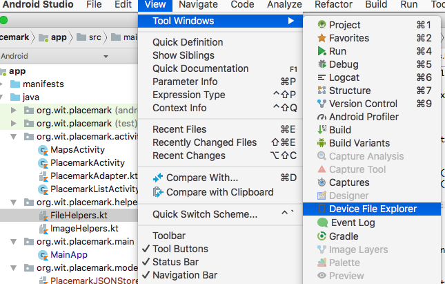
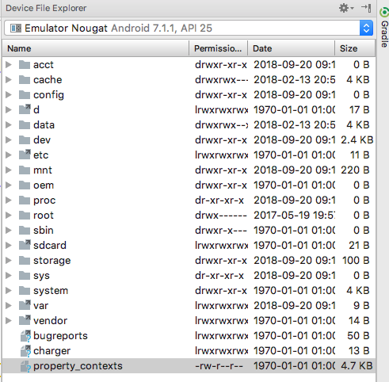
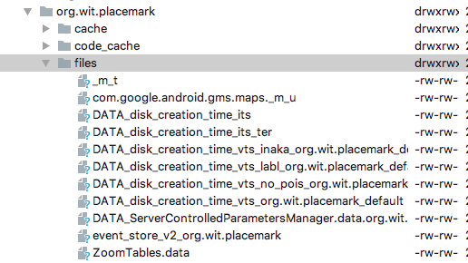

# Persistence

Currently our placemarks are transient - when the app is closed the placemarks are lost. We would like to make them persistent - i.e. they are retained between app launches.

There are many strategies for implementing persistence - both local and remote (cloud). We will start with one of the simplest - storing the placemarks in a simple file.

Before we try this, you should get used to exploring the phones' file system. In Studio, select `View->Tools Windows->Device File Explorer`:

This reveals the following:

In this window, navigate to `data/data/org.wit.placemark/files`

We will be monitoring this directory - as it is the default location for an files you write/read in your app.