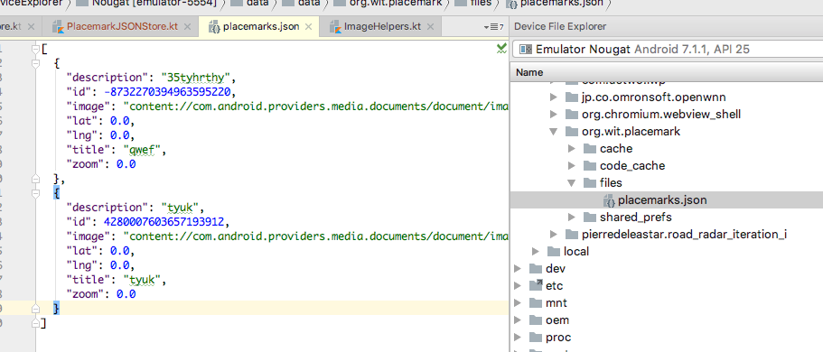
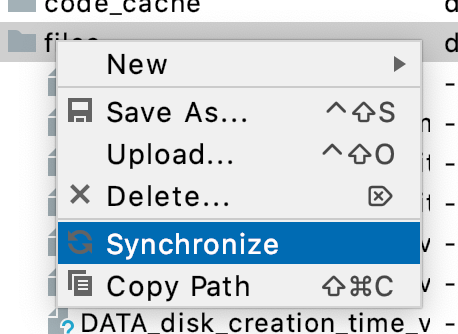

## MainApp

To use the new store, we just need to switch it in the application object:

```kotlin
package org.wit.placemark.main

import android.app.Application
import org.jetbrains.anko.AnkoLogger
import org.jetbrains.anko.info
import org.wit.placemark.models.PlacemarkJSONStore
import org.wit.placemark.models.PlacemarkMemStore
import org.wit.placemark.models.PlacemarkStore

class MainApp : Application(), AnkoLogger {

  lateinit var placemarks: PlacemarkStore

  override fun onCreate() {
    super.onCreate()
    placemarks = PlacemarkJSONStore(applicationContext)
    info("Placemark started")
  }
}
```

No other changes should be necessary.

Run the app now - and verify that you can create placemarks. Terminate the app, and see if the placemarks are still there when you relaunch the app.

Delete the app from the phone, and verify that there are no placemarks when you install and run it again.

Finally, locate the actual file in the Device File Explorer:



In the above view, you may need to select 'Synchronize' from the context menu to reveal the file:


