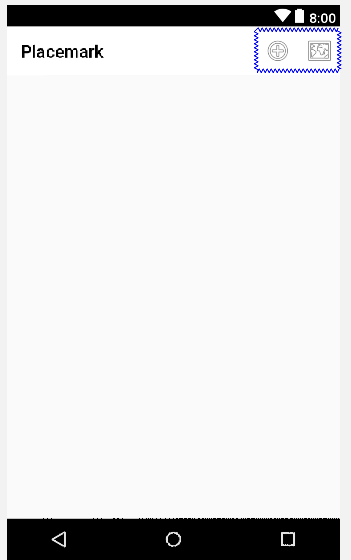
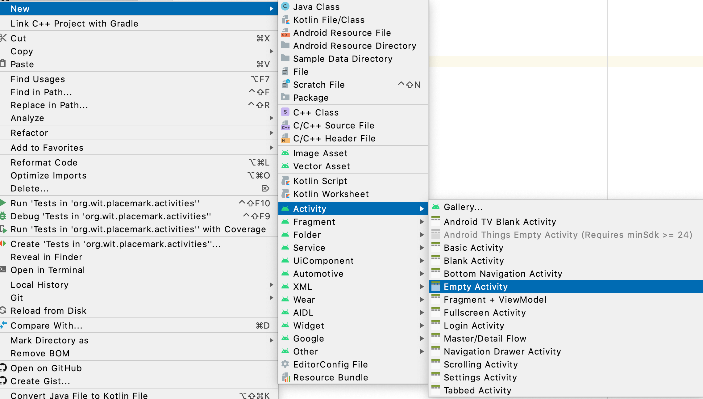
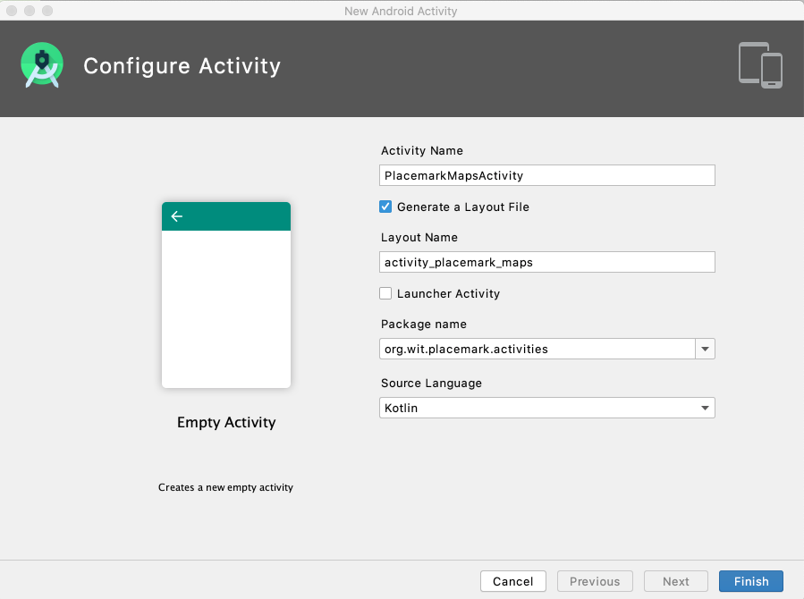
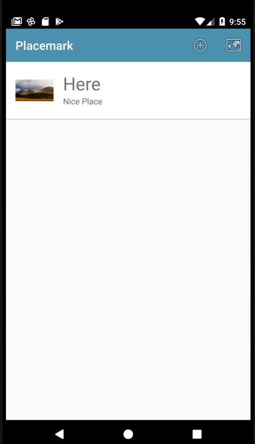
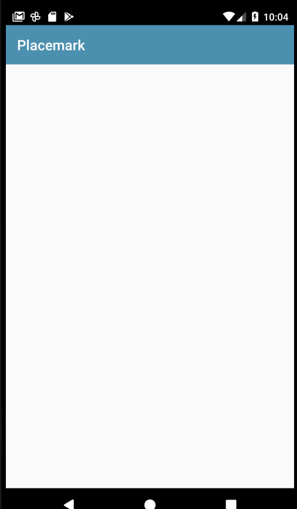

# PlacemarkMapsActivity

We would like a new activity to show the locations of all placemarks in our collection. This should be activated by a new menu option.

## Menu

Create a new menu option in the `main_menu.xml`:

## res/menu/menu_main.xml

```xml
<?xml version="1.0" encoding="utf-8"?>
<menu xmlns:android="http://schemas.android.com/apk/res/android"
  xmlns:app="http://schemas.android.com/apk/res-auto">

  <item
    android:id="@+id/item_add"
    android:icon="@android:drawable/ic_menu_add"
    android:title="@string/menu_addPlacemark"
    app:showAsAction="always" />

  <item
    android:id="@+id/item_map"
    android:icon="@android:drawable/ic_menu_mapmode"
    android:title="@string/menu_addPlacemark"
    app:showAsAction="always"/>
</menu>
```

We have just duplicated the add item - and given it the id `item_map` and the icon `ic_menu_mapmode`. It should look like this in the layout editor:



## `PlacemarkMapsActivity`

Now use the wizard in Android to generate a new `Empty` activity called PlacemarkMapsActivity





Accepting the defaults as shown above - your application will have the following class automatically generated by the wizard:

```kotlin
package org.wit.placemark.activities

import androidx.appcompat.app.AppCompatActivity
import android.os.Bundle

class PlacemarkMapsActivity : AppCompatActivity() {
  override fun onCreate(savedInstanceState: Bundle?) {
    super.onCreate(savedInstanceState)
    setContentView(R.layout.activity_placemark_maps)
  }
}
```

Extend the above onCreate method initialise the toolbar:

```kotlin
    setSupportActionBar(toolbar)
    toolbar.title = title
```

A bug in Studio may require you to manually add the following import:

```kotlin
import org.wit.placemark.R
```

This empty layout will also be generated:

## `res/layout/content_placemark_maps.xml`

```xml
<?xml version="1.0" encoding="utf-8"?>
<androidx.constraintlayout.widget.ConstraintLayout xmlns:android="http://schemas.android.com/apk/res/android"
  xmlns:app="http://schemas.android.com/apk/res-auto"
  xmlns:tools="http://schemas.android.com/tools"
  android:layout_width="match_parent"
  android:layout_height="match_parent"
  app:layout_behavior="@string/appbar_scrolling_view_behavior"
  tools:context=".activities.PlacemarkMapsActivity"
  tools:showIn="@layout/activity_placemark_maps">

</androidx.constraintlayout.widget.ConstraintLayout>
```

Replace this with the following - which includes the toolbar:

```xml
<?xml version="1.0" encoding="utf-8"?>
<androidx.coordinatorlayout.widget.CoordinatorLayout xmlns:android="http://schemas.android.com/apk/res/android"
    xmlns:app="http://schemas.android.com/apk/res-auto"
    xmlns:tools="http://schemas.android.com/tools"
    android:layout_width="match_parent"
    android:layout_height="match_parent"
    tools:context=".activities.PlacemarkMapsActivity">

  <com.google.android.material.appbar.AppBarLayout
      android:layout_width="match_parent"
      android:layout_height="wrap_content"
      android:background="@color/colorAccent"
      android:fitsSystemWindows="true"
      app:elevation="0dip"
      app:theme="@style/ThemeOverlay.AppCompat.Dark.ActionBar">

    <androidx.appcompat.widget.Toolbar
        android:id="@+id/toolbar"
        android:layout_width="match_parent"
        android:layout_height="wrap_content"
        app:titleTextColor="@color/colorPrimary" />
  </com.google.android.material.appbar.AppBarLayout>

</androidx.coordinatorlayout.widget.CoordinatorLayout>
```

The wizard will also modify the manifest to include the new activity:

## AndroidManifest.xml

```xml
    <activity
      android:name=".activities.PlacemarkMapsActivity"
      android:label="@string/title_activity_placemark_maps"></activity>
```

In PlacemarkListActivity - we can extend the existing menu handler to now also launch this new activity:

## PlacemarkListActivity

```kotlin
  override fun onOptionsItemSelected(item: MenuItem): Boolean {
    when (item?.itemId) {
      R.id.item_add -> startActivityForResult<PlacemarkActivity>(200)
      R.id.item_map -> startActivity<PlacemarkMapsActivity>()
    }
    return super.onOptionsItemSelected(item)
  }
```

The above will require the following import

```kotlin
import org.jetbrains.anko.startActivity
```

When the map menu is selected - you will get a (blank) new activity:




