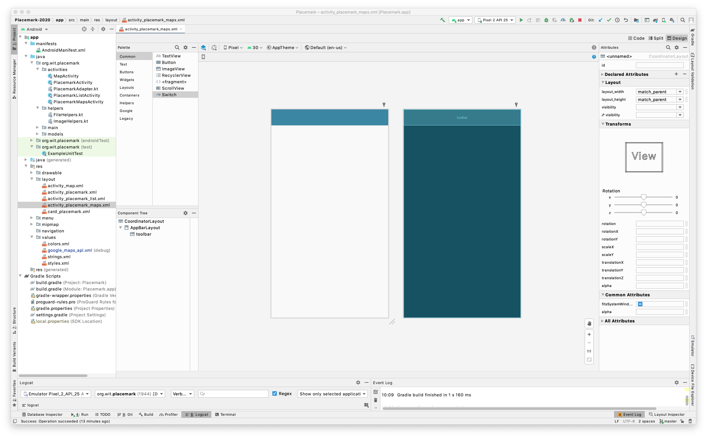
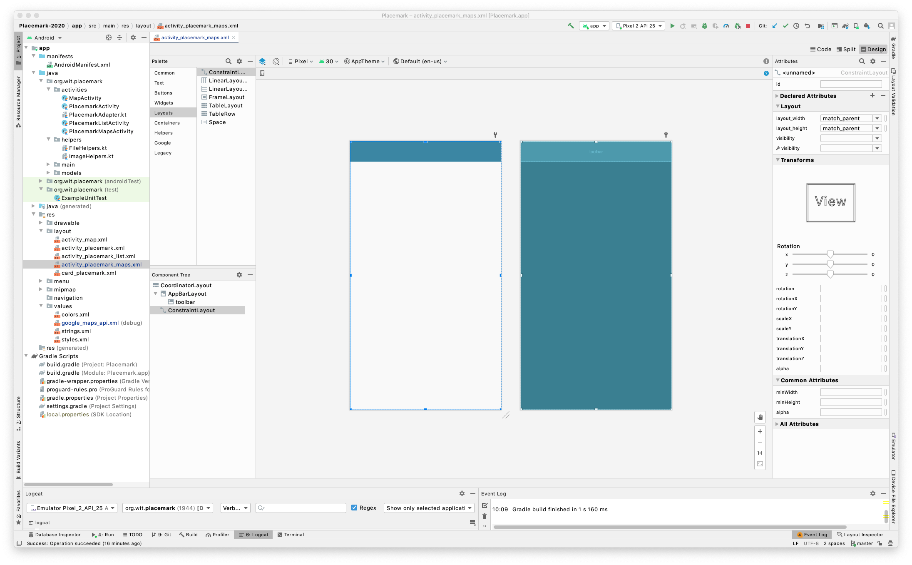
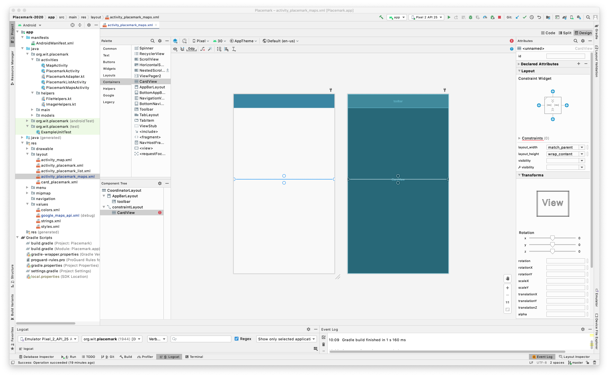
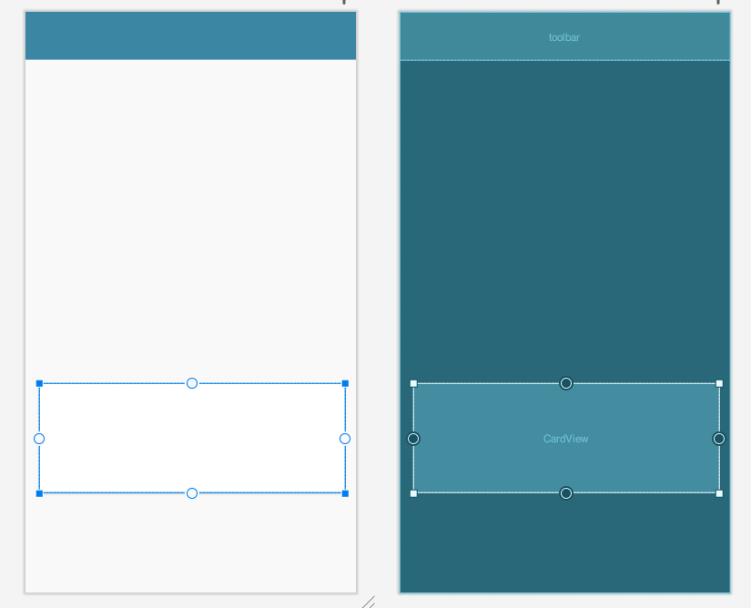
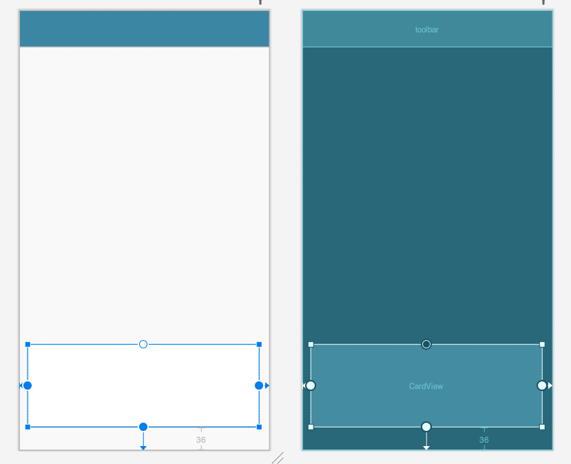
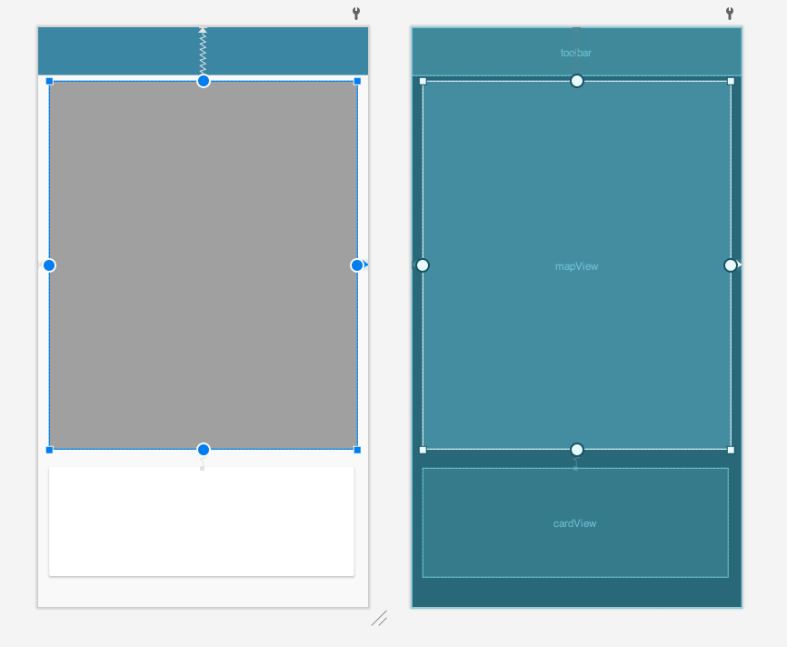
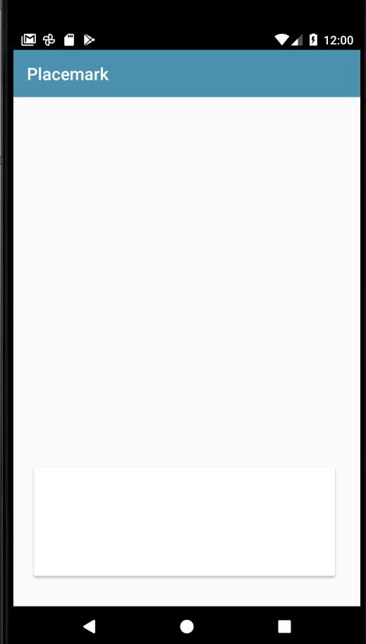
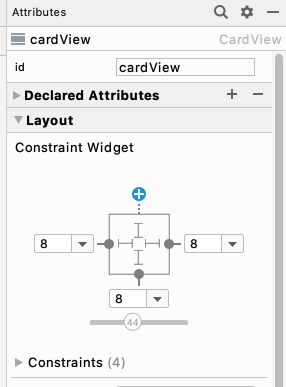
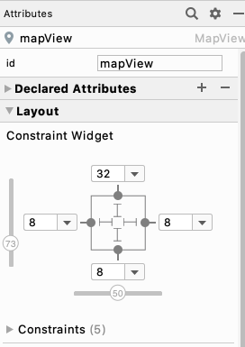

# Experiments with ConstraintLayout

This is our new PlacemakMapsActivity in studio design view:



We will use the `ConstraintLayout` to design the layout for this activity. Drag & Drop from `Layouts->Constraint Layout` in the Palette directly on to the canvas:



This will give us a set of tools for organising the controls we would like to introduce.

Lets stat by dragging and dropping a `CardView` component onto the canvas:



Make sure the CardView is a child of the ContraintLayout (parent/child relationship is visible in the Component Tree).

The CardView will initially be zero height - to grabbing it to resize can be a bit counter-intuitive. Try moving the pointer along the bar until a `L` shaped edge appears -then grab this and resize:



See if you can 'anchor' the left, right and bottom edges to the activity edges but clicking on the anchor 'dots' and attaching them like so:



You do this by selecting each of the circle anchor points and then clicking on the appropriate edge.

Now drag a MapView onto the canvas - and do the same anchoring procedure:



Be sure to attach the bottom of the Map to the top of the Card:

Run the app now - you should see something like this when the view is activated:



The map does not appear yet.

Before we fix that, we might want to fine tune the margins of the CardView:



and the MapView:



This are set in the `Attributes` panel on the right of the design view.

This is the layout at this stage:

## `res/layout/activity_placemark_maps.xml`

```xml
<?xml version="1.0" encoding="utf-8"?>
<androidx.coordinatorlayout.widget.CoordinatorLayout xmlns:android="http://schemas.android.com/apk/res/android"
    xmlns:app="http://schemas.android.com/apk/res-auto"
    xmlns:tools="http://schemas.android.com/tools"
    android:layout_width="match_parent"
    android:layout_height="match_parent"
    tools:context=".activities.PlacemarkMapsActivity">

  <com.google.android.material.appbar.AppBarLayout
      android:layout_width="match_parent"
      android:layout_height="wrap_content"
      android:background="@color/colorAccent"
      android:fitsSystemWindows="true"
      app:elevation="0dip"
      app:theme="@style/ThemeOverlay.AppCompat.Dark.ActionBar">

    <androidx.appcompat.widget.Toolbar
        android:id="@+id/toolbar"
        android:layout_width="match_parent"
        android:layout_height="wrap_content"
        app:titleTextColor="@color/colorPrimary" />
  </com.google.android.material.appbar.AppBarLayout>

  <androidx.constraintlayout.widget.ConstraintLayout
      android:id="@+id/constraintLayout"
      android:layout_width="match_parent"
      android:layout_height="match_parent"
      app:layout_anchor="@+id/constraintLayout"
      app:layout_anchorGravity="center">

    <androidx.cardview.widget.CardView
        android:id="@+id/cardView"
        android:layout_width="357dp"
        android:layout_height="128dp"
        android:layout_marginStart="8dp"
        android:layout_marginEnd="8dp"
        android:layout_marginBottom="8dp"
        app:layout_constraintBottom_toBottomOf="parent"
        app:layout_constraintEnd_toEndOf="parent"
        app:layout_constraintHorizontal_bias="0.448"
        app:layout_constraintStart_toStartOf="parent" />

    <com.google.android.gms.maps.MapView
        android:id="@+id/mapView"
        android:layout_width="360dp"
        android:layout_height="431dp"
        android:layout_marginStart="8dp"
        android:layout_marginTop="32dp"
        android:layout_marginEnd="8dp"
        android:layout_marginBottom="8dp"
        app:layout_constraintBottom_toTopOf="@+id/cardView"
        app:layout_constraintEnd_toEndOf="parent"
        app:layout_constraintStart_toStartOf="parent"
        app:layout_constraintTop_toTopOf="parent"
        app:layout_constraintVertical_bias="0.736" />
  </androidx.constraintlayout.widget.ConstraintLayout>

</androidx.coordinatorlayout.widget.CoordinatorLayout>
```
