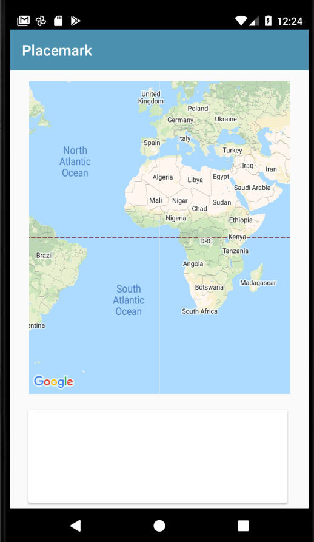

# Map Component

Now we can bring in a new attribute into the PlacemarkMapsActivity for the map object we just introduced:

## PlacemarkMapsActivity

```kotlin
package org.wit.placemark.activities

import android.os.Bundle
import androidx.appcompat.app.AppCompatActivity
import com.google.android.gms.maps.GoogleMap
import org.wit.placemark.R

import kotlinx.android.synthetic.main.activity_placemark_maps.*

class PlacemarkMapsActivity : AppCompatActivity() {

  lateinit var map: GoogleMap

  override fun onCreate(savedInstanceState: Bundle?) {
    super.onCreate(savedInstanceState)
    setContentView(R.layout.activity_placemark_maps)
    toolbar.title = title
    setSupportActionBar(toolbar)
    mapView.onCreate(savedInstanceState);
  }
}
```

Notice we are calling `mapView.onCreate`. This should now display the (empty) map:


To make the map actually render correctly - we need to rework the class so that we are passing the lifecycle events on to the map from PlacemarkMapsActivity:

## PlacemarkMapsActivity

```kotlin
package org.wit.placemark.activities

import android.os.Bundle
import androidx.appcompat.app.AppCompatActivity
import com.google.android.gms.maps.GoogleMap
import org.wit.placemark.R
import kotlinx.android.synthetic.main.activity_placemark_maps.*
import kotlinx.android.synthetic.main.content_placemark_maps.*

class PlacemarkMapsActivity : AppCompatActivity() {

  lateinit var map: GoogleMap

  override fun onCreate(savedInstanceState: Bundle?) {
    super.onCreate(savedInstanceState)
    setContentView(R.layout.activity_placemark_maps)
    setSupportActionBar(toolbar)
    mapView.onCreate(savedInstanceState);
  }

  override fun onDestroy() {
    super.onDestroy()
    mapView.onDestroy()
  }

  override fun onLowMemory() {
    super.onLowMemory()
    mapView.onLowMemory()
  }

  override fun onPause() {
    super.onPause()
    mapView.onPause()
  }

  override fun onResume() {
    super.onResume()
    mapView.onResume()
  }

  override fun onSaveInstanceState(outState: Bundle) {
    super.onSaveInstanceState(outState)
    mapView.onSaveInstanceState(outState)
  }
}
```

The map should now display correctly:


