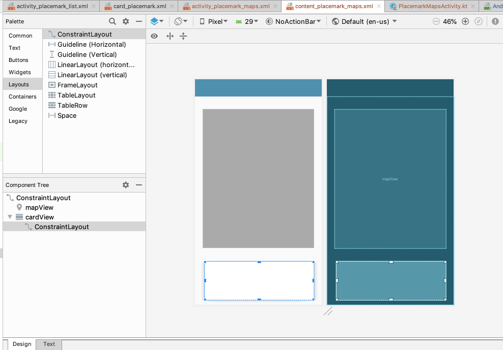
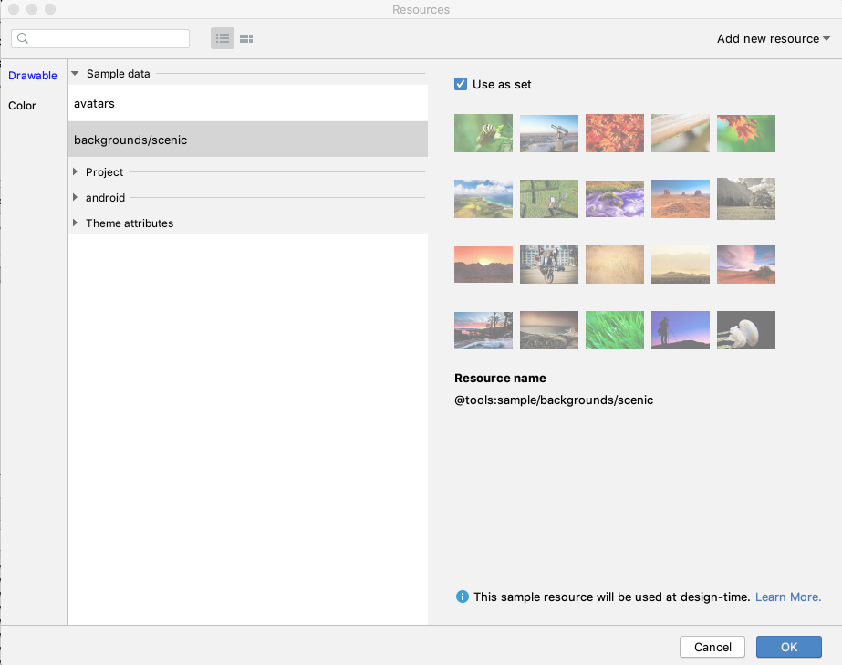
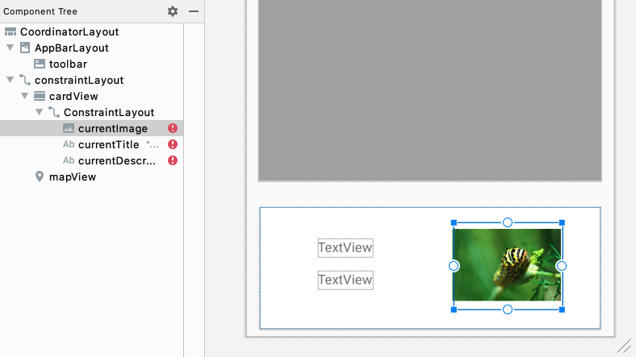
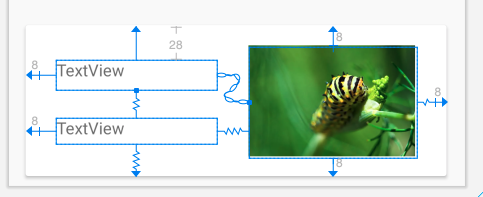
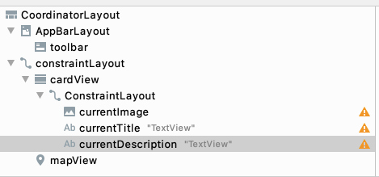

# CardView

We already have a CardView in place. We now start to work inside it. First, install a ConstraintLayout inside the Card:



Then, insert an ImageView and 2 TextViews into the card:



Call the components `currentTitle` and `currentDescription` and `currentImage` - These IDs can be set in the Attributes panel.

You might place and resize the components like this:



These are not anchored yet - we might try this now:



This is the complete layout at this stage:

## `res/layout/activity_placemark_maps.xml`

```xml
<?xml version="1.0" encoding="utf-8"?>
<androidx.coordinatorlayout.widget.CoordinatorLayout xmlns:android="http://schemas.android.com/apk/res/android"
    xmlns:app="http://schemas.android.com/apk/res-auto"
    xmlns:tools="http://schemas.android.com/tools"
    android:layout_width="match_parent"
    android:layout_height="match_parent"
    tools:context=".activities.PlacemarkMapsActivity">

  <com.google.android.material.appbar.AppBarLayout
      android:layout_width="match_parent"
      android:layout_height="wrap_content"
      android:background="@color/colorAccent"
      android:fitsSystemWindows="true"
      app:elevation="0dip"
      app:theme="@style/ThemeOverlay.AppCompat.Dark.ActionBar">

    <androidx.appcompat.widget.Toolbar
        android:id="@+id/toolbar"
        android:layout_width="match_parent"
        android:layout_height="wrap_content"
        app:titleTextColor="@color/colorPrimary" />
  </com.google.android.material.appbar.AppBarLayout>

  <androidx.constraintlayout.widget.ConstraintLayout
      android:id="@+id/constraintLayout"
      android:layout_width="match_parent"
      android:layout_height="match_parent"
      app:layout_anchor="@+id/constraintLayout"
      app:layout_anchorGravity="center">

    <androidx.cardview.widget.CardView
        android:id="@+id/cardView"
        android:layout_width="357dp"
        android:layout_height="128dp"
        android:layout_marginStart="8dp"
        android:layout_marginEnd="8dp"
        android:layout_marginBottom="8dp"
        app:layout_constraintBottom_toBottomOf="parent"
        app:layout_constraintEnd_toEndOf="parent"
        app:layout_constraintHorizontal_bias="0.448"
        app:layout_constraintStart_toStartOf="parent" >

      <androidx.constraintlayout.widget.ConstraintLayout
          android:layout_width="match_parent"
          android:layout_height="match_parent">

        <ImageView
            android:id="@+id/currentImage"
            android:layout_width="142dp"
            android:layout_height="94dp"
            android:layout_marginTop="8dp"
            android:layout_marginEnd="8dp"
            android:layout_marginBottom="8dp"
            app:layout_constraintBottom_toBottomOf="parent"
            app:layout_constraintEnd_toEndOf="parent"
            app:layout_constraintHorizontal_bias="0.763"
            app:layout_constraintStart_toEndOf="@+id/currentTitle"
            app:layout_constraintTop_toTopOf="parent"
            tools:srcCompat="@tools:sample/backgrounds/scenic" />

        <TextView
            android:id="@+id/currentTitle"
            android:layout_width="136dp"
            android:layout_height="25dp"
            android:layout_marginStart="8dp"
            android:layout_marginTop="28dp"
            android:layout_marginEnd="8dp"
            android:text="TextView"
            app:layout_constraintEnd_toStartOf="@+id/currentImage"
            app:layout_constraintStart_toStartOf="parent"
            app:layout_constraintTop_toTopOf="parent" />

        <TextView
            android:id="@+id/currentDescription"
            android:layout_width="136dp"
            android:layout_height="22dp"
            android:layout_marginStart="8dp"
            android:layout_marginTop="20dp"
            android:layout_marginEnd="8dp"
            android:text="TextView"
            app:layout_constraintBottom_toBottomOf="parent"
            app:layout_constraintEnd_toStartOf="@+id/currentImage"
            app:layout_constraintStart_toStartOf="parent"
            app:layout_constraintTop_toBottomOf="@+id/currentTitle"
            app:layout_constraintVertical_bias="0.121" />
      </androidx.constraintlayout.widget.ConstraintLayout>
    </androidx.cardview.widget.CardView>

    <com.google.android.gms.maps.MapView
        android:id="@+id/mapView"
        android:layout_width="360dp"
        android:layout_height="431dp"
        android:layout_marginStart="8dp"
        android:layout_marginTop="32dp"
        android:layout_marginEnd="8dp"
        android:layout_marginBottom="8dp"
        app:layout_constraintBottom_toTopOf="@+id/cardView"
        app:layout_constraintEnd_toEndOf="parent"
        app:layout_constraintStart_toStartOf="parent"
        app:layout_constraintTop_toTopOf="parent"
        app:layout_constraintVertical_bias="0.736" />
  </androidx.constraintlayout.widget.ConstraintLayout>

</androidx.coordinatorlayout.widget.CoordinatorLayout>
```

The Component Tree is flagging a number of warnings:



These relate to 'hard coded' default strings for the text views, and a missing description for the image view. You can use the `Fix` button to create string resources for each of these.

This should let you create these strings:

## res/values/strings.xml

```
  <string name="placemark_image_placeholder">Placemark Image</string>
  <string name="placemark_title_placeholder">Placemark Title</string>
  <string name="placemark_description_placeholder">Placemark Description</string>
```

which will be referenced from the layout like this:

```xml
        <ImageView
            android:id="@+id/currentImage"
            android:layout_width="142dp"
            android:layout_height="94dp"
            android:layout_marginTop="8dp"
            android:layout_marginEnd="8dp"
            android:layout_marginBottom="8dp"
            app:layout_constraintBottom_toBottomOf="parent"
            app:layout_constraintEnd_toEndOf="parent"
            app:layout_constraintHorizontal_bias="0.763"
            app:layout_constraintStart_toEndOf="@+id/currentTitle"
            app:layout_constraintTop_toTopOf="parent"
            tools:srcCompat="@tools:sample/backgrounds/scenic"
            android:contentDescription="@string/placemarkPicture" />

        <TextView
            android:id="@+id/currentTitle"
            android:layout_width="136dp"
            android:layout_height="25dp"
            android:layout_marginStart="8dp"
            android:layout_marginTop="28dp"
            android:layout_marginEnd="8dp"
            android:text="@string/placemarkTitle"
            app:layout_constraintEnd_toStartOf="@+id/currentImage"
            app:layout_constraintStart_toStartOf="parent"
            app:layout_constraintTop_toTopOf="parent" />

        <TextView
            android:id="@+id/currentDescription"
            android:layout_width="136dp"
            android:layout_height="22dp"
            android:layout_marginStart="8dp"
            android:layout_marginTop="20dp"
            android:layout_marginEnd="8dp"
            android:text="@string/placemarkDescription"
            app:layout_constraintBottom_toBottomOf="parent"
            app:layout_constraintEnd_toStartOf="@+id/currentImage"
            app:layout_constraintStart_toStartOf="parent"
            app:layout_constraintTop_toBottomOf="@+id/currentTitle"
            app:layout_constraintVertical_bias="0.121" />
```

This is the final version of the layout:

```xml
<?xml version="1.0" encoding="utf-8"?>
<androidx.coordinatorlayout.widget.CoordinatorLayout xmlns:android="http://schemas.android.com/apk/res/android"
    xmlns:app="http://schemas.android.com/apk/res-auto"
    xmlns:tools="http://schemas.android.com/tools"
    android:layout_width="match_parent"
    android:layout_height="match_parent"
    tools:context=".activities.PlacemarkMapsActivity">

  <com.google.android.material.appbar.AppBarLayout
      android:layout_width="match_parent"
      android:layout_height="wrap_content"
      android:background="@color/colorAccent"
      android:fitsSystemWindows="true"
      app:elevation="0dip"
      app:theme="@style/ThemeOverlay.AppCompat.Dark.ActionBar">

    <androidx.appcompat.widget.Toolbar
        android:id="@+id/toolbar"
        android:layout_width="match_parent"
        android:layout_height="wrap_content"
        app:titleTextColor="@color/colorPrimary" />
  </com.google.android.material.appbar.AppBarLayout>

  <androidx.constraintlayout.widget.ConstraintLayout
      android:id="@+id/constraintLayout"
      android:layout_width="match_parent"
      android:layout_height="match_parent"
      app:layout_anchor="@+id/constraintLayout"
      app:layout_anchorGravity="center">

    <androidx.cardview.widget.CardView
        android:id="@+id/cardView"
        android:layout_width="357dp"
        android:layout_height="128dp"
        android:layout_marginStart="8dp"
        android:layout_marginEnd="8dp"
        android:layout_marginBottom="8dp"
        app:layout_constraintBottom_toBottomOf="parent"
        app:layout_constraintEnd_toEndOf="parent"
        app:layout_constraintHorizontal_bias="0.448"
        app:layout_constraintStart_toStartOf="parent" >

      <androidx.constraintlayout.widget.ConstraintLayout
          android:layout_width="match_parent"
          android:layout_height="match_parent">

        <ImageView
            android:id="@+id/currentImage"
            android:layout_width="142dp"
            android:layout_height="94dp"
            android:layout_marginTop="8dp"
            android:layout_marginEnd="8dp"
            android:layout_marginBottom="8dp"
            app:layout_constraintBottom_toBottomOf="parent"
            app:layout_constraintEnd_toEndOf="parent"
            app:layout_constraintHorizontal_bias="0.763"
            app:layout_constraintStart_toEndOf="@+id/currentTitle"
            app:layout_constraintTop_toTopOf="parent"
            tools:srcCompat="@tools:sample/backgrounds/scenic"
            android:contentDescription="@string/placemarkPicture" />

        <TextView
            android:id="@+id/currentTitle"
            android:layout_width="136dp"
            android:layout_height="25dp"
            android:layout_marginStart="8dp"
            android:layout_marginTop="28dp"
            android:layout_marginEnd="8dp"
            android:text="@string/placemarkTitle"
            app:layout_constraintEnd_toStartOf="@+id/currentImage"
            app:layout_constraintStart_toStartOf="parent"
            app:layout_constraintTop_toTopOf="parent" />

        <TextView
            android:id="@+id/currentDescription"
            android:layout_width="136dp"
            android:layout_height="22dp"
            android:layout_marginStart="8dp"
            android:layout_marginTop="20dp"
            android:layout_marginEnd="8dp"
            android:text="@string/placemarkDescription"
            app:layout_constraintBottom_toBottomOf="parent"
            app:layout_constraintEnd_toStartOf="@+id/currentImage"
            app:layout_constraintStart_toStartOf="parent"
            app:layout_constraintTop_toBottomOf="@+id/currentTitle"
            app:layout_constraintVertical_bias="0.121" />
      </androidx.constraintlayout.widget.ConstraintLayout>
    </androidx.cardview.widget.CardView>

    <com.google.android.gms.maps.MapView
        android:id="@+id/mapView"
        android:layout_width="360dp"
        android:layout_height="431dp"
        android:layout_marginStart="8dp"
        android:layout_marginTop="32dp"
        android:layout_marginEnd="8dp"
        android:layout_marginBottom="8dp"
        app:layout_constraintBottom_toTopOf="@+id/cardView"
        app:layout_constraintEnd_toEndOf="parent"
        app:layout_constraintStart_toStartOf="parent"
        app:layout_constraintTop_toTopOf="parent"
        app:layout_constraintVertical_bias="0.736" />
  </androidx.constraintlayout.widget.ConstraintLayout>

</androidx.coordinatorlayout.widget.CoordinatorLayout>
```
