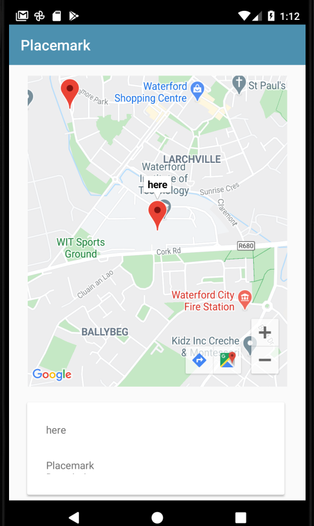

# Marker Listener

Back in the class, implement the OnMarkerListener interface:

## PlacemarkMapsActivity

```kotlin
class PlacemarkMapsActivity : AppCompatActivity(), GoogleMap.OnMarkerClickListener {
```

This is the implementation:

```kotlin
  override fun onMarkerClick(marker: Marker): Boolean {
    currentTitle.text = marker.title
    return false
  }
```

In order to receive events, you will need to register to listen for then. Here is a reworked configureMap to do this:

```kotlin
 fun configureMap() {
    ...
    map.setOnMarkerClickListener(this)
    ...
  }
```

Run the app now - and if you click on a marker, it should display its title in the card:


