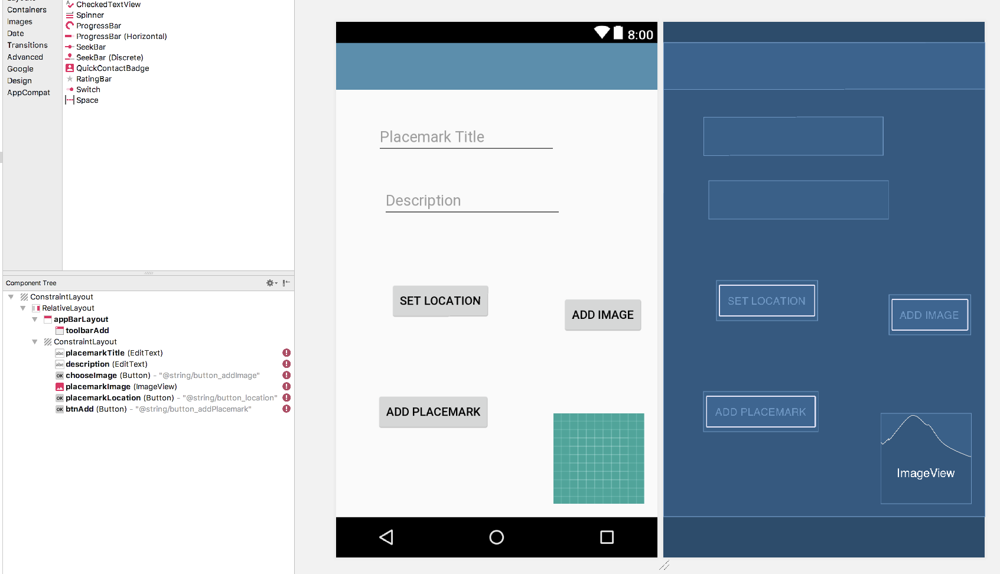
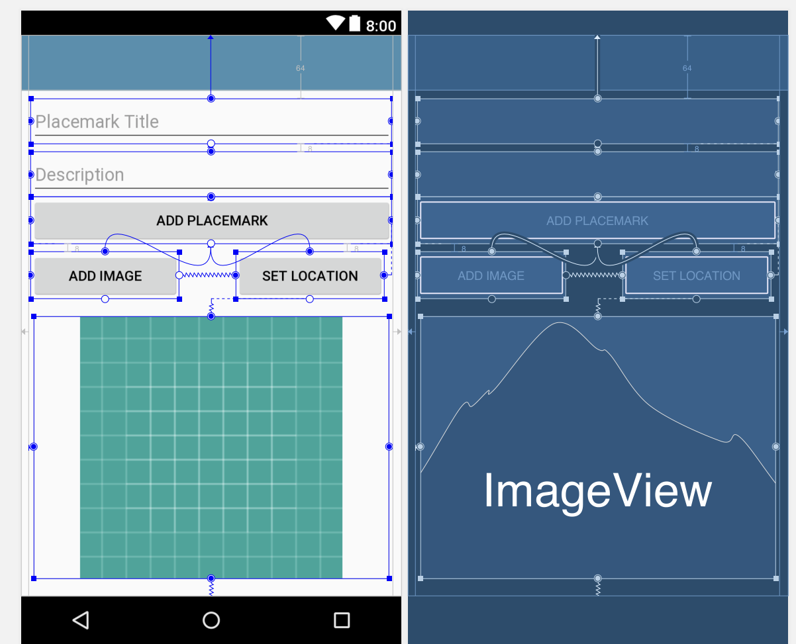

## Solution

Placemark application so far:

- [placemark-07.zip](archives/placemark-07.zip)

## Exercise 1

Currently the PlacemarkActivity layout is hand coded - and is not using the ConstraintLayout. The screen shots below are taken from a refactor the view to make it fully based on the ConstraintLayout. All of this refactoring is carried out using the visual tools.

See if you can replicate in your project. Keep a close eye on the Component Tree as you work through it.







## Exercise 2

Currently, when you select the marker in the PlacemarkMapsActivity, we display the title of the placemark only:

```
  override fun onMarkerClick(marker: Marker): Boolean {
    currentTitle.text = marker.title
    return false
  }
```

How would you go about showing the description + the image as well?

HINT: What does this code do in the configureMap function:

```
      map.addMarker(options).tag = it.id
```

How can we use this to realise this feature?
