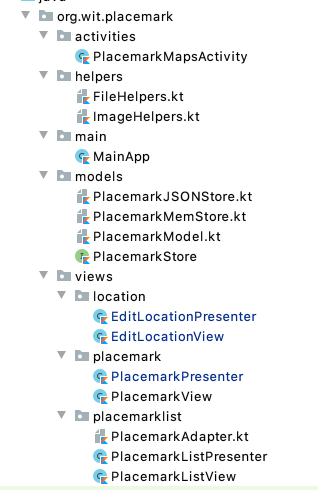

## Refactor package structure

Have a look at this revised project package structure:

Notice that we have created a `views` packages - and then this contains a package for each view/presenter pair.

See if you can replicate this now in your project.

Using studio drag / drop to do a major refactoring like this can be a bit fraught, as the studio UX may lag behind the actions you will have taken to create the new structure. You might wish to switch to the `Project files` perspective occasionally to see if the changes are in sync with the project structure.

Also, make sure the AndroidManifest is also being updated with the correct package structure.

You may also want to do a complete clean and build.
