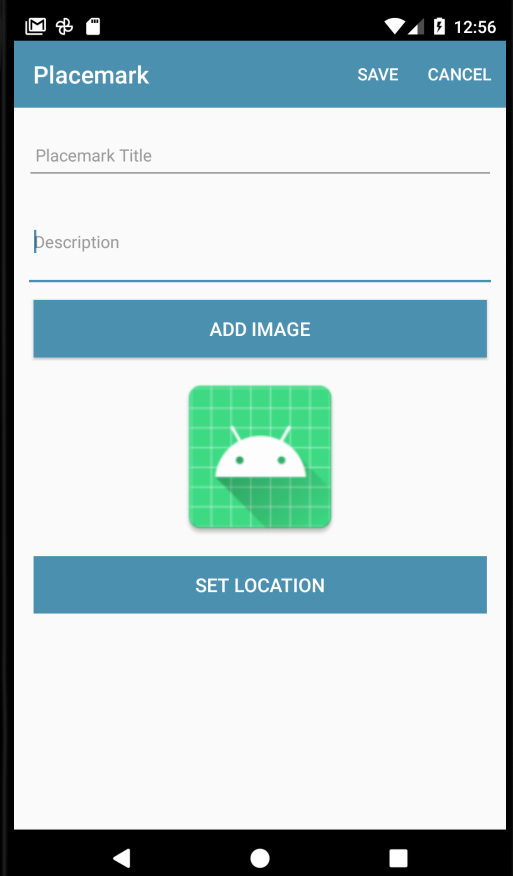

# Solutions

## Exercise 2:

Simplify the UX for PlacemarkActivity, removing the `Add Placemark` button, and including a `save` menu option to perform equivalent functionality:



## Solution

## strings.xml

```xml
  <string name="menu_savePlacemark">Save</string>
```

## menu_placemark.xml

```xml
<?xml version="1.0" encoding="utf-8"?>
<menu xmlns:android="http://schemas.android.com/apk/res/android"
    xmlns:app="http://schemas.android.com/apk/res-auto">

    <item
        android:id="@+id/item_save"
        android:title="@string/menu_savePlacemark"
        app:showAsAction="always"/>
    <item
        android:visible="false"
        android:id="@+id/item_delete"
        android:title="@string/menu_deletePlacemark"
        app:showAsAction="always"/>
    <item
        android:id="@+id/item_cancel"
        android:title="@string/menu_cancelPlacemark"
        app:showAsAction="always"/>
</menu>
```

## res/layouts/activity_placemark.xml

```xml
<?xml version="1.0" encoding="utf-8"?>
<androidx.constraintlayout.widget.ConstraintLayout
    xmlns:android="http://schemas.android.com/apk/res/android"
    xmlns:app="http://schemas.android.com/apk/res-auto"
    xmlns:tools="http://schemas.android.com/tools"
    android:layout_width="match_parent"
    android:layout_height="match_parent"
    tools:context="org.wit.placemark.views.placemark.PlacemarkView">

  <RelativeLayout
      android:layout_width="match_parent"
      android:layout_height="wrap_content"
      app:layout_constraintBottom_toBottomOf="parent"
      app:layout_constraintTop_toTopOf="parent"
      app:layout_constraintVertical_bias="0.0"
      tools:layout_editor_absoluteX="-16dp">

    <com.google.android.material.appbar.AppBarLayout
        android:id="@+id/appBarLayout"
        android:layout_width="match_parent"
        android:layout_height="wrap_content"
        android:background="@color/colorAccent"
        android:fitsSystemWindows="true"
        app:elevation="0dip"
        app:theme="@style/ThemeOverlay.AppCompat.Dark.ActionBar">

      <androidx.appcompat.widget.Toolbar
          android:id="@+id/toolbarAdd"
          android:layout_width="match_parent"
          android:layout_height="wrap_content"
          app:titleTextColor="@color/colorPrimary" />
    </com.google.android.material.appbar.AppBarLayout>


    <androidx.constraintlayout.widget.ConstraintLayout
        android:layout_width="match_parent"
        android:layout_height="wrap_content"
        android:layout_alignTop="@+id/appBarLayout"
        android:layout_alignParentBottom="true">


      <Button
          android:id="@+id/chooseImage"
          android:layout_width="379dp"
          android:layout_height="wrap_content"
          android:layout_marginStart="8dp"
          android:layout_marginTop="8dp"
          android:layout_marginEnd="8dp"
          android:background="@color/colorAccent"
          android:paddingTop="8dp"
          android:paddingBottom="8dp"
          android:text="@string/button_addImage"
          android:textColor="@color/colorPrimary"
          android:textSize="16sp"
          app:layout_constraintEnd_toEndOf="parent"
          app:layout_constraintStart_toStartOf="parent"
          app:layout_constraintTop_toBottomOf="@+id/description" />

      <Button
          android:id="@+id/placemarkLocation"
          android:layout_width="379dp"
          android:layout_height="wrap_content"
          android:layout_marginStart="8dp"
          android:layout_marginTop="8dp"
          android:layout_marginEnd="8dp"
          android:background="@color/colorAccent"
          android:paddingTop="8dp"
          android:paddingBottom="8dp"
          android:stateListAnimator="@null"
          android:text="@string/button_location"
          android:textColor="@color/colorPrimary"
          android:textSize="16sp"
          app:layout_constraintEnd_toEndOf="parent"
          app:layout_constraintStart_toStartOf="parent"
          app:layout_constraintTop_toBottomOf="@+id/placemarkImage" />

      <EditText
          android:id="@+id/description"
          android:layout_width="394dp"
          android:layout_height="82dp"
          android:layout_marginStart="8dp"
          android:layout_marginTop="8dp"
          android:layout_marginEnd="8dp"
          android:hint="@string/hint_placemarkDescription"
          android:inputType="text"
          android:maxLength="25"
          android:maxLines="1"
          android:padding="8dp"
          android:textColor="@color/colorPrimaryDark"
          android:textSize="14sp"
          app:layout_constraintEnd_toEndOf="parent"
          app:layout_constraintStart_toStartOf="parent"
          app:layout_constraintTop_toBottomOf="@+id/placemarkTitle" />

      <EditText
          android:id="@+id/placemarkTitle"
          android:layout_width="392dp"
          android:layout_height="47dp"
          android:layout_marginStart="8dp"
          android:layout_marginTop="72dp"
          android:layout_marginEnd="8dp"
          android:autofillHints=""
          android:hint="@string/hint_placemarkTitle"
          android:inputType="text"
          android:maxLength="25"
          android:maxLines="1"
          android:padding="8dp"
          android:textColor="@color/colorPrimaryDark"
          android:textSize="14sp"
          app:layout_constraintEnd_toEndOf="parent"
          app:layout_constraintStart_toStartOf="parent"
          app:layout_constraintTop_toTopOf="parent" />

      <ImageView
          android:id="@+id/placemarkImage"
          android:layout_width="0dp"
          android:layout_height="150dp"
          android:layout_marginStart="8dp"
          android:layout_marginTop="8dp"
          android:layout_marginEnd="8dp"
          app:layout_constraintEnd_toEndOf="parent"
          app:layout_constraintStart_toStartOf="parent"
          app:layout_constraintTop_toBottomOf="@+id/chooseImage"
          app:srcCompat="@mipmap/ic_launcher" />
    </androidx.constraintlayout.widget.ConstraintLayout>


  </RelativeLayout>
</androidx.constraintlayout.widget.ConstraintLayout>
```

## PlacemarkView

```kotlin
package org.wit.placemark.views.placemark

import android.content.Intent
import androidx.appcompat.app.AppCompatActivity
import android.os.Bundle
import android.view.Menu
import android.view.MenuItem
import kotlinx.android.synthetic.main.activity_placemark.*
import org.jetbrains.anko.AnkoLogger
import org.jetbrains.anko.toast
import org.wit.placemark.R
import org.wit.placemark.helpers.readImageFromPath
import org.wit.placemark.models.PlacemarkModel

class PlacemarkView : AppCompatActivity(), AnkoLogger {

  lateinit var presenter: PlacemarkPresenter
  var placemark = PlacemarkModel()

  override fun onCreate(savedInstanceState: Bundle?) {
    super.onCreate(savedInstanceState)
    setContentView(R.layout.activity_placemark)
    toolbarAdd.title = title
    setSupportActionBar(toolbarAdd)

    presenter = PlacemarkPresenter(this)

    chooseImage.setOnClickListener { presenter.doSelectImage() }

    placemarkLocation.setOnClickListener { presenter.doSetLocation() }
  }

  fun showPlacemark(placemark: PlacemarkModel) {
    placemarkTitle.setText(placemark.title)
    description.setText(placemark.description)
    placemarkImage.setImageBitmap(readImageFromPath(this, placemark.image))
    if (placemark.image != null) {
      chooseImage.setText(R.string.change_placemark_image)
    }
  }

  override fun onCreateOptionsMenu(menu: Menu): Boolean {
    menuInflater.inflate(R.menu.menu_placemark, menu)
    if (presenter.edit) menu.getItem(0).setVisible(true)
    return super.onCreateOptionsMenu(menu)
  }

  override fun onOptionsItemSelected(item: MenuItem): Boolean {
    when (item?.itemId) {
      R.id.item_save -> {
        if (placemarkTitle.text.toString().isEmpty()) {
          toast(R.string.enter_placemark_title)
        } else {
          presenter.doAddOrSave(placemarkTitle.text.toString(), description.text.toString())
        }
      }
      R.id.item_delete -> {
        presenter.doDelete()
      }
      R.id.item_cancel -> {
        presenter.doCancel()
      }
    }
    return super.onOptionsItemSelected(item)
  }

  override fun onActivityResult(requestCode: Int, resultCode: Int, data: Intent?) {
    super.onActivityResult(requestCode, resultCode, data)
    if (data != null) {
      presenter.doActivityResult(requestCode, resultCode, data)
    }
  }
}
```
