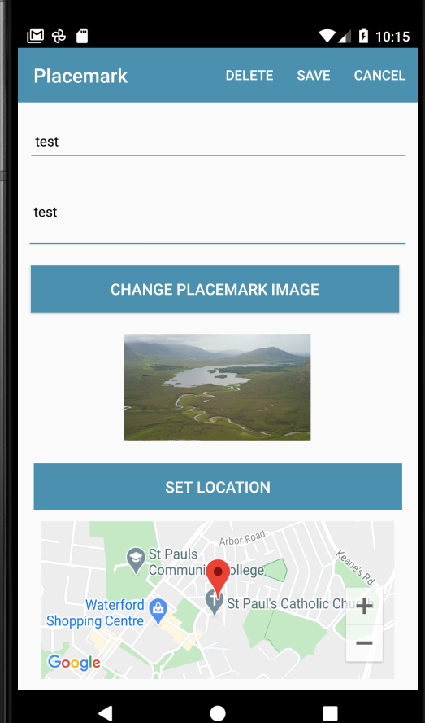

## PlacemarkView

Manually managing a MapView component on an activity involves:

- declaring a GoogleMap reference
- initialising the mapView widget + using it to acquire the googleMap reference
- manage the mapView lifecycle

Here are the changes to PlacemarkView to do this:

## PlacemarkView

```kotlin
...
class PlacemarkView : BaseView(), AnkoLogger {
  ...
  lateinit var map: GoogleMap
  ...

  override fun onCreate(savedInstanceState: Bundle?) {
    ...
    mapView.onCreate(savedInstanceState);
    mapView.getMapAsync {
      map = it
      presenter.doConfigureMap(map)
    }
  }

  ...

  override fun onDestroy() {
    super.onDestroy()
    mapView.onDestroy()
  }

  override fun onLowMemory() {
    super.onLowMemory()
    mapView.onLowMemory()
  }

  override fun onPause() {
    super.onPause()
    mapView.onPause()
  }

  override fun onResume() {
    super.onResume()
    mapView.onResume()
  }

  override fun onSaveInstanceState(outState: Bundle) {
    super.onSaveInstanceState(outState)
    mapView.onSaveInstanceState(outState)
  }
}
```

And PlacemarkPresenter

## PlacemarkPresenter

```
class PlacemarkPresenter(view: BaseView) : BasePresenter(view) {

  var map: GoogleMap? = null


  fun doConfigureMap(m: GoogleMap) {
    map = m
    locationUpdate(placemark.lat, placemark.lng)
  }

  fun locationUpdate(lat: Double, lng: Double) {
    placemark.lat = lat
    placemark.lng = lng
    placemark.zoom = 15f
    map?.clear()
    map?.uiSettings?.setZoomControlsEnabled(true)
    val options = MarkerOptions().title(placemark.title).position(LatLng(placemark.lat, placemark.lng))
    map?.addMarker(options)
    map?.moveCamera(CameraUpdateFactory.newLatLngZoom(LatLng(placemark.lat, placemark.lng), placemark.zoom))
    view?.showPlacemark(placemark)
  }
```

This will ensure that the marker is placed on the map correctly - if the placemark already exists.

Try this now - with an existing placemark - and see if the map + marker appears:



The above only works for an existing placemark you are editing.

For a new placemark, we would need to take special measures:

In the init block in the presenter, if we are not in edit mode, set the location to the default:

## PlacemarkPresenter

```kotlin
  init {
    if (view.intent.hasExtra("placemark_edit")) {
      edit = true
      placemark = view.intent.extras?.getParcelable<PlacemarkModel>("placemark_edit")!!
      view.showPlacemark(placemark)
    } else {
      placemark.lat = defaultLocation.lat
      placemark.lng = defaultLocation.lng
    }
  }
```

Also, when the user has edited the location - make sure to also update the position:

```
  override fun doActivityResult(requestCode: Int, resultCode: Int, data: Intent) {
    ...
    ...
      LOCATION_REQUEST -> {
        val location = data.extras?.getParcelable<Location>("location")!!
        placemark.lat = location.lat
        placemark.lng = location.lng
        placemark.zoom = location.zoom
        locationUpdate(placemark.lat, placemark.lng)
      }
    }
  }
```

This is the complete PlacemarkView/Presenters at this stage:

## PlacemarkPresenter

```kotlin
package org.wit.placemark.views.placemark

import android.content.Intent
import com.google.android.gms.maps.CameraUpdateFactory
import com.google.android.gms.maps.GoogleMap
import com.google.android.gms.maps.model.LatLng
import com.google.android.gms.maps.model.MarkerOptions
import org.wit.placemark.helpers.showImagePicker
import org.wit.placemark.models.Location
import org.wit.placemark.models.PlacemarkModel
import org.wit.placemark.views.*

class PlacemarkPresenter(view: BaseView) : BasePresenter(view) {

  var placemark = PlacemarkModel()
  var defaultLocation = Location(52.245696, -7.139102, 15f)
  var edit = false;
  var map: GoogleMap? = null

  init {
    if (view.intent.hasExtra("placemark_edit")) {
      edit = true
      placemark = view.intent.extras?.getParcelable<PlacemarkModel>("placemark_edit")!!
      view.showPlacemark(placemark)
    } else {
      placemark.lat = defaultLocation.lat
      placemark.lng = defaultLocation.lng
    }
  }

  fun doAddOrSave(title: String, description: String) {
    placemark.title = title
    placemark.description = description
    if (edit) {
      app.placemarks.update(placemark)
    } else {
      app.placemarks.create(placemark)
    }
    view?.finish()
  }

  fun cachePlacemark (title: String, description: String) {
    placemark.title = title;
    placemark.description = description
  }

  fun doConfigureMap(m: GoogleMap) {
    map = m
    locationUpdate(placemark.lat, placemark.lng)
  }

  fun locationUpdate(lat: Double, lng: Double) {
    placemark.lat = lat
    placemark.lng = lng
    placemark.zoom = 15f
    map?.clear()
    map?.uiSettings?.setZoomControlsEnabled(true)
    val options = MarkerOptions().title(placemark.title).position(LatLng(placemark.lat, placemark.lng))
    map?.addMarker(options)
    map?.moveCamera(CameraUpdateFactory.newLatLngZoom(LatLng(placemark.lat, placemark.lng), placemark.zoom))
    view?.showPlacemark(placemark)
  }

  fun doCancel() {
    view?.finish()
  }

  fun doDelete() {
    app.placemarks.delete(placemark)
    view?.finish()
  }

  fun doSelectImage() {
    view?.let {
      showImagePicker(view!!, IMAGE_REQUEST)
    }
  }

  fun doSetLocation() {
    if (edit == false) {
      view?.navigateTo(VIEW.LOCATION, LOCATION_REQUEST, "location", defaultLocation)
    } else {
      view?.navigateTo(
        VIEW.LOCATION,
        LOCATION_REQUEST,
        "location",
        Location(placemark.lat, placemark.lng, placemark.zoom)
      )
    }
  }

  override fun doActivityResult(requestCode: Int, resultCode: Int, data: Intent) {
    when (requestCode) {
      IMAGE_REQUEST -> {
        placemark.image = data.data.toString()
        view?.showPlacemark(placemark)
      }
      LOCATION_REQUEST -> {
        val location = data.extras?.getParcelable<Location>("location")!!
        placemark.lat = location.lat
        placemark.lng = location.lng
        placemark.zoom = location.zoom
        locationUpdate(placemark.lat, placemark.lng)
      }
    }
  }
}
```

## PlacemarkView

```kotlin
package org.wit.placemark.views.placemark

import android.content.Intent
import android.os.Bundle
import android.view.Menu
import android.view.MenuItem
import com.google.android.gms.maps.GoogleMap
import kotlinx.android.synthetic.main.activity_placemark.*
import org.jetbrains.anko.AnkoLogger
import org.jetbrains.anko.toast
import org.wit.placemark.R
import org.wit.placemark.helpers.readImageFromPath
import org.wit.placemark.models.PlacemarkModel
import org.wit.placemark.views.BaseView

class PlacemarkView : BaseView(), AnkoLogger {

  lateinit var presenter: PlacemarkPresenter
  var placemark = PlacemarkModel()
  lateinit var map: GoogleMap

  override fun onCreate(savedInstanceState: Bundle?) {
    super.onCreate(savedInstanceState)
    setContentView(R.layout.activity_placemark)

    init(toolbarAdd)

    mapView.onCreate(savedInstanceState);
    mapView.getMapAsync {
      map = it
      presenter.doConfigureMap(map)
    }

    presenter = initPresenter (PlacemarkPresenter(this)) as PlacemarkPresenter

    chooseImage.setOnClickListener {
      presenter.cachePlacemark(placemarkTitle.text.toString(), description.text.toString())
      presenter.doSelectImage()
    }

    placemarkLocation.setOnClickListener {
      presenter.cachePlacemark(placemarkTitle.text.toString(), description.text.toString())
      presenter.doSetLocation()
    }
  }

  override fun showPlacemark(placemark: PlacemarkModel) {
    placemarkTitle.setText(placemark.title)
    description.setText(placemark.description)
    placemarkImage.setImageBitmap(readImageFromPath(this, placemark.image))
    if (placemark.image != null) {
      chooseImage.setText(R.string.change_placemark_image)
    }
  }

  override fun onCreateOptionsMenu(menu: Menu): Boolean {
    menuInflater.inflate(R.menu.menu_placemark, menu)
    if (presenter.edit) menu.getItem(0).setVisible(true)
    return super.onCreateOptionsMenu(menu)
  }

  override fun onOptionsItemSelected(item: MenuItem): Boolean {
    when (item?.itemId) {
      R.id.item_delete -> {
        presenter.doDelete()
      }
      R.id.item_save -> {
        if (placemarkTitle.text.toString().isEmpty()) {
          toast(R.string.enter_placemark_title)
        } else {
          presenter.doAddOrSave(placemarkTitle.text.toString(), description.text.toString())
        }
      }
      R.id.item_cancel -> {
        finish()
      }
    }
    return super.onOptionsItemSelected(item)
  }

  override fun onActivityResult(requestCode: Int, resultCode: Int, data: Intent?) {
    super.onActivityResult(requestCode, resultCode, data)
    if (data != null) {
      presenter.doActivityResult(requestCode, resultCode, data)
    }
  }

  override fun onBackPressed() {
    presenter.doCancel()
  }

  override fun onDestroy() {
    super.onDestroy()
    mapView.onDestroy()
  }

  override fun onLowMemory() {
    super.onLowMemory()
    mapView.onLowMemory()
  }

  override fun onPause() {
    super.onPause()
    mapView.onPause()
  }

  override fun onResume() {
    super.onResume()
    mapView.onResume()
  }

  override fun onSaveInstanceState(outState: Bundle) {
    super.onSaveInstanceState(outState)
    mapView.onSaveInstanceState(outState)
  }
}
```

This should work now.

However, when you create a new placemark, it still does not determine the actual current location.
