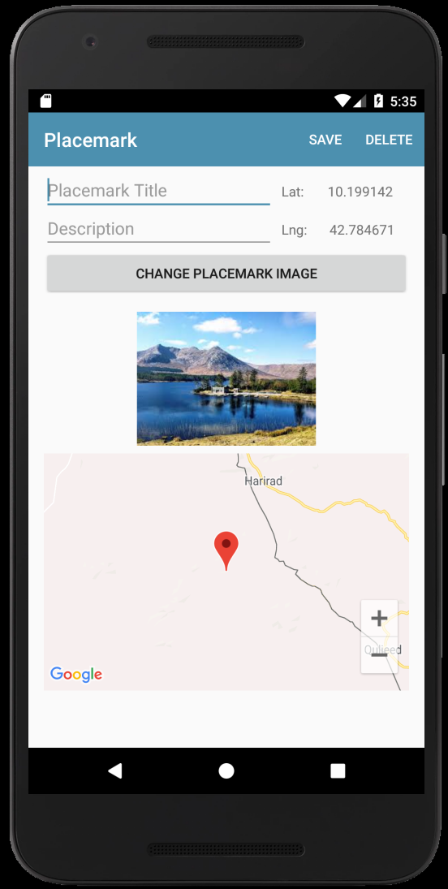

#Solution

Placemark application so far:

- [placemark-09a.zip](archives/placemark-09a.zip)

## Exercises

Look at the following version of the placemark activity:

## Exercise 1:

As shown above, show the latitude/longitude of the placemark on the view.

## Exercise 2:

Notice in the above that the 'Set Location' button has been removed. If the map widget itself is clicked, then we will launch the EditLocation activity. Implement this capability
