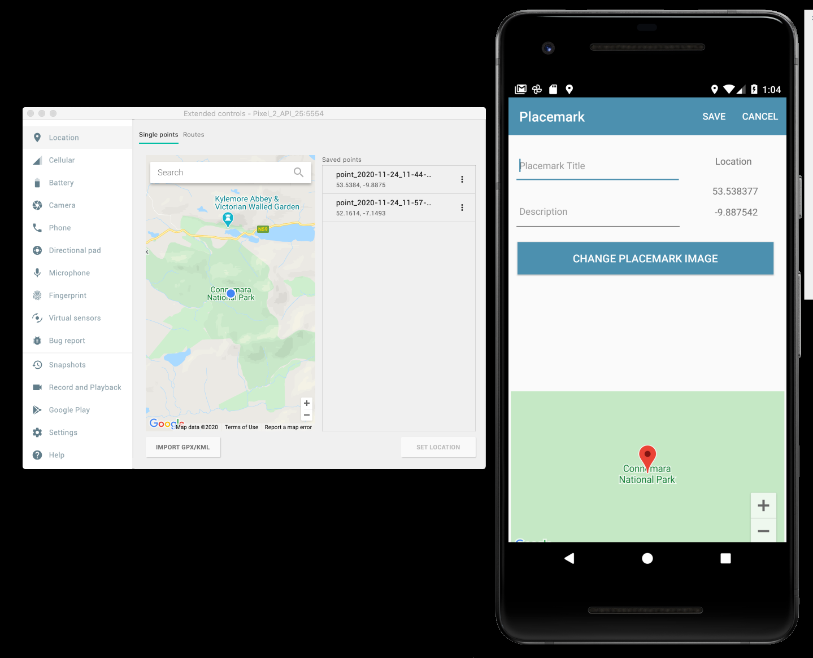
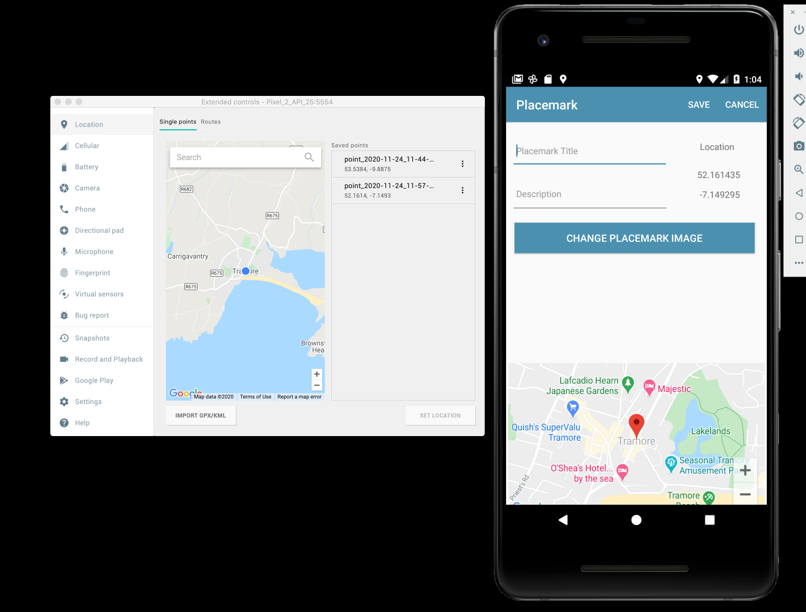

# Live Location Updates

First, we need a new helper function:

## LocationHelper

```kotlin
@SuppressLint("RestrictedApi")
fun createDefaultLocationRequest() : LocationRequest {
  val locationRequest = LocationRequest().apply {
    interval = 10000
    fastestInterval = 5000
    priority = LocationRequest.PRIORITY_HIGH_ACCURACY
  }
  return locationRequest
}
```

In PlacemarkPresenter, use this helper to initialise a new attribute:

```kotlin
  val locationRequest = createDefaultLocationRequest()
```

Now introduce a new method, also in the presenter:

## PlacemarkPresenter

```kotlin
  @SuppressLint("MissingPermission")
  fun doResartLocationUpdates() {
    var locationCallback = object : LocationCallback() {
      override fun onLocationResult(locationResult: LocationResult?) {
        if (locationResult != null && locationResult.locations != null) {
          val l = locationResult.locations.last()
          locationUpdate(l.latitude, l.longitude)
        }
      }
    }
    if (!edit) {
      locationService.requestLocationUpdates(locationRequest, locationCallback, null)
    }
  }
```

This method, when invoked, does 2 things:

- defines a callback - to be triggered when we turn location updates
- checks to see if we are in edit mode - if not, it is assumed we would like live location updates to commence.

Finally, we need to be careful how we start these location updates. The safest place is from the PresenterView:

## PlacemarkView

```kotlin
  override fun onResume() {
    super.onResume()
    mapView.onResume()
    presenter.doResartLocationUpdates()
  }
```

Here, in onResume(), we ask for location updates to start (or restart if the view has been removed). We are assuming that location updates will be automatically terminated if the view is destroyed.

Run the app now in the simulator - and set up a few locations. When you set the location to each in turn, the PlacemarkView should update the map reasonably promptly:



