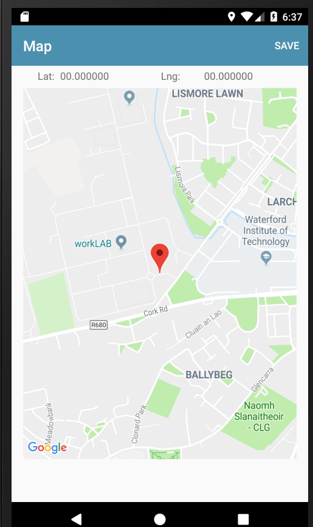

# Exercises

Placemark application so far:

- [placemark-09b.zip](archives/placemark-09b.zip)

## Exercise 1:

When you create a new placemark you may find that the description and title keep getting reset to blank every few seconds. This is because we are receiving location updates asynchronously from the location provider :

## PlacemarkPresenter

```kotlin
  @SuppressLint("MissingPermission")
  fun doResartLocationUpdates() {
    var locationCallback = object : LocationCallback() {
      override fun onLocationResult(locationResult: LocationResult?) {
        if (locationResult != null && locationResult.locations != null) {
          val l = locationResult.locations.last()
          locationUpdate(l.latitude, l.longitude)
        }
      }
    }
    if (!edit) {
      locationService.requestLocationUpdates(locationRequest, locationCallback, null)
    }
  }
```

The call to `locationUpdate` above will trigger a refresh of the view via a call to `showPlacemark` in the locationUpdate function above.

How might be go about fixing this issue?

## Exercise 2:

This is a revised EditLocation view:



In this version, as you drag the marker around the lat/long is updated as the marker is moved. Try to implement this now.

One strategy might be to replace the existing view completely with a version that loads a new layout. This layout can be designed in the layout editor, and contain the MapView + the lat/lng text views.

To kick start this process, you could copy the PlacemarkMapView class + layout. You should be able to keep the same presenter.
