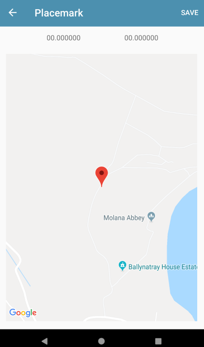

# Exercises

Placemark application so far:

- [placemark-10a.zip](archives/placemark-10a.zip)

## Exercise 1:

Refactor the Models package so that it is structured like this:

We will be introducing a new package here in the next lab

## Exercise 2: Location Update

If you now open the Edit Location view, it will always display the location as 

i.e. it always shows 00.00000 for lat/lng initially.  

As soon as you move the placemark it is updated correctly. Fix this now.

