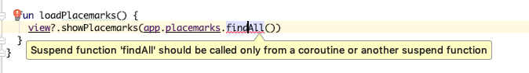

## Exercise Solutions

## Exercise 1:

Refactor the Models package so that it is structured like this:

## Solution

Use studio + drag & drop to restructure the models package as shown.

## Exercise 2: Location Update

If you now open the Edit Location view, it will always display the location as 

i.e. it always shows 00.00000 for lat/lng initially.  

As soon as you move the placemark it is updated correctly. Fix this now.

## Exercise 2 Solution

First introduce a new empty method in the BaseView class:

## BaseView

~~~
  open fun showLocation(latitude : Double, longitude : Double) {}
~~~

## EditLocationView

~~~kotlin
  override fun showLocation(latitude : Double, longitude : Double) {
    lat.setText("%.6f".format(latitude))
    lng.setText("%.6f".format(longitude))
  }
~~~

## EditLocationPresenter

~~~kotlin
  fun doConfigureMap(map: GoogleMap) {
    // as before
    view?.showLocation(loc.latitude, loc.longitude);
  }

~~~

