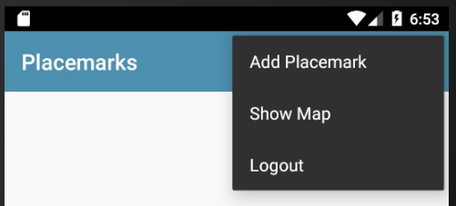

# Logout

As we now support log in - we also need to support logout. This will require a change to our existing menus in PlacemarkListView. Once logged in the AppBar will be reconfigured to have a drop down menu:

First, some new/revised strings:

## res/values/strings.xml

~~~
  <string name="menu_showMap">Show Map</string>
  <string name="menu_logout">Logout</string>
~~~

This is the revised menu 

## memu_main.xml

~~~xml
<?xml version="1.0" encoding="utf-8"?>
<menu xmlns:android="http://schemas.android.com/apk/res/android"
  xmlns:app="http://schemas.android.com/apk/res-auto">

  <item
    android:id="@+id/item_add"
    android:icon="@android:drawable/ic_menu_add"
    android:title="@string/menu_addPlacemark"
    app:showAsAction="never"/>

  <item
    android:id="@+id/item_map"
    android:icon="@android:drawable/ic_menu_mapmode"
    android:title="@string/menu_showMap"
    app:showAsAction="never"/>

  <item
    android:id="@+id/item_logout"
    android:title="@string/menu_logout"
    android:visible="true"
    app:showAsAction="never" />
</menu>
~~~

In order to Launch a view, we have been encapsulating the start procedure in BaseView:

## BaseView

~~~kotlin
...
import org.wit.placemark.views.login.LoginView
...
enum class VIEW {
  LOCATION, PLACEMARK, MAPS, LIST, LOGIN
}
...

  fun navigateTo(view: VIEW, code: Int = 0, key: String = "", value: Parcelable? = null) {
    var intent = Intent(this, PlacemarkListView::class.java)
    when (view) {
      VIEW.LOCATION -> intent = Intent(this, EditLocationView::class.java)
      VIEW.PLACEMARK -> intent = Intent(this, PlacemarkView::class.java)
      VIEW.MAPS -> intent = Intent(this, PlacemarkMapView::class.java)
      VIEW.LIST -> intent = Intent(this, PlacemarkListView::class.java)
      VIEW.LOGIN -> intent = Intent(this, LoginView::class.java)
    }
    if (key != "") {
      intent.putExtra(key, value)
    }
    startActivityForResult(intent, code)
  }
~~~

We need to be able to handle the new logout menu option. This is an extend version of the menu handler in PlacemarkListView:

## PlacemarkListView

~~~kotlin
  override fun onOptionsItemSelected(item: MenuItem): Boolean {
    when (item?.itemId) {
      R.id.item_add -> presenter.doAddPlacemark()
      R.id.item_map -> presenter.doShowPlacemarksMap()
      R.id.item_logout ->presenter.doLogout()
    }
    return super.onOptionsItemSelected(item)
  }
~~~

Finally, this will need a new method in PlacemarkListPresenter:

## PlacemarkListPresenter

~~~kotlin
  fun doLogout() {
    view?.navigateTo(VIEW.LOGIN)
  }
~~~

Notice we are just switching to the login screen when logout is selected.

Try this now, and make sure login and logout work as expected.
