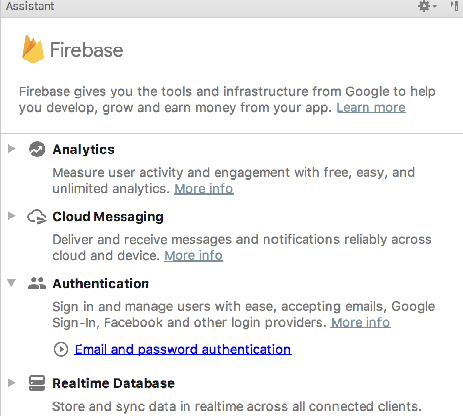
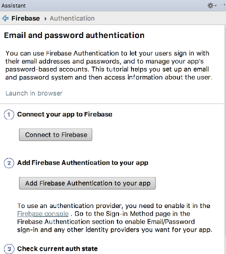

# Connect the App

Back in Android Studio, select `Tools->Firebase` - you should see the Firebase Assistant:

Select `Authentication`:

... and then select `Email and password authentication`:

Now press `Connect to Firebase`

This will open a web browser onto your firebase application, and you will be invited to select the application:

This will take a moment - and you should see a confirmation screen (in the browser):

Pressing 'Connect' should succeed:

Back in studio, we should see evidence of this:

All of the above will have inserted a new file into your project called `google-services.json`. This file is embedded in the `app` folder. You will need to switch to the `Project` perspective in Studio in order to see it.

Now press the "Add firebase Authentication to your app". This step will permit you to accept:

Once accepted it will add new entries into both of our gradle files. The top level gradle will have this additional entry:

## build.gradle
 
~~~gradle
    classpath 'com.google.gms:google-services:4.3.3'
~~~

The app gradle file will have additional libraries and a new plugin:

## project gradle

~~~
...
apply plugin: 'com.google.gms.google-services'
...
  implementation 'com.google.firebase:firebase-auth:19.2.0'
...
~~~

These are the new features in the project:

~~~
...
apply plugin: 'com.google.gms.google-services'
...
  implementation 'com.google.firebase:firebase-auth:19.1.0'
...
~~~

Rebuild the application now to make sure all of these libraries can be incorporated correctly.

## google-service.json

The Firebase wizard will also have generate a file of various credentials for your app in 

- app/app/google-services.json

Have a look at the contents of this file now. It contains multiple keys to facilitate authentication to your firebase app. You may wish to exclude this from git, particularly if the repo is public:

## .gitignore

~~~
app/google-services.json
~~~

