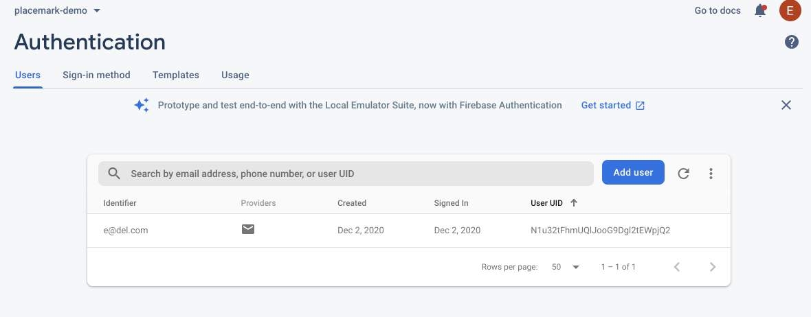

# Signup/Login Implementation

Back in the LoginPresenter class - we can implement the Firebase login strategy:

## LoginPresenter

~~~kotin
package org.wit.placemark.views.login

import com.google.firebase.auth.FirebaseAuth
import org.jetbrains.anko.toast
import org.wit.placemark.views.BasePresenter
import org.wit.placemark.views.BaseView
import org.wit.placemark.views.VIEW

class LoginPresenter(view: BaseView) : BasePresenter(view) {

  var auth: FirebaseAuth = FirebaseAuth.getInstance()

  fun doLogin(email: String, password: String) {
    view?.showProgress()
    auth.signInWithEmailAndPassword(email, password).addOnCompleteListener(view!!) { task ->
      if (task.isSuccessful) {
        view?.navigateTo(VIEW.LIST)
      } else {
        view?.toast("Sign Up Failed: ${task.exception?.message}")
      }
      view?.hideProgress()
    }
  }

  fun doSignUp(email: String, password: String) {
    view?.showProgress()
    auth.createUserWithEmailAndPassword(email, password).addOnCompleteListener(view!!) { task ->
      if (task.isSuccessful) {
        view?.navigateTo(VIEW.LIST)
      } else {
        view?.toast("Sign Up Failed: ${task.exception?.message}")
      }
      view?.hideProgress()
    }
  }
}
~~~

This will sign up a new user with the Firebase service. Try it now 

Make sure to enter a correctly formed email + a password of at least 8 characters.

The application should take you to the main Placemarks screen.

Back in the Firebase console - check the authentication panel to see if the new user is recorded:

