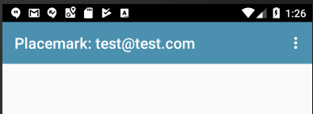

# Solutions

## Exercise 1 : Logout

## PlacemarkListPresenter

~~~kotlin
  fun doLogout() {
    FirebaseAuth.getInstance().signOut()
    view?.navigateTo(VIEW.LOGIN)
  }

~~~

## Exercise 2: Current User

Adjust the title of the PlacemarkListActivity - such that it displays the logged in users email:

## Solution

Now that we are centralising the toolbar initialisation in BaseView, we can introduce this feature for all views:

## BaseView

~~~kotlin
...
 fun init(toolbar: Toolbar, upEnabled: Boolean) {
    toolbar.title = title
    setSupportActionBar(toolbar)
    supportActionBar?.setDisplayHomeAsUpEnabled(upEnabled)
    val user = FirebaseAuth.getInstance().currentUser
    if (user != null) {
      toolbar.title = "${title}: ${user.email}"
    }
  }
...
~~~

