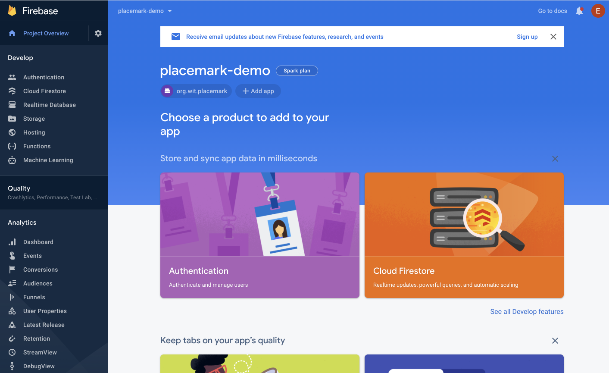
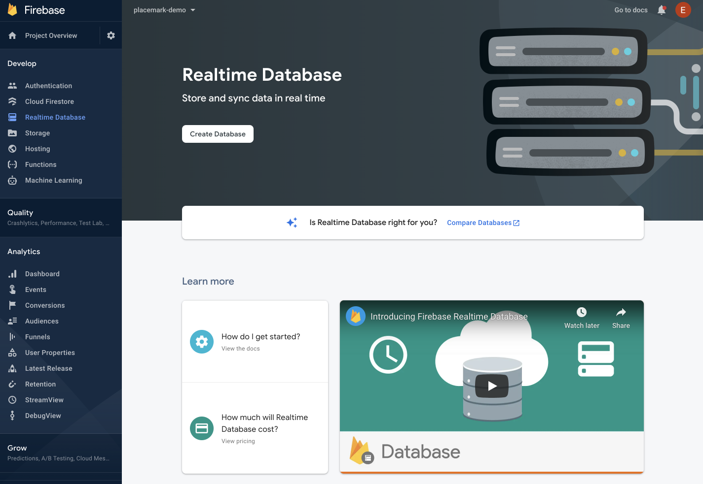
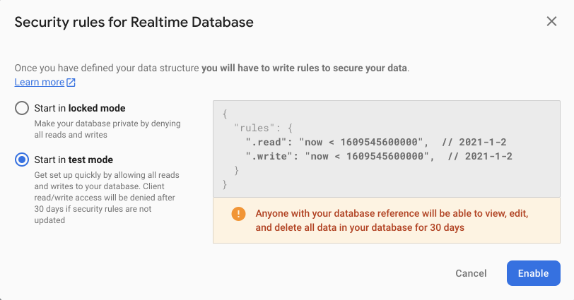
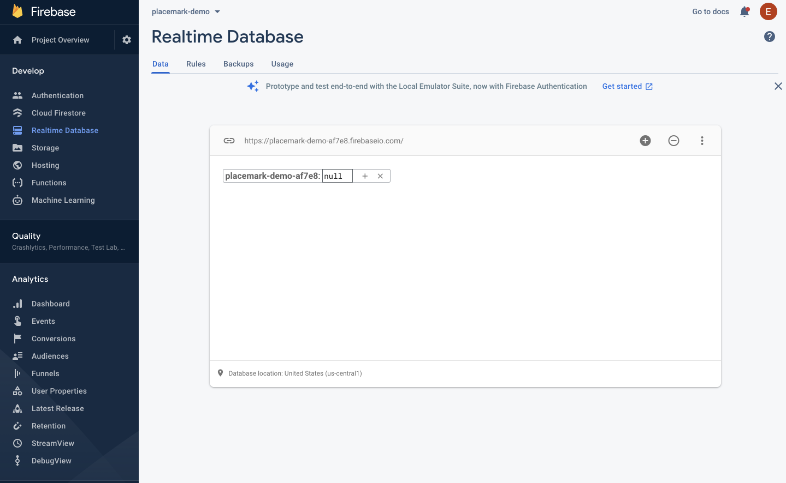
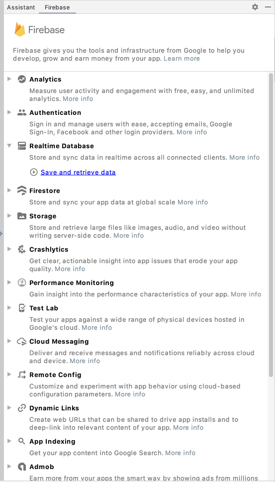
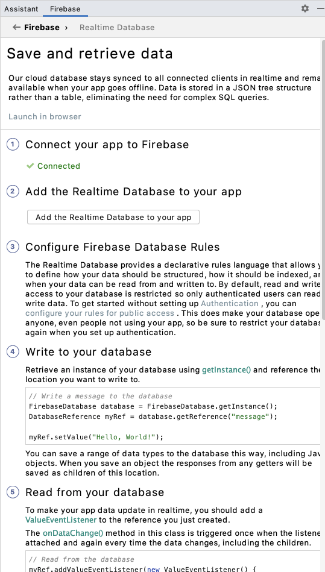
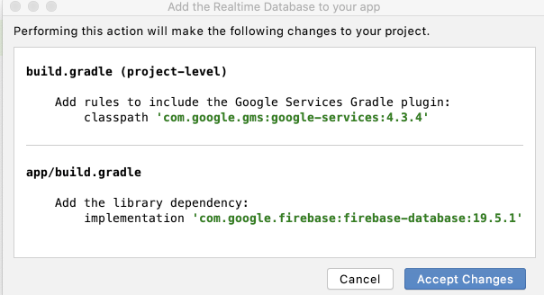

# Firebase Database

In your Firebase Application Console, select `Realtime Database`:

This will reveal this view :

Press `Create Database`:

In the above - be sure to select 'start in test mode'

This is a view into your database - you will see in real time here any objects you insert. Also, take note of the url, which is:

~~~
https://placemark-demo-af7e8.firebaseio.com/
~~~

... in the above. This will be used in your application configuration. 

To establish the connection, in Studio select `Tools->Firebase->Realtime Database`

Press connect `Save and Retrieve data`. 

Then press `Add the Realtime Database to your app`

Press `Accept Changes`. This will have added a new library to both gradle files:

~~~gradle
...
    classpath 'com.google.gms:google-services:4.3.4'
...
  implementation 'com.google.firebase:firebase-database:19.5.1'
...
~~~

And we will also have changes to `google-services.json`. It may look something like this:

~~~
{
  "project_info": {
    "project_number": "4283XXXXX",
    "firebase_url": "https://placemark-XXXXd.firebaseio.com",
    "project_id": "placemark-XXXd",
  },
  "client": [
    {
      "client_info": {
        "mobilesdk_app_id": "1:428338485028:android:634c4XXXce143",
        "android_client_info": {
          "package_name": "org.wit.placemark"
        }
      },
      "oauth_client": [
        {
          "client_id": "4283XXXXX028-ntqXXXXXXXXXl9ot6ok3r.apps.googleusercontent.com",
          "client_type": 1,
          "android_info": {
            "package_name": "org.wit.placemark",
            "certificate_hash": "bcaa865ad78XXXXXXXXX731db4da8b"
          }
        },
        {
          "client_id": "42833848XXXXXX5cup7XXXXXXk8s.apps.googleusercontent.com",
          "client_type": 3
        }
      ],
      "api_key": [
        {
          "current_key": "AIzaSyBXXXXXXXXXXXoTeWhTqfKxbI"
        }
      ],
      "services": {
        "analytics_service": {
          "status": 1
        },
        "appinvite_service": {
          "status": 2,
          "other_platform_oauth_client": [
            {
              "client_id": "428338XXXXXXXXXXXXXXXXXX1e4kk8s.apps.googleusercontent.com",
              "client_type": 3
            }
          ]
        },
        "ads_service": {
          "status": 2
        }
      }
    }
  ],
  "configuration_version": "1"
}
~~~

A Firebase URL should be in the opening info object.